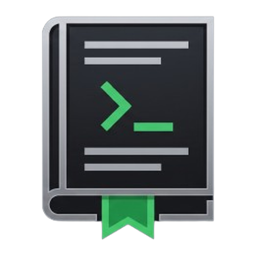

<p align="center">
  
</p>

# The Missing Manual

**The free, text-first library of real-world developer and STEM knowledge.**

**[themissingmanual.dev →](https://themissingmanual.dev)**

---

## What's inside

- **350 guides, 1,384 phases, 27 categories** - Git, operating systems, hardware, networking,
  databases, architecture, security, DevOps, infrastructure, performance, 7 full programming
  languages and 30+ frameworks end-to-end, plus Logic, Mathematics, and Physics for the reasoning
  underneath it all.
- **Everything is laddered A→Z.** Each category opens with "what this actually is" for someone who's
  never touched it, and ends at genuinely advanced material - no assumed knowledge, ever.
- **It's not just reading.** Interactive playgrounds (regex testers, sorting visualizers, a real
  in-browser terminal), inline quizzes, hands-on exercises, runnable Python/JS/SQL code blocks, and
  animated instrument-style explainers (a live CPU clock signal, a network latency trace, a git
  rebase played out step by step) for the concepts that are easier to watch than read.
- **An AI tutor** that answers questions about the exact phase you're reading, grounded in and
  citing the guide's own content - not a generic chatbot bolted on the side.
- **Your own private highlights and notes** on any phase, spaced-repetition review, a local
  skill map / roadmap of everything you've covered, and a set of logic/pattern brain games to keep
  the fundamentals sharp after you've read them once.
- **Built to stick around, not just be read once.** Offline-capable (installable PWA), exportable
  to EPUB, shareable "TIL" cards for what you just learned, and a public backlog where anyone can
  vote on what gets written next.
- **Free. No account, no paywall, no ads.** It stays that way.

## How it's built

A content-first split: the guides are the product, the platform serves them.

```
guides/            Markdown source of truth - every guide, every phase, every quiz/exercise
platform/
  core/            Rust: ingest, SQLite storage, Tantivy full-text search
  server/          Rust (axum): the public + admin API
  web/             SvelteKit: SSR frontend, admin CMS, search UI
```

- **Guides are plain Markdown** with YAML frontmatter - no CMS lock-in, readable and diffable in a
  PR. Interactive elements (quizzes, exercises, playgrounds, animated explainers) are authored as
  fenced code blocks right in the Markdown.
- **The server ingests `guides/` on startup** (and on a timer, and on demand from the admin panel) -
  drop a folder in, it goes live. No database migration to write a guide.
- **Search is real full-text search** (Tantivy), not a fuzzy string match - typo-tolerant, ranked,
  same engine that powers the in-app AI tutor's "look this up in the guides" tool.
- **Built to be read by machines too.** Every guide phase is independently citable (its own URL, its
  own JSON-LD `Article`/`FAQPage` structured data), served as clean semantic HTML, and available as
  raw Markdown to anything that asks for it (`Accept: text/markdown`) - including a small
  [MCP server](platform/web/src/routes/mcp/+server.js) so AI agents can search and read the library
  directly.
- **Diagrams render server-side and follow your theme.** Mermaid diagrams in guides are baked to
  static SVG at ingest by a pure-Rust engine - [`mermaid-to-svg`](platform/third_party/mermaid-to-svg),
  vendored from xAI's Grok Build (itself a patched fork of
  [warpdotdev/mermaid-to-svg](https://github.com/warpdotdev/mermaid-to-svg)) - so the browser never
  loads mermaid.js. The engine bakes fixed colors, so to make one baked SVG follow every site theme
  (light, dark, sepia, nord, dracula, ...) *live*, each diagram is rendered once with **sentinel
  colors** that [`app.css`](platform/web/src/app.css) remaps to the theme's design tokens in the CSS
  cascade - no per-theme baking, no JavaScript, and it themes gitGraph/sequence/ER diagrams too. If
  you want theme-adaptive server-rendered Mermaid in your own Rust project, that sentinel + CSS-remap
  technique (see [`mermaid_ssr.rs`](platform/core/src/mermaid_ssr.rs)) is
  yours to reuse. The vendored crates keep their own MIT / Apache-2.0 licenses
  ([NOTICE](platform/third_party/NOTICE)).

## Contributing

Guides live in `guides/<category>/<slug>/` as plain Markdown - no code required to write one.

Found something wrong in a guide, or a command that doesn't work anymore? Open an issue or a PR -
small, factual corrections are exactly the kind of contribution this project wants most.

## License

The whole repository - guide content and code alike - is licensed under
[CC BY-NC-SA 4.0](LICENSE): share it, adapt it, teach with it, even train models on it - just
credit the source, don't sell it, and share alike.