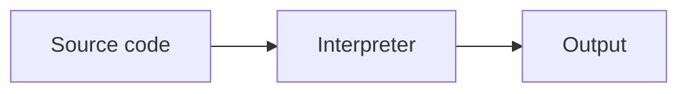

# The Missing Manual — Writer's Manual

Everything a writer needs to add guides. **You only ever edit Markdown files** —
no code. The server reads the `guides/` folder on startup, so new/edited guides
appear after a restart (or the periodic sync).

---

## 1. Folder & file structure

One folder per guide, named with the URL slug (lowercase, hyphens):

```
guides/
  your-guide-slug/
    _guide.md                 ← guide overview (phase 0)
    01-first-chapter.md       ← phase 1
    02-second-chapter.md      ← phase 2
    03-third-chapter.md       ← phase 3
```

- A guide is **3 phases** by convention (can be 2–5). Each phase = one `NN-title.md`.
- `_guide.md` is the landing/overview page for the guide.
- File names: `NN-kebab-title.md` where `NN` is the zero-padded phase number.

---

## 2. Frontmatter (the `---` block at the top)

**Every file** starts with YAML frontmatter.

`_guide.md` (the overview — note `phase: 0`, plus `category` and `order`):

```yaml
---
title: "How the Internet Actually Works"
guide: "how-the-internet-works"     # must equal the folder slug
phase: 0
summary: "One or two sentences describing the whole guide."
tags: [networking, internet, dns, beginner-friendly]
category: networking                # which topic it appears under
order: 1                            # sort order within the category
difficulty: beginner                # beginner | intermediate | advanced
synonyms: ["how does the internet work", "what happens when a page loads"]
updated: 2026-06-22                 # YYYY-MM-DD, bump when you edit
---
```

Each phase file (`NN-*.md`) — same shape, no `category`/`order`, real `phase` number:

```yaml
---
title: "The Journey of One Request"
guide: "how-the-internet-works"
phase: 1
summary: "What this chapter covers, in 1–2 sentences."
tags: [networking, packets, request-response]
difficulty: beginner
synonyms: ["what happens when i load a website", "how does data travel"]
updated: 2026-06-22
---
```

`summary` and `synonyms` matter a lot: they power search, the "did you mean",
and how AI/answer engines surface the guide. Write synonyms as the real
questions a person would type.

---

## 3. The body — normal Markdown

Headings (`##`), prose, lists, `code`, bold, links, images. End each phase with
the standard navigation line:

```
---

[← Phase 1: …](01-….md) · [Guide overview](_guide.md) · [Phase 3: … →](03-….md)
```

Place any playground or quiz **just above** that navigation line, with a short
lead-in sentence.

---

## 4. Interactive playgrounds  ← add nothing but a fenced block

Drop a fenced code block whose "language" is `playground-<type>`. The site swaps
it for the live widget automatically.

````
Step through it yourself:

```playground-sorting
```
````

Most need **no content** (leave the fence empty). Three take optional config on
the lines inside:

| Type | Config inside the fence |
|------|-------------------------|
| `playground-regex` | line 1 = the regex pattern, the rest = sample text to match |
| `playground-ds` | one word: `array`, `stack`, `queue`, `map`, or `set` |
| `playground-tokens` | default text to tokenize |

Example with config:

````
```playground-regex
\d{3}-\d{4}
Call 555-1234 or 555-9876.
```
````

**Available types** (good fits for Python guides in **bold**):
**terminal**, **regex**, git, network, subnet, base, hash, chmod, **bigo**,
**sorting**, **ds**, **json**, cron, **unittest**, eventloop, dns, tcp, lru, lb,
cors, http, join, gc, tokens, embed.

(`eventloop` illustrates the JavaScript event loop — fine for context, but
Python's async model differs, so use sparingly in Python guides.)

---

## 5. Runnable code  ← reader can edit & run it in the browser

Add the word `runnable` after the language on a normal code fence. Python runs
via Pyodide in the browser (also `js` and `sql`):

````
```python runnable
def greet(name):
    return f"Hello, {name}!"

print(greet("world"))
```
````

Use this generously in Python guides — let readers run and tweak each example.

---

## 6. Diagrams (optional)

A `mermaid` fence renders a diagram:

````

````

---

## 7. Quizzes  ← author them right in the Markdown

Add a `quiz` fenced block holding a **JSON array** of questions. Put it near the
end of the phase (before the navigation line).

````
```quiz
[
  {
    "q": "What does a Python list comprehension return?",
    "choices": ["A generator", "A new list", "Nothing"],
    "answer": 1,
    "explain": "It builds and returns a new list."
  },
  {
    "q": "Which is mutable?",
    "choices": ["tuple", "list", "str"],
    "answer": 1
  }
]
```
````

Rules:
- `answer` is the **0-based index** of the correct choice (0 = first).
- `explain` is optional; it appears after the reader answers.
- Keep it **2–3 questions** per phase, focused on the one idea that must stick.
- Valid **JSON**: double quotes, commas between items, no trailing commas.

What quizzes do automatically:
- A **perfect score** marks the guide complete in the reader's learning path
  (and fires a small celebration).
- Finishing a quiz enrolls the chapter into **spaced review**.
- The questions also feed **FAQ structured data** (helps search/answer engines).

(If a phase has no `quiz` block, no quiz shows — totally fine to add them later.)

---

## 8. Pre-publish checklist

- [ ] Folder named with the slug; files `NN-title.md` + `_guide.md`.
- [ ] Frontmatter complete on every file; `guide:` equals the folder name; `updated:` set.
- [ ] `summary` + `synonyms` written as real reader questions.
- [ ] Each phase ends with the `[← prev] · [Guide overview] · [next →]` line.
- [ ] Playgrounds/quizzes placed above that line, with a lead-in sentence.
- [ ] Quiz JSON is valid (answers are 0-based).
- [ ] Runnable Python snippets actually run.

New guides go live after the server restarts / re-syncs the `guides/` folder.

---

## Quick reference

| I want to… | Put this in the Markdown |
|------------|--------------------------|
| Interactive widget | ` ```playground-<type> ` (empty, or config inside) |
| Runnable Python | ` ```python runnable ` |
| Diagram | ` ```mermaid ` |
| Quiz | ` ```quiz ` + JSON array |
