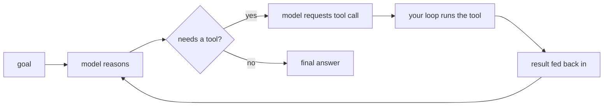

# An Agent Is a Loop

You ask a plain chatbot "what's the weather in Oslo right now?" and it tells you, confidently, something it cannot possibly know. It has no window, no thermometer, no live feed - it's a text predictor frozen at training time. That gap is the whole reason agents exist. An agent is what you get when you stop expecting the model to *know* everything and start letting it *go find out*.

Here's the picture to carry through this entire guide: an agent is a language model given **tools** and a **loop**. The model thinks, picks a tool, you run it, you feed the result back, and the model thinks again - around and around until the task is done. That's it. There's no second brain. The same model that writes your emails is the one "driving," except now it can press buttons in the real world.

## The three parts, and who owns each

Strip an agent down and exactly three pieces remain. Knowing which ones *you* control and which one the *model* controls is the single most clarifying thing in this whole topic.

```text
  ┌──────────────────────────────────────────────┐
  │  1. THE MODEL - reasons, decides what to do  │  ← the model owns this
  │  2. THE TOOLS - functions it's allowed to call│  ← you define these
  │  3. THE LOOP - runs tools, feeds results back│  ← you write this
  └──────────────────────────────────────────────┘
```

*What just happened:* We split the agent into the part that decides (the model) and the parts that act and orchestrate (your code). The model never actually *runs* anything - it can only ask. Your loop is the hands; the model is the head. Keep that division in your head and agents stop being mysterious.

The most common beginner misread is thinking the model "does things." It doesn't - it emits a request ("please call `get_weather` with city = Oslo") and waits. Your code reaches out to the weather service, gets the number, and hands it back. The model proposes; your loop disposes.

## One call versus a loop of calls

A normal LLM feature is a single round trip: you send a prompt, you get text, you're done. An agent is that same call placed inside a `while` loop that keeps going until the model says "I'm finished."

```text
  PLAIN LLM CALL              AGENT
  ─────────────              ─────────────────────────────
  prompt ─► model ─► text     loop:
                               prompt ─► model ─► "call tool X"
                               run tool X ─► result
                               feed result back ─► model ─► "call tool Y"
                               run tool Y ─► result
                               feed result back ─► model ─► "done: <answer>"
                              end loop
```

*What just happened:* The only structural difference between a chatbot and an agent is the loop. One call answers from memory; a loop lets the model gather facts it didn't have, one tool call at a time, and revise its plan as results come in. That repetition is the entire upgrade.

## The cycle, step by step

Every trip around the loop follows the same rhythm. People call it the **reason-act cycle** (or "ReAct"), but you can read it plainly: think, do, look, repeat.



*What just happened:* The loop only ever exits through one door - the model deciding it has enough to answer and producing a final response instead of another tool request. Until then it keeps circling: reason, request, run, read. Notice the tool result flows *back into* the model on the next turn; that feedback is what lets the agent course-correct instead of committing to a blind plan up front.

## A concrete walk-through

Say the goal is: "Is the office in Oslo open right now?" Answering needs two facts the model doesn't have - the current time in Oslo, and the office hours. Watch the loop earn the answer.

```text
TURN 1  model: "I need the current time in Oslo."
        → requests: get_time(city="Oslo")
        your loop runs it → "2026-06-30 19:40"
TURN 2  model: "Now I need the office hours."
        → requests: lookup_hours(office="Oslo")
        your loop runs it → "Mon–Fri 09:00–18:00"
TURN 3  model: "19:40 is past 18:00 on a weekday."
        → no tool needed → final answer: "No, it closed at 18:00."
```

*What just happened:* The model decomposed one question into two lookups, ran them in sequence, then reasoned over the combined results to answer. No single tool gave the answer - the *loop* did, by letting the model gather and then conclude. This is the difference between an agent and a glorified search box.

> 💡 **Key point.** An agent's intelligence isn't only in the model - it's in the loop closing. The model is smart at deciding *what to fetch* and *what the results mean*; your loop is what makes those fetches actually happen and keeps the conversation moving until there's an answer.

## For builders

When you build one, the loop is yours and it's small - often a few dozen lines. You hold a running list of messages, call the model, check whether the reply is a tool request or a final answer, run the tool if asked, append the result to the message list, and call again. The model supplies the brains; you supply the plumbing, and the plumbing is where bugs and runaway costs live (that's all of Phase 3). The takeaway for now: the loop is *ordinary code*, and you are fully in charge of it.

> ⚠️ **Gotcha - the model can't stop itself.** Nothing in the model guarantees it ever decides "done." If your loop has no limit, a confused agent will circle forever, billing you every turn. The stop conditions are *your* job, not the model's. We make this a hard rule in [Phase 3](03-where-agents-go-wrong.md).

```quiz
[
  {
    "q": "What are the three parts of an AI agent?",
    "choices": [
      "A model, a database, and a user interface",
      "A model, a set of tools, and a loop",
      "Two models checking each other and a referee",
      "A prompt, a fine-tuned model, and a GPU"
    ],
    "answer": 1,
    "explain": "An agent is a language model given tools it can call and a loop that runs those tools and feeds results back until the task is done."
  },
  {
    "q": "When the model 'calls a tool,' what actually happens?",
    "choices": [
      "The model executes the function itself, internally",
      "The model requests the call, and your loop's code runs the tool and returns the result",
      "The tool runs inside the training data",
      "Nothing - tool calls are just suggestions the user runs by hand"
    ],
    "answer": 1,
    "explain": "The model only proposes a call. Your code is what actually runs the tool and hands the result back on the next turn. The model is the head; your loop is the hands."
  },
  {
    "q": "What is the one structural difference between a plain LLM feature and an agent?",
    "choices": [
      "Agents use a bigger, more expensive model",
      "Agents wrap the model call in a loop that repeats until the model signals it's done",
      "Agents never hallucinate",
      "Agents run entirely on the user's device"
    ],
    "answer": 1,
    "explain": "A plain feature is a single request-response. An agent puts that same call inside a loop, letting the model gather facts and revise its plan across multiple turns."
  }
]
```

[← Guide overview](_guide.md) · [Phase 2: The Reasoning-Acting Cycle →](02-the-reasoning-acting-cycle.md)
