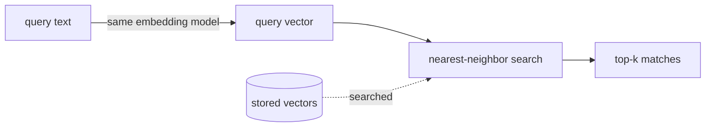

# Measuring Similarity — From "Near" to Search by Meaning

In [Phase 1](01-meaning-as-coordinates.md) you learned that meaning becomes coordinates, and that *close* means *similar*. But we waved a hand at the most important word: "close." A computer can't squint at a map. It needs a number — a single value that says "these two vectors are 0.91 similar" or "these are basically unrelated."

This phase makes "close" precise, gently, and then shows you the payoff: once you can measure closeness, **search by meaning falls out almost for free.** You embed the question, you find the nearest stored vectors, you return what they point to. That's it. That's semantic search.

## The intuition: same direction means same meaning

**What it actually is.** The most common way to measure similarity between two embeddings is **cosine similarity**. The mental model: forget the dots on the map for a second and picture an *arrow* drawn from the origin out to each point. Cosine similarity asks one question — **do these two arrows point the same way?**

```text
        ^                  arrow A: "a small fluffy cat"
        |   A   B          arrow B: "a tiny furry kitten"
        |  ╱  ╱            → point almost the SAME direction
        | ╱ ╱              → cosine similarity ≈ 1  (very similar)
        |╱╱
        +───────────────>
        |╲
        | ╲    C           arrow C: "quarterly tax filing"
        |  ╲               → points a totally different way
        v   C              → cosine similarity ≈ 0  (unrelated)
```

*What just happened:* Arrows A and B point in nearly the same direction, so their cosine similarity is near 1 — the system reads them as meaning almost the same thing. Arrow C heads off elsewhere, so its similarity to A is near 0 — unrelated. Cosine similarity ignores how *long* each arrow is and cares only about its *direction*, which turns out to be exactly what you want for comparing meaning.

📝 **Terminology — cosine similarity.** A single number, between -1 and 1, that measures how aligned two vectors are. **1** = pointing the same way (most similar). **0** = at right angles (unrelated). **-1** = pointing opposite ways. In practice with text embeddings you'll mostly see values between 0 and 1, and "higher = more similar."

**Why people get this wrong.** The frequent confusion is between *similarity* and *distance* — they're two sides of the same coin and people mix up which way is "good." Higher cosine **similarity** means *more* alike (1 is best). Smaller **distance** means *more* alike (0 is best). Some tools report one, some report the other; a few use plain straight-line (Euclidean) distance instead of cosine. The headache isn't the math — it's forgetting which direction means "better" in the tool in front of you.

⚠️ **Gotcha — know whether your tool returns "bigger is better" or "smaller is better."** If you sort results the wrong way, you'll proudly return the *least* relevant matches and wonder why search feels broken. Before you trust any ranking, confirm: is this a similarity score (sort descending) or a distance (sort ascending)? Check the tool's docs once; it saves a baffling afternoon.

## Semantic search: embed the query, find the nearest neighbors

This is the whole point. Everything so far was setup for this one move.

**What it actually is.** **Semantic search** means searching by meaning instead of by matching words. You do it in three steps:

1. **Ahead of time:** embed every document you want to be searchable, and store the vectors.
2. **At search time:** embed the user's query with the *same model*.
3. Find the stored vectors **nearest** to the query vector, and return whatever they point to.

That third step — "find the nearest stored vectors to this one" — has a name: **nearest-neighbor search**.



📝 **Terminology — nearest-neighbor search.** Given one query point, find the stored points closest to it. "Find the 5 nearest" is a *k-nearest-neighbors* search, often written `k=5`.

**What it does in real life.** Here's the move in plain terms, with a small library of stored documents:

```text
   STORED (embedded once, ahead of time)
   ┌────────────────────────────────────────────────┐
   │ doc1  "How to reset your password"              │
   │ doc2  "Recovering a lost account login"         │
   │ doc3  "Our refund and returns policy"           │
   │ doc4  "Office holiday hours for December"        │
   └────────────────────────────────────────────────┘

   QUERY:  "I can't get into my account"
              │
              ├─ embed with the SAME model → query vector
              │
              ▼
   compare query vector to every stored vector (cosine similarity):

      doc2  "Recovering a lost account login"     0.89   ◄── nearest
      doc1  "How to reset your password"          0.81
      doc3  "Our refund and returns policy"       0.12
      doc4  "Office holiday hours for December"    0.05
```

*What just happened:* The query "I can't get into my account" shares **no words** with doc2 ("Recovering a lost account login") — not one. A keyword search for "account" would miss the *intent* entirely, and a search for the exact phrase would return nothing. But in meaning space, "can't get into my account" and "recovering a lost account login" point almost the same direction, so doc2 scores highest. The system understood the *problem*, not the vocabulary. The low scores on doc3 and doc4 correctly push the irrelevant stuff to the bottom.

💡 **Key point.** This is the superpower in one line: **semantic search matches meaning, so it handles synonyms and paraphrase automatically.** "Car" finds "automobile." "How do I cancel" finds "ending your subscription." "It's broken" finds "troubleshooting a malfunction." You didn't write any synonym lists — the embedding model already knows these things mean the same.

## Where it beats keyword search — and where it doesn't

Be honest about the trade, because semantic search is not strictly better than keyword search; it's *different*, and the best systems often use both.

| Situation | Keyword search | Semantic search |
|---|---|---|
| Query uses different words than the doc ("can't log in" vs "account recovery") | Misses it | Finds it |
| Synonyms / paraphrase / typos in meaning | Misses unless you maintain synonym lists | Handles naturally |
| Exact match needed: an error code, a SKU, a function name like `parseDate` | Nails it | May drift to "similar-looking" but wrong results |
| Rare proper noun the model never learned well | Finds the literal string | Can fumble it |
| Explaining *why* a result matched | Easy — show the matched word | Hard — "the vectors were close" isn't satisfying |

*What just happened:* Each method wins where the other is weak. Keyword search is literal and precise; semantic search is flexible and meaning-aware. That's why production search frequently runs **both** and blends the rankings — a pattern called *hybrid search*. You don't have to choose a side; you choose per query, or run both and merge.

⚠️ **Gotcha — exact identifiers are semantic search's blind spot.** If a user searches for the error code `ERR_2048` or the part number `XJ-9920`, embeddings may happily return things that *look or feel* similar instead of the exact match. Anything where the literal string is the point — codes, IDs, names — is where you want keyword matching in the mix. Knowing this up front stops you from blaming the embedding model for doing exactly what it was built to do.

**Why this saves you later.** Almost every "AI that finds the right thing" feature — support-article search, recommendation, deduplication, and the retrieval step inside chatbots — is this exact pattern: embed, find nearest, return. When you go to build [RAG](/guides/rag-explained), the "retrieval" half *is* the semantic search you just learned. Nothing new to invent; you'll just feed the results to a language model.

## Recap

1. **Cosine similarity** measures whether two vectors point the same direction: **1 = most similar, 0 = unrelated.**
2. **Similarity** (bigger is better) and **distance** (smaller is better) are two ways to say the same thing — always know which your tool returns.
3. **Semantic search** = embed every document ahead of time, embed the query with the *same model*, return the **nearest neighbors**.
4. Because it matches *meaning*, it handles **synonyms and paraphrase for free** — its biggest advantage over keyword search.
5. It's **weak on exact identifiers**; serious systems often blend semantic and keyword search.

You can now reason about search by meaning end to end on a small library. The last question is the practical one: what happens when "compare the query to every stored vector" means comparing against *ten million* of them? That's the next phase — plus the three gotchas that quietly wreck real systems.

---

[← Phase 1: Meaning as Coordinates](01-meaning-as-coordinates.md) · [Guide overview](_guide.md) · [Phase 3: Vector Databases & the Gotchas →](03-vector-databases-and-the-gotchas.md)
