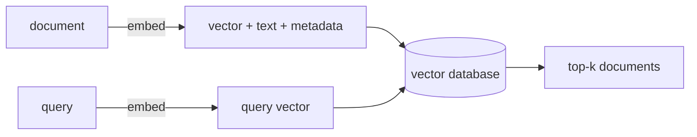

# Vector Databases & the Gotchas — Searching Millions, Without Getting Burned

[Phase 2](02-measuring-similarity.md) compared a query against four documents by hand. Real systems have a hundred thousand support articles, or ten million product descriptions, and a user expects results before they blink — comparing the query against every stored vector one by one gets slow exactly when you need it fast.

This phase covers what separates a toy from a real system: **searching millions of vectors quickly**, and the **three gotchas** that make a system technically work while quietly returning garbage. The gotchas matter more than the tooling — you can swap databases in an afternoon, but a chunking mistake will haunt you for months.

## The gotcha cheat-card

> **Search feeling off? Find your symptom, then read the section.**

| Symptom | Likely cause | The fix |
|---|---|---|
| Results are nonsense / everything looks equally (ir)relevant | Query and documents embedded with **different models** (§4) | Re-embed everything with one model; never mix (§4) |
| Right document exists but never surfaces | Document **chunked** too big/small or split mid-idea (§5) | Rethink chunk size and boundaries; re-embed (§5) |
| Top result is "similar" but factually wrong, and you trusted it | **Similarity ≠ correctness** (§6) | Treat results as candidates, not answers; verify (§6) |
| Search is slow at scale | Doing an **exact** scan over millions of vectors (§2) | Use an **ANN index** / a vector database (§1–2) |

---

## 1. A vector database is a search engine for nearest neighbors

**What it actually is.** A **vector database** is a store built for one job: keep a huge pile of embeddings and, given a query vector, return the nearest ones *fast*. It's the specialized muscle behind Phase 2's "find nearest neighbors" step, scaled to millions of vectors.

**What it does in real life.** You hand it vectors (usually with metadata attached — the original text, an ID, tags), and later a query vector, asking for the top `k` nearest:

*What just happened:* Same shape as Phase 2's semantic search — embed, find nearest, return. The database adds the speed to do "find nearest" across an enormous collection in milliseconds, plus the bookkeeping to hand back real text and metadata instead of a bare vector.

## 2. Why "fast" needs approximation: ANN indexes

**What it actually is.** The honest way to find the true nearest neighbors is to compare the query against *every* stored vector and keep the closest — an **exact** search. It's correct, but its cost grows with every vector you add; at ten million vectors, exact-on-every-query is too slow for an interactive app.

The escape is an **ANN index** — Approximate Nearest Neighbor. It organizes the vectors ahead of time (into graphs or clusters) so query time only checks a small, promising slice instead of everything.

📝 **Terminology — ANN.** A search that returns vectors that are *almost certainly* the nearest, by skipping most of the collection. You trade a tiny bit of accuracy for a large speed gain — it might occasionally miss the true #1 result and return #2 instead, almost always an acceptable trade.

**What it does in real life.** Most vector databases use ANN by default and let you tune how thoroughly it looks — more thorough means more accurate but slower.

⚠️ **Gotcha — "approximate" is in the name for a reason.** If a single miss is unacceptable (say, deduplication that must *never* let a duplicate slip through), either accept exact search's cost or tune the index toward higher accuracy. For ordinary search, the approximation is invisible to users.

## 3. The tools (lightly)

Roughly three flavors, and the right one depends on scale and what you already run:

- **A library you embed in your own code** — **FAISS** (from Meta). You call it directly and own the storage and serving around it. Great for batch jobs and full control.
- **An extension to a database you already have** — **pgvector**, adding vector columns and nearest-neighbor search to PostgreSQL. Keeps vectors next to your existing data: one system, one backup, normal SQL filters alongside vector search.
- **A managed vector database service** — **Pinecone** and similar hosted services. Send vectors over an API and they run the index, scaling, and ops for you.

A sane default: start with **pgvector** if you're already on Postgres, and move to a dedicated service only when scale or features demand it.

> This is a *light* tour on purpose. Picking and tuning a specific vector store is a deep topic of its own; the mental model here transfers to all of them.

## 4. Gotcha: vectors from different models can't be compared

This one produces the most baffling "why is my search returning total nonsense?" bug.

**What's actually happening.** Every embedding model has its **own private map** (hinted at in [Phase 1](01-meaning-as-coordinates.md)). Model A's coordinates for "cat" mean nothing on Model B's map — different spaces, often different lengths. Comparing a vector from one model against one from another is like comparing a latitude in degrees to a temperature in Celsius: the numbers compute, the result is meaningless.

⚠️ **Gotcha — embed your documents and your queries with the same model, always.** The classic disaster: documents embedded months ago with one model, incoming queries embedded with a newer one. Every query "works" (returns results, no errors) but the results are random, because the two live in incompatible spaces. If you **upgrade your embedding model**, you must **re-embed your entire collection** — old and new vectors don't mix. Write the model name down next to your stored vectors so future-you knows what they're in. This is the first thing to check when search suddenly returns garbage after a "harmless" dependency bump or model swap.

## 5. Gotcha: chunking decides what can ever be found

**What it actually is.** You usually can't embed a whole 40-page document as one vector — it would blur every topic into one muddy average, and most models have a length limit anyway. So you split long text into smaller pieces — **chunks** — and embed each separately. Search then finds the relevant *chunk*, not the whole document.

📝 **Terminology — chunking.** Splitting a long document into smaller passages before embedding, so each passage gets its own vector and can be matched on its own.

**Why people get this wrong.** Chunking feels like a boring preprocessing detail, so people slap an arbitrary "split every 500 characters" on it and move on. But chunking sets the ceiling on what your search can *ever* return. Split too **big** and one chunk covers five topics — its vector is a vague average matching everything weakly, nothing strongly. Split too **small** and you slice a single idea in half, so neither half carries the full meaning. Split mid-sentence and you can sever the exact passage that answered the question.

⚠️ **Gotcha — bad chunking is invisible until it isn't.** There are no errors. Search runs, returns results, looks fine in a demo. Then a user asks the one question whose answer got split across a chunk boundary, and the right passage never surfaces — because as a vector, it never existed as a coherent unit. When a document you *know* contains the answer refuses to show up, suspect the chunking before the model. Splitting on natural boundaries (paragraphs, sections) beats any fixed character count.

## 6. Gotcha: similarity is not correctness

**What's actually happening.** This is the deepest trap, because it's not a bug — the system is doing exactly what you asked. Nearest-neighbor search returns the vectors most *similar* to your query. Similar is not the same as **correct**, **true**, or **up to date**.

A document can be the closest match in meaning while being **wrong** (an outdated policy), **stale** (last year's prices), or **plausibly off-topic** (sounds relevant but answers a slightly different question). The search did its job perfectly — it found the nearest neighbor. Whether that neighbor is *right* is a question vectors can't answer.

⚠️ **Gotcha — "the top result" is a candidate, not a verdict.** Treat search results as *suggestions to be checked*, not answers. This matters enormously once you feed them to a language model: hand it a confidently-wrong "most similar" passage and it will often present that wrong information confidently. Being similar does not make an answer true — this is precisely the seam where [RAG, Explained](/guides/rag-explained) picks up, and "similarity ≠ correctness" is *the* reason RAG systems need careful retrieval, source citations, and verification.

## Recap

1. A **vector database** stores millions of embeddings and returns nearest neighbors fast — the muscle behind Phase 2's search.
2. Speed at scale comes from **ANN indexes**, trading a tiny bit of accuracy for a huge speed gain by skipping most of the collection.
3. Tools range from **libraries** (FAISS) to **database extensions** (pgvector) to **managed services** (Pinecone) — same core op, different amounts of ops work.
4. **Never mix models:** documents and queries must be embedded with the *same* model, and upgrading a model means re-embedding everything.
5. **Chunking sets the ceiling** on what can be found — split on natural boundaries, not arbitrary character counts.
6. **Similarity is not correctness:** the nearest match can still be wrong, stale, or off-topic — treat results as candidates to verify.

Meaning becomes coordinates, "near" becomes a number, and a vector database turns that into search across millions — along with the traps that decide whether it works in practice. Feeding these results to a language model to actually answer questions is exactly what [RAG, Explained](/guides/rag-explained) is about.

---

[← Phase 2: Measuring Similarity](02-measuring-similarity.md) · [Guide overview](_guide.md) · [Next guide: RAG, Explained →](/guides/rag-explained)
