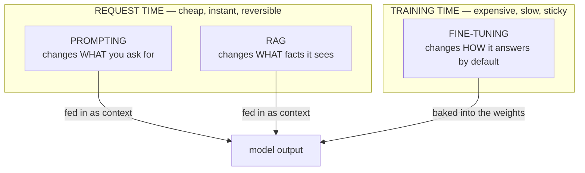

# Three Ways to Steer a Model

Out of the box, a large language model is a generalist. It will write you a sonnet, a SQL query, and a
breakup text with the same shrug of competence. Your job is almost never "use a model" — it's "make *this*
model reliably do *our specific thing*, in *our specific way*." That's steering.

There are exactly three levers you can pull, and the entire fine-tuning-vs-prompting debate comes down to
knowing which lever fixes which problem. Pull the wrong one and you'll spend weeks and a real budget solving
a problem the cheapest lever would have solved in an afternoon. So before any cost discussion, get this
mental model solid.

## The one picture to hold onto

A model's output depends on two things: the **weights** (the billions of numbers baked in during training —
this is the model's "instincts," its defaults) and the **context** (everything you hand it at request time —
the prompt, the conversation, any documents you paste in). Two of your three levers work on the context; one
works on the weights.



*The dividing line that matters most:* **RAG adds knowledge. Fine-tuning teaches behavior.** Almost every
expensive mistake in this space is someone fine-tuning to add knowledge (which RAG does better and cheaper)
or someone trying to prompt their way to a consistent format at scale (which is exactly fine-tuning's job).
Keep reading and that sentence will become something you can act on.

## Lever 1 — Prompting: change the instructions at request time

**What it actually is.** You write the model better instructions. That's the whole lever. You tell it who to
be ("You are a terse senior code reviewer"), what to do, what format to use, and you can show it a couple of
examples right there in the prompt. Nothing about the model changes — you're feeding a generalist a clearer
brief each time you call it.

**What it does in real life.** It's the fastest, cheapest, most reversible way to steer. You edit a string
and the behavior changes on the very next request. No training, no waiting, no infrastructure. Modern models
are startlingly steerable this way — far more than most people assume before they've really tried.

**A real example.** Showing the model two examples inside the prompt ("few-shot" prompting) often gets you
most of the way to a consistent format:

```text
System: Classify each support ticket as BUG, BILLING, or FEATURE.
        Reply with only the label.

User: "I was charged twice this month."        → BILLING
User: "The export button does nothing."        → BUG
User: "Can you add dark mode?"                  → FEATURE
User: "App crashes when I open settings."       →
```

*What just happened:* You didn't change the model at all. You showed it the pattern in the context, and a
capable model will continue it (`BUG`). This is the lever you should exhaust before considering the others,
and it's covered properly in [Prompt Engineering, Honestly](/guides/prompt-engineering-honestly).

**The gotcha.** Prompting has a ceiling. Stuff enough rules and examples into every request and three things
creep up: the prompt gets long (and you pay per token, every single call), the model starts ignoring
instructions buried in the middle, and behavior stays *mostly* consistent rather than *reliably* consistent.
When you hit that ceiling honestly — not in your imagination — that's the first real signal another lever
might be warranted.

## Lever 2 — RAG: inject knowledge at request time

**What it actually is.** RAG (Retrieval-Augmented Generation) means: before you call the model, go fetch the
relevant facts — from your docs, your database, your knowledge base — and paste them into the prompt. The
model then answers using text you handed it a moment ago, instead of relying on whatever it happened to
absorb during training.

**What it does in real life.** It gives a general model *your* specific, current knowledge without changing
the model at all. Your pricing page changed this morning? Update the document; the next answer is correct. A
customer asks about an internal policy the model has never seen? Retrieve the policy doc, hand it over, and
the model reads it like an open-book exam.

**A real example.** Conceptually, RAG turns a closed-book question into an open-book one:

```text
Without RAG:  "What's our refund window?"  → model guesses from generic training → maybe wrong

With RAG:     [retrieve: refund-policy.md]
              "Using the policy below, what's our refund window?
               --- Refunds accepted within 30 days of purchase. ---"
                                          → model reads it → "30 days." (correct, sourced)
```

*What just happened:* The model didn't *learn* your refund policy. It *read* it, at request time, from
context you supplied. Change the policy file and the answer changes immediately — nothing to retrain. The
full machinery (chunking, embeddings, retrieval) lives in [RAG, Explained](/guides/rag-explained).

**The gotcha.** RAG fixes *what the model knows*, not *how it behaves*. It will happily retrieve your refund
policy and then answer in a rambling, off-brand, wrong-format way — because RAG never touched its behavior.
If your problem is "the model doesn't know our facts," RAG is your tool. If your problem is "the model knows
plenty but won't consistently answer in our voice/format," RAG won't help, and that's the doorway to the
third lever.

## Lever 3 — Fine-tuning: change the model's default behavior

**What it actually is.** Fine-tuning takes an existing trained model and nudges its **weights** — the numbers
that *are* the model — by training it further on hundreds or thousands of your own example input/output
pairs. You're not giving it instructions or documents. You're changing its instincts so that the behavior
you want becomes its *default*, with no special prompting required.

📝 **Weights.** The billions of numbers learned during a model's original training. They encode everything
the model "knows" and every habit it has. Prompting and RAG leave the weights untouched; fine-tuning is the
only lever that edits them.

**What it does in real life.** After fine-tuning on, say, three thousand examples of your support replies, the
model writes in your support voice *by default* — terse where you're terse, with your standard sign-off, in
your exact format — even from a bare prompt. The behavior is baked in, so your prompts get shorter (the rules
are now in the weights, not in every request) and the consistency gets tighter than prompting alone reliably
delivers.

**A real example.** The shape of fine-tuning is a file of demonstrations — "when the input looks like this,
this is exactly how I want you to respond":

```text
{"input": "where's my order #4821",
 "output": "Hi! Order #4821 shipped Tuesday — tracking: <link>. Anything else? — Support"}

{"input": "this is broken and I'm furious",
 "output": "I'm really sorry. Let's fix this fast. Can you tell me what you were doing when it broke? — Support"}

   ... a few thousand more pairs in exactly the tone and format you want ...
```

*What just happened:* You're not telling the model rules in prose. You're showing it the behavior, over and
over, and the training process adjusts the weights until that behavior is the path of least resistance. The
voice, structure, and sign-off become *defaults* — not instructions you have to repeat every call.

**The gotcha — the one that costs the most.** Fine-tuning is a poor way to teach *facts*. People assume
"training it on our documents" will make the model *know* our documents. What it mostly learns is the *style*
and *shape* of those documents, not reliable recall of their contents — and any fact that changes next week is
now frozen into weights you'd have to retrain to update. For knowledge, RAG wins almost every time. Hold this
line: **fine-tune for behavior, retrieve for knowledge.**

**Why this saves you later.** When the budget-holder asks "should we train our own model so it knows our
product?", you now have the honest answer ready: training won't reliably make it *know* the product (that's
RAG), and you almost certainly haven't exhausted prompting yet. You've just saved a quarter.

## Recap

1. A model's output comes from its **weights** (its defaults) plus its **context** (what you hand it per
   request). Prompting and RAG work on context; fine-tuning works on weights.
2. **Prompting** changes the *instructions* at request time — cheapest, fastest, fully reversible, but it has
   a ceiling.
3. **RAG** injects *knowledge* at request time — the right tool when the model doesn't know your facts, and
   facts change without retraining.
4. **Fine-tuning** changes the model's *default behavior* by editing its weights — the right tool for
   consistent voice/format/style, the wrong tool for teaching facts.
5. The line that drives every decision: **RAG adds knowledge, fine-tuning teaches behavior.**

Now that you can tell the levers apart, the next phase looks honestly at what pulling the fine-tuning lever
actually takes — because the cost is rarely where people expect it.

---

[← Guide overview](_guide.md) · [Phase 2: What Fine-Tuning Actually Involves →](02-what-fine-tuning-actually-involves.md)
