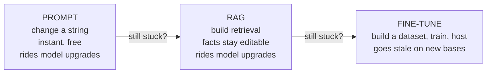

# Choosing - the No-Nonsense Order

You've got the three levers and you know what fine-tuning really costs. Now the decision. There's a default
order that's right far more often than not, and it falls straight out of one principle: **each step up costs
more and locks you in more, so climb only as high as your problem forces you to.**

This phase gives you that order, a table to decide from in the moment, and the traps that catch nearly
everyone - so you can make the call confidently and explain it to whoever's holding the budget.

## The decision table

> **Start here. Find your situation, then read the section below it.**

| Your situation | Reach for | Why |
|---|---|---|
| "It's not following my instructions / format" | **Prompting** first | You almost certainly haven't exhausted it (§1) |
| "It doesn't know our facts / docs / current data" | **RAG** | Knowledge belongs in context, not in weights (§2) |
| "Facts change often (prices, policies, inventory)" | **RAG** | Retrieval updates instantly; weights go stale (§2) |
| "It knows enough but won't answer in our voice/format reliably, at scale" | **Fine-tuning** | This is behavior, and that's fine-tuning's actual job (§3) |
| "We need shorter prompts / lower latency on a narrow, high-volume task" | **Fine-tuning** (likely LoRA) | Bake the rules into weights instead of paying for them every call (§3) |
| "We want it to *know* our product" | **RAG**, not fine-tuning | Training teaches style, not reliable recall (§1, §2) |
| Not sure yet | **Prompting** | Cheapest place to learn what you actually need (§4) |

## 1. Start with prompting - always

**The move.** Before anything else, push prompting until it genuinely stops improving: clear instructions, a
sharp system prompt, a few well-chosen examples in the context, structured output if you need it. Measure
where it lands.

**Why it's first.** It's free in every way that matters - you edit a string, the behavior changes on the next
call, and you can undo it instantly. No dataset to build, nothing to host, nothing to retrain when the base
model improves. Most "we need to fine-tune" problems dissolve here.

⚠️ **The trap to avoid.** "We tried prompting" almost always means "we tried *a* prompt, once, and it wasn't
perfect." That's not exhausting prompting - that's barely starting. Exhausting it means you've seriously
iterated and hit a real ceiling: instructions ignored, prompts ballooning, consistency stuck at *mostly* when
you need *reliably*. Only a real ceiling justifies climbing higher. Full technique lives in
[Prompt Engineering, Honestly](/guides/prompt-engineering-honestly).

## 2. Add RAG when the problem is knowledge

**The move.** If prompting can't fix it because the model *doesn't know* something - your internal docs,
your current data, anything specific or fresh - add retrieval. Fetch the relevant facts and put them in the
context at request time.

**Why it's second, not last.** RAG costs more than prompting (you're building a retrieval pipeline) but far
less than fine-tuning, and critically, it keeps your facts *editable* - change a document, the next answer is
correct, no retraining. Any problem that's really about knowledge should stop here and never reach
fine-tuning. The full build is in [RAG, Explained](/guides/rag-explained).

💡 **Key point.** If you remember one thing from this whole guide, make it this: **never fine-tune to teach
facts.** Facts change, and weights don't update themselves. The instant your knowledge has a shelf life,
retrieval is the right answer.

## 3. Fine-tune when - and only when - the problem is behavior at scale

**The move.** If prompting is genuinely exhausted *and* the problem is behavior rather than knowledge - 
consistent voice, consistent format, consistent style, or a narrow task you run at high volume where you want
the rules baked in - then fine-tune. Reach for parameter-efficient methods like LoRA first (Phase 2).

**The clear "yes" cases.** Fine-tuning earns its cost when:

- You need a **consistent output format or structure** that prompting only achieves *most* of the time, and
  "most" isn't good enough.
- You need a **specific voice, tone, or style** as the reliable default across thousands of calls.
- You have a **narrow, repetitive, high-volume task** where baking the behavior into the weights lets you drop
  a long instruction prompt - saving tokens and latency on every single call, which adds up at scale.

**The clear "no" cases.** Don't fine-tune when:

- The goal is to make the model **know facts** → that's RAG.
- You **haven't seriously exhausted prompting** → climb back down.
- The behavior you want **changes often** → you'd be retraining constantly.
- The volume is **low** → you'll never recoup the dataset and serving cost; a longer prompt is cheaper.

⚠️ **The staleness trap.** A model you fine-tuned today is built on *today's* base model. Better base models
ship regularly - and when they do, your tuned model doesn't automatically inherit the improvements. To move up,
you re-run your fine-tuning on the new base, which means keeping your dataset and pipeline alive indefinitely.
Prompting and RAG ride the upgrades for free; fine-tuning makes you pay for each one. That ongoing tax is part
of the real cost, and it's exactly why fine-tuning sits *last* in the order.

## 4. Why this order, in one breath

*What just happened:* You climb only as far as the problem forces you. Each rung costs more and commits you
more, so the discipline is to *stop at the first rung that actually solves your problem*. Reaching the top is
not a sign of sophistication - reaching exactly the rung you needed is.

## The bottom line, plainly

Fine-tuning is real, useful, and occasionally exactly right - for **behavior** (voice, format, style) on a
**narrow task at scale**, after prompting is genuinely exhausted and RAG doesn't fit because the problem was
never about knowledge. That's a narrower target than the hype suggests. Most teams get where they're going on
prompting and RAG, spend a fraction of the money, and keep the freedom to ride the next better model for free.
If you do climb to fine-tuning, climb on purpose - with a real dataset, a clear baseline, and your eyes open
about the standing cost.

## Recap

1. **Climb the cheapest-first ladder: prompt → RAG → fine-tune.** Each rung costs more and locks you in more;
   stop at the first one that solves your problem.
2. **Prompting first, always** - and "we tried it once" is not "we exhausted it."
3. **RAG for knowledge** - and never fine-tune to teach facts, because facts change and weights don't.
4. **Fine-tune only for behavior at scale** - consistent voice/format/style or a narrow high-volume task,
   after prompting is truly exhausted; start with LoRA.
5. **Mind the staleness tax** - fine-tuned models don't inherit better base models for free; prompting and RAG
   do.

That's the whole decision, plainly put. You can now answer "should we fine-tune our own model?" with a reasoned
order instead of a reflex - and that answer will usually save your team a great deal of time and money.

---

[← Phase 2: What Fine-Tuning Actually Involves](02-what-fine-tuning-actually-involves.md) · [Guide overview](_guide.md)

**Related guides:** [Prompt Engineering, Honestly](/guides/prompt-engineering-honestly) ·
[RAG, Explained](/guides/rag-explained) · [Using an LLM API](/guides/using-an-llm-api)
