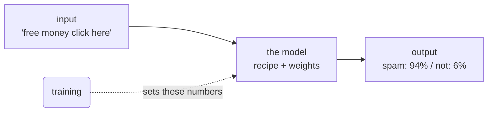

# Data → Weights → Predictions

When someone says "we trained a model," the mind reaches for something almost alive — a little brain
that read a library and woke up clever. That picture is the reason training feels mysterious. So let's
replace it with one that's accurate and far less spooky.

Here's the secret this phase delivers: **a model is a big pile of numbers, and those numbers are the
only thing training ever changes.** Once you see that, everything else in this guide is detail.

## What a model actually is

**What it actually is.** A model is a fixed recipe with a lot of adjustable knobs. The recipe says *how*
to turn an input into an output — multiply this, add that, combine these. The knobs are numbers, and
they decide what the recipe actually produces. Those numbers have a name.

📝 **Terminology.** A **weight** is one of those adjustable numbers inside a model. A real model can
have anywhere from a handful of weights to billions of them. When people say a model has "7 billion
parameters," they mean it has roughly that many of these knobs. *Weight* and *parameter* are used
almost interchangeably.

**Why people get this wrong.** The common picture is that the model *stores the data it was trained on*,
like a database you can search. It doesn't. After training, the original examples are gone; what
remains is the *settings of the knobs* — the weights that the examples produced. The data shaped the
numbers and then left the room.

**What it does in real life.** A trained model is a file full of numbers. You hand it a new input, it
runs that input through the recipe using its current weights, and out comes a prediction. Same recipe
every time; the weights are what make one model good at spotting spam and another good at finishing
your sentences.



## So what is a "prediction"?

**What it actually is.** A prediction is the recipe's output for an input it may never have seen
before. "Prediction" sounds like fortune-telling, but in machine learning it means any answer the model
produces: a label ("this email is spam"), a number ("this house is worth $420,000"), or the next word
in a sentence.

**A real example.** Imagine the simplest possible model: one that guesses a house's price from its
size. The recipe is "price = size × *weight* + *another weight*," and training's whole job is to find
good values for those two weights.

```text
   Before training (random weights):
     1,500 sq ft  ──►  model guesses  $38,000     (wildly wrong)

   After training (weights tuned on real sales):
     1,500 sq ft  ──►  model guesses  $410,000    (close to reality)
```

*What just happened:* Nothing about the recipe changed between those two lines — it's the same
"size × weight" formula both times. Only the two numbers inside it moved. Training looked at real
houses with known prices and slid those numbers until the formula's guesses started matching reality.
That sliding *is* learning.

**The gotcha.** ⚠️ A model can only predict things shaped like what it was trained on. The house model
knows nothing about cars, and feeding it a car's data won't get you a sensible answer — it'll confidently
return a number anyway, because the recipe always produces *something*. A model never says "I don't
know" unless it was specifically built to; by default it always answers, even when the question is
nonsense. Hold onto that — it explains a lot of strange AI behavior later.

**Why this saves you later.** Once "a model is tuned numbers running a fixed recipe" is your mental
picture, the scary words deflate. "Loading the model" means loading those numbers. "The model is 4 GB"
means the numbers take up 4 GB. "Fine-tuning" means nudging numbers that were already mostly set. You
can reason about all of it instead of treating it as a black box.

## Recap

1. A **model** is a fixed recipe plus a large set of adjustable numbers called **weights** (a.k.a.
   parameters).
2. Training only ever changes those weights — it does not store the original data inside the model.
3. A **prediction** is the recipe's output for a given input, using the current weights.
4. A model always produces *some* answer, even for inputs it has no business answering — being right is
   what training is for.

Now we know *what* training changes. Next: *how* it figures out which way to nudge each number.

Watch it animated: [training vs. inference](/explainers/TrainingInference.dc.html)

---

[← Guide overview](_guide.md) · [Phase 2: Learning by Being Wrong →](02-learning-by-being-wrong.md)
