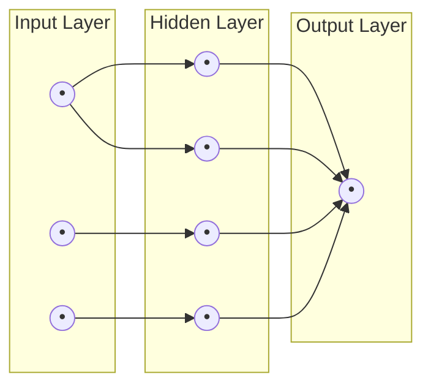

# Neurons, Layers, and What "Network" Means

Strip away the buzzwords and a neural network is a structure for turning numbers into other numbers, arranged in a specific shape: numbers move through a sequence of stages, each doing a small transformation, until you're left with an answer. That's the whole shape. Everything else in this guide is detail on top of that one idea.

## The three kinds of layers

A neural network is organized into **layers** - groups of units arranged side by side, stacked one after another. Every network has exactly two layers with fixed jobs, and any number of layers in between:

- **The input layer** receives the raw data. If you're classifying an image, this is where the pixel values enter. If you're predicting house prices, this is where square footage, bedroom count, and location enter, each as a number. The input layer doesn't compute anything - it's just the network's on-ramp, one slot per piece of input data.
- **The output layer** produces the final answer. For a network that decides "cat or dog," this is two slots, each ending up holding something like a confidence score. For a network predicting a single price, it's one slot holding one number.
- **Hidden layers** sit between the two, and this is where the actual computation happens. They're called "hidden" because you never look at their values directly - you feed the input in one end and read the output at the other end, and what happens in between is intermediate work the network does for itself.



*What this diagram means:* data enters on the left, one slot per input value, passes through a hidden layer where every unit is connected to every unit in the layer before it, and lands on the right as one or more output values. A network with more than one hidden layer stacked between input and output is what "deep learning" literally refers to - "deep" means "has multiple hidden layers," nothing more mystical than that.

📝 **Terminology:** the pattern where every unit in one layer connects to every unit in the next is called a **fully connected** (or **dense**) layer. It's the simplest and most common arrangement, though not the only one - networks built for images or sequences often use more specialized connection patterns. This guide sticks to the fully connected case, since it's the shape the rest of the anatomy is easiest to see in.

## What a single neuron structurally is

Zoom into one of those circles - a single **neuron** (also called a **unit** or **node**, all the same thing) - and structurally, it's just two things wired together:

1. A set of **inputs**, each arriving along one of the connecting lines from the previous layer.
2. A single **output**, sent forward along its own connecting lines to the next layer.

That's the entire structural shape: several numbers come in, one number goes out. Every neuron in a hidden or output layer works this way. What determines what number comes out - given the numbers that came in - is what Phase 2 is about. For now, the important thing is the shape: a neuron is a small unit with many inputs and one output, and a layer is a row of these units all doing their own version of the same job in parallel.

```text
Input layer   -> one slot per feature in your raw data, no computation
Hidden layer  -> the actual computation; can be one layer or many stacked
Output layer  -> one slot per number the network is meant to produce
```

## Why "network" and not just "layers"

The word "network" is doing real work here, not just sounding technical. A neuron doesn't only send its output to one place - it typically sends the exact same output value along a connection to *every* neuron in the next layer (in the fully connected case above). So the overall structure isn't a straight line of single connections; it's a dense mesh of connections between every pair of adjacent layers, which is exactly what a network - in the graph-theory sense, nodes connected by many edges - actually is.

This matters structurally because it means a single input value can influence *every* neuron in the next layer, and by extension, every neuron after that, all the way to the output. No one hidden neuron sees "the whole picture" of the input on its own, but by the time you reach the output layer, every output number has been shaped, in some tiny way, by every input number. That's the structural reason a network can represent something as complicated as "is this a picture of a cat" from raw pixel values: not because any one neuron is smart, but because there are enormous numbers of these small connections layered on top of each other.

The remaining question - and it's the one that actually gives a neuron its computational power - is what exactly a neuron *does* with the numbers arriving on all those input connections before it produces its one output number. That's Phase 2.

[← Overview](_guide.md) | [Phase 2: Weights, biases, and activation functions →](02-weights-and-activations.md)
