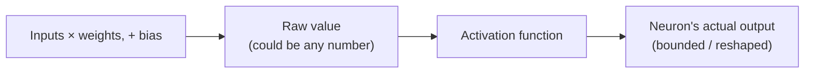

# Weights, Biases, and Activation Functions

Phase 1 left one question hanging: given several numbers arriving at a neuron, how does it turn them into the one number it sends onward? The answer has exactly two steps, done in order, every time, by every neuron in every hidden and output layer. Once you have those two steps, you have the entire computational engine of a neural network — the rest is just this pattern, repeated at scale.

## Step one: a weighted sum

Every connection arriving at a neuron carries a **weight** — a number that says how much importance that particular input gets. A neuron doesn't just add up its inputs plainly; it multiplies each input by its own weight first, then adds up the results.

```text
weighted sum = (input_1 × weight_1) + (input_2 × weight_2) + (input_3 × weight_3) + ...
```

*What this means:* if `weight_1` is large, that input has a big say in the neuron's behavior. If a weight is near zero, that input is effectively being ignored, no matter what value it carries. If a weight is negative, that input actually pushes the sum *down* rather than up. Structurally, the weights are what encode everything the network has "learned" — how those specific numbers get set is the subject of a separate guide, but the two things to hold onto here are: every connection has its own independent weight, and the weighted sum is just each input scaled by how much it matters, added together.

On top of the weighted sum, a neuron adds one more number: the **bias**. It's a single value, one per neuron, added after the weighted sum:

```text
neuron's raw value = weighted sum + bias
```

The bias exists to shift the neuron's output up or down independent of its inputs — think of it as the neuron's baseline tendency, the value it produces even when every input is zero. Without a bias, every neuron would be stuck passing exactly through zero when its inputs are all zero, and there'd be no way to represent something like "this neuron should activate readily" versus "this neuron should be hard to trigger" as a separate, tunable knob from the weights themselves.

## Step two: squash it through an activation function

Here's where it gets interesting. If a neuron stopped at the weighted sum plus bias, its output would just be one plain number, capable of growing arbitrarily large or arbitrarily negative depending on the inputs. Instead, that raw value gets passed through an **activation function** — a fixed mathematical shape that takes the raw number in and produces the neuron's actual output.

A few common activation functions, structurally:

- **ReLU** (Rectified Linear Unit) — the simplest and most widely used today. It passes positive values through unchanged, and turns any negative value into zero. Structurally: "if it's positive, keep it; if it's negative, kill it."
- **Sigmoid** — squashes any input, however large or small, into a value between 0 and 1. Useful when you want a neuron's output to look like a probability.
- **Tanh** — similar to sigmoid in shape, but squashes into a range between -1 and 1 instead of 0 and 1.



*What this diagram means:* the weighted sum and bias produce one unshaped number, and the activation function is a deliberate, fixed reshaping step applied to that number before it's allowed to leave the neuron. Different activation functions reshape it differently, but every neuron in a typical hidden layer applies the same one, consistently, every time.

## Why the activation function isn't optional

This is the part that looks like a minor implementation detail and is actually load-bearing for the entire idea of a "deep" network. Here's the problem if you skip it: a weighted sum plus a bias, with nothing else applied, is a **linear** operation — scaling and adding, nothing more. And here's the fact about linear operations that breaks everything: stacking linear operations on top of each other, no matter how many layers you use, produces something that is *still just one linear operation* overall.

Concretely: if every neuron in every layer only ever computed a weighted sum with no activation function, a 50-layer network would behave *exactly* the same as some single, one-layer network doing one weighted sum — mathematically collapsible into it, every time. All that depth, all those neurons, all those weights, would buy you nothing beyond what a single layer could already do. You could stack a thousand purely linear layers and it would still only be capable of representing straight lines and flat planes — never a curve, never a genuine "if this AND that, but not the other thing" kind of decision boundary.

> Stacking linear layers without a non-linear activation function between them is mathematically pointless — no matter how many you stack, the result collapses into one single linear function.

The **non-linear** activation function is what breaks that collapse. Because ReLU, sigmoid, and similar functions bend the numbers — they don't just scale and shift, they reshape the relationship — stacking layers *with* a non-linearity between them genuinely builds something new at each layer, something the previous layers alone couldn't already express. This is the actual reason "deep" networks with many layers can represent extremely complicated relationships (recognizing a face, understanding language) that a single layer fundamentally cannot: not because there are more numbers involved, but because each non-linear bend lets the next layer build on a genuinely more complex shape than the one before it.

```quiz
[
  {
    "q": "What are the two things a neuron computes, in order, before producing its output?",
    "choices": [
      "A random number, then a fixed lookup",
      "A weighted sum plus a bias, then the result passed through an activation function",
      "An average of its inputs, then a rounding step",
      "A comparison against every other neuron in the layer"
    ],
    "answer": 1,
    "explain": "Every neuron multiplies each input by its weight, sums the results, adds its bias, and then reshapes that raw value through an activation function."
  },
  {
    "q": "What does a weight control in a neural network?",
    "choices": [
      "How many layers the network has",
      "How much a specific input contributes to a neuron's weighted sum",
      "The order in which neurons are computed",
      "Whether a neuron is part of the input or output layer"
    ],
    "answer": 1,
    "explain": "Each connection has its own weight, which scales that specific input's contribution — a near-zero weight effectively ignores the input, a negative weight pushes the sum down."
  },
  {
    "q": "What happens if you remove the non-linear activation function from every neuron in a multi-layer network?",
    "choices": [
      "Nothing changes; activation functions are purely cosmetic",
      "The network trains faster with no downside",
      "The entire stack of layers collapses into a single equivalent linear function, no matter how many layers there are",
      "The network can only produce negative numbers"
    ],
    "answer": 2,
    "explain": "Stacked linear operations (weighted sums with no non-linearity) always reduce to one linear operation overall. The non-linear activation function is what lets depth actually add representational power."
  }
]
```

Watch it animated: [how a neural network is structured](/explainers/NeuralNetwork.dc.html)

[← Phase 1: Neurons, layers, and what "network" means](01-neurons-and-layers.md) | [Overview](_guide.md) | [Phase 3: The forward pass →](03-the-forward-pass.md)
