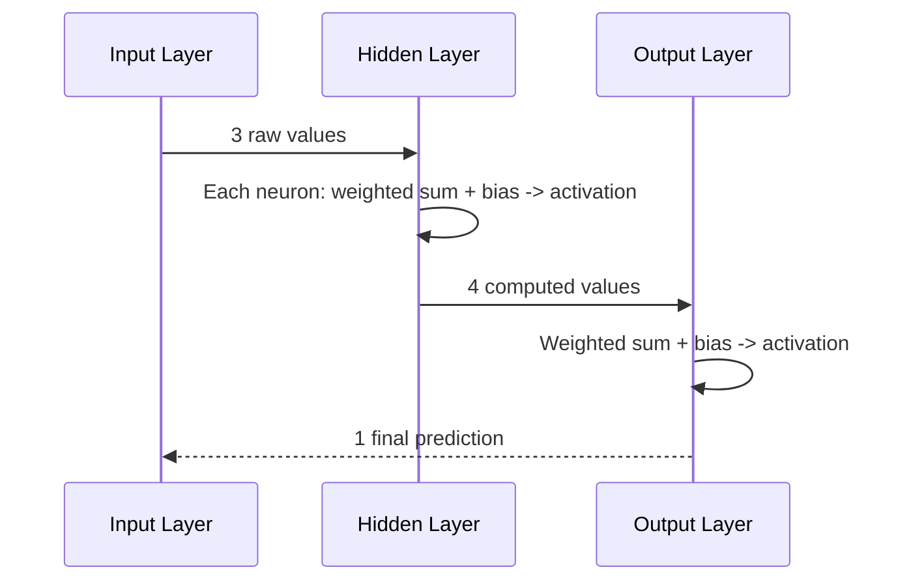

# The Forward Pass

You now have every piece: layers arranged input to output, neurons that each compute a weighted sum plus a bias and reshape it through an activation function, and connections carrying values from one layer to the next. This phase puts it all in motion - following one prediction as it travels through the whole structure, start to finish.

## What "forward pass" means

The **forward pass** is the name for this entire journey: feeding one set of input values into the input layer, and following the computation, layer by layer, until a final value emerges from the output layer. It's called "forward" because data only ever moves in one direction through it - from input toward output, never backward - during this particular operation. (Tuning the weights, covered elsewhere, does involve information flowing backward through the network - which is exactly why that direction gets its own name and its own guide, rather than being folded into this one.)

## Walking through one pass, layer by layer

Say you have a small network: 3 input values, one hidden layer with 4 neurons, and 1 output neuron - structurally the same shape from Phase 1's diagram. Here's what actually happens to a single set of inputs:

```text
Step 1: The 3 input values enter the input layer unchanged.
         (e.g. square footage, bedroom count, distance to downtown)

Step 2: Each of the 4 hidden neurons receives all 3 input values.
         Each hidden neuron independently computes:
           its own weighted sum of the 3 inputs, using its own weights
           + its own bias
           -> passed through its activation function
         Result: 4 output numbers, one per hidden neuron.

Step 3: The single output neuron receives all 4 hidden-layer outputs.
         It computes:
           its own weighted sum of those 4 values, using its own weights
           + its own bias
           -> passed through its activation function (or none, for some outputs)
         Result: 1 final number - the network's prediction.
```

*What just happened:* the same two-step recipe from Phase 2 - weighted sum plus bias, then activation function - ran once per neuron, and it ran in a strict order: every neuron in the hidden layer had to finish before the output neuron could start, because the output neuron's inputs *are* the hidden layer's outputs. Nothing skips ahead. Each layer fully finishes its computation before the next layer can begin, which is exactly what makes this a well-defined, one-directional flow rather than a tangle.



*What this diagram means:* the whole forward pass is a strict relay - each layer waits for the complete output of the layer before it, transforms it, and hands off a new set of values to the next layer. By the time the process reaches the arrow back to the start, that's purely showing "this is the answer that came out," not data actually flowing backward.

## Why this is called "inference"

When a trained network is used to make a prediction on new data - a photo it's never seen, a house it's never priced - running the forward pass on that input is called **inference**. It's worth being precise about what is and isn't happening during inference: the weights and biases throughout the network are already fixed numbers at this point, set once beforehand. A forward pass, including every inference request your app ever makes to a trained model, does not change a single weight. It's purely a read-and-compute operation: take the fixed weights, take the new input, run the relay described above, get an answer.

> A forward pass never changes the network. It's the network, exactly as it currently is, computing one answer for one input.

This is also why the same input, run twice through the same trained network, always produces the exact same output - there's no randomness or memory involved in the structure itself (some networks deliberately introduce randomness during training as a technique, but the raw forward-pass mechanism described here is a fixed, repeatable computation).

## Where the weights actually come from

Everything in this guide assumed the weights and biases already had sensible values - Phase 2 talked about what a weight *does*, never about how it ends up being 0.73 instead of some other number. That's a deliberate boundary. How a network starts with random, useless weights and gradually adjusts them until the forward pass described above actually produces good predictions is a genuinely separate topic, involving comparing the network's output to the right answer and pushing the weights in a direction that reduces the error. If you want that half of the picture, that's exactly what [how a model learns](/guides/how-a-model-learns) covers - how the weights actually get set is a separate topic from the structure that carries them.

For now, the anatomy is complete: layers of neurons, each computing a weighted sum plus a bias and reshaping it through a non-linear activation function, relaying values forward from input to output. That structure is the same whether the network is freshly initialized with random junk or fully trained and state-of-the-art - training only ever changes the numbers sitting inside this same shape.

[← Phase 2: Weights, biases, and activation functions](02-weights-and-activations.md) | [Overview](_guide.md)
