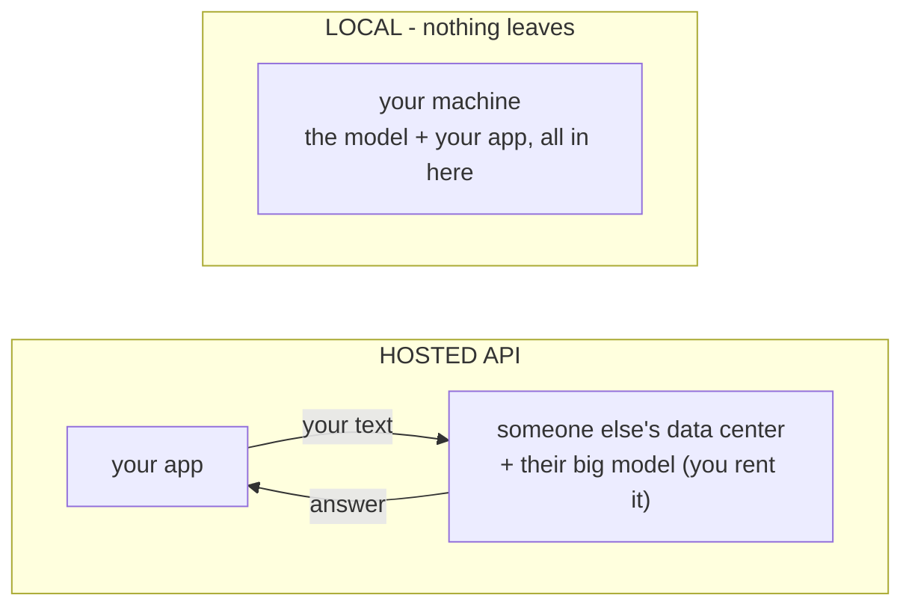

# Why (and Why Not) Run Locally

Before you spend an evening downloading models, it's worth being clear about what you're actually getting. Running a model locally is not "the same thing, but free." It's a genuinely different deal - better in some ways that matter a lot, worse in ways that matter just as much. The people happiest running models locally went in knowing exactly which trade they were making.

Let's lay both sides on the table, then talk about when local is the right call.

## The mental model: where does the model live, and who pays for the compute?

**What it actually is.** There are only two places a large language model can run: on a computer you control, or on a computer someone else controls. That single fact drives almost every trade-off in this phase.

When you call a **hosted API** - OpenAI, Anthropic, and the rest - your text travels over the internet to their data center, runs through a model on their hardware, and the answer travels back. You rent their compute by the token and never touch the model itself. (That whole flow is the subject of [Using an LLM API](/guides/using-an-llm-api).)

When you **run locally**, the model's files sit on your disk, and the math runs on your own CPU or GPU. Nothing leaves your machine. You own the compute, which means you also own its limits.



Everything below is a consequence of that picture.

## The case *for* running locally

**Privacy - your data never leaves the machine.** This is the big one. When the model runs locally, the prompt, the documents you feed it, and the answers all stay on your hardware - nothing transmitted to a third party, logged on their servers, or potentially used to train a future model. For sensitive code, private documents, health or legal text, or anything under a confidentiality obligation, this is often the *whole* reason to run locally - sometimes the only acceptable option.

**No per-token cost.** A hosted API bills you for every request, forever. A local model costs you the electricity to run it and nothing else. If you're doing heavy, repetitive work - classifying thousands of records, churning through a big batch overnight, experimenting in a tight loop - the meter that never runs is a real relief.

**Offline.** The model works on a plane, in a basement, behind a corporate firewall, on a flaky connection - anywhere, because there's no network call to fail. Once the files are on disk, the internet is optional.

**Control.** You choose the exact model and version, and it never changes underneath you. A hosted model can be updated, deprecated, rate-limited, or retired on the provider's schedule; your local copy answers the same way today and next year. You can also reach for specialized open-weights models that no big provider offers.

## The case *against* (the plain part)

**The models are usually weaker.** This is the trade you're really making. The largest, sharpest models are enormous - far too big to run on a personal machine - so they're only available as hosted services. The open-weights models you can run at home are smaller, and on hard reasoning, long documents, and tricky instructions, that gap shows. A good local model is genuinely useful; it generally won't match the best hosted model on the hardest tasks. Going in expecting parity is the fastest route to disappointment.

> 📝 **Terminology.** **Open-weights** means the trained model's parameters (its "weights") are published for you to download and run yourself. It's what makes local running possible at all - you can't run a model whose weights nobody released. (It is *not* the same as "open source," and the license attached can still restrict how you use it - more on that in [Phase 3](03-hardware-and-quantization.md).)

**Your hardware is the ceiling.** With an API, the provider's giant machines are the limit. Locally, *your* machine is - its memory decides which models even load, and its CPU or GPU decides how fast they answer. A model that's too big won't run at all, and a model that barely fits may answer slowly enough to test your patience. Phase 3 is entirely about reading those limits before you hit them.

**Setup effort.** A hosted API is a key and an HTTP call. Local means installing a runtime, downloading multi-gigabyte model files, and learning which model suits your hardware. It's very approachable now - Phase 2 walks the whole thing - but it isn't zero, and you maintain it yourself.

## The trade-off at a glance

Here's both sides in one straight table - neither column is the winner; they're different tools.

```text
                      LOCAL                        HOSTED API
  Privacy        data never leaves machine    text sent to provider
  Cost           electricity only             per-token, ongoing
  Offline        yes                          needs a connection
  Control        exact model, never changes   provider's schedule
  Model quality  smaller / weaker             access to the best
  Speed          limited by your hardware     their big machines
  Setup          install + download + tune    an API key
```

## When local genuinely makes sense

Reach for a local model when one of these is true:

- **Privacy is non-negotiable** - sensitive data that mustn't leave your control.
- **You're running a high volume** of cheap, repetitive calls and the per-token bill would sting.
- **You need it offline**, or behind a firewall with no outbound access.
- **You want to learn or tinker** - there's no better way to build a real feel for how these models work than running one yourself.
- **A smaller model is genuinely good enough** for the task - summarizing, drafting, classifying, simple extraction. Plenty of real work doesn't need the very best model.

Lean toward a **hosted API** when you need top-tier quality on hard problems, you don't want to manage infrastructure, or your volume is low enough that the bill is trivial. ⚠️ A common mistake is treating this as all-or-nothing. Plenty of real systems do both - a local model for the bulk, private, or offline work, and a hosted call for the few requests that truly need the strongest model. You're choosing per task, not for life.

## Recap

1. There are two places a model can run: **your machine** or **someone else's** - and that drives every trade-off.
2. **For local:** privacy (data never leaves), no per-token cost, offline, and full control over the model.
3. **Against local:** models are usually weaker, your hardware is the hard ceiling, and there's real setup effort.
4. **Choose local** for privacy, high volume, offline needs, learning, or when a smaller model is good enough; **choose hosted** for top quality on hard tasks with zero infrastructure.
5. It's not all-or-nothing - many systems sensibly use both.

You know the deal you're making. Next, let's actually make it - pull a real model down and talk to it.

---

[← Guide overview](_guide.md) · [Phase 2: Getting One Running (Ollama) →](02-getting-one-running.md)
