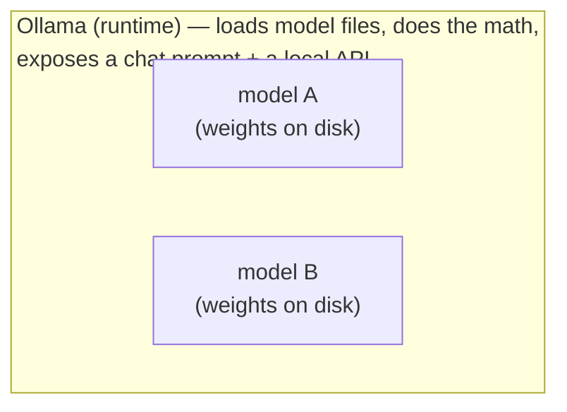

# Getting One Running (Ollama)

This is the part that feels like a trick the first time it works: you type one command, wait a few minutes, type another, and a real language model is answering you — with the network unplugged, on hardware you can touch. There's no account, no key, no meter.

We'll use **Ollama**, because it removes almost all the friction. It's a small program that handles downloading, storing, and running models — and gives you both a chat prompt and a local API, which is everything you need.

## The mental model: a model is a file you download and run

**What it actually is.** An open-weights model is, at bottom, a big file (or a few files) full of numbers — the trained weights. "Running it locally" means two things working together: a **runtime** (Ollama) that knows how to load those numbers and do the math, and the **model file** itself that the runtime loads. Ollama is the record player; the model is the record.

**Why people get this wrong.** It's easy to picture "installing an AI" as one monolithic thing. Cleaner to keep them separate: install the *runtime* once, then download *models* into it — as many as you like, swapping between them. Pulling a second model doesn't reinstall anything; it just drops another record on the shelf.



> 📝 **Terminology.** When you tell Ollama to **pull** a model, it downloads the weight files to your disk. When you **run** a model, Ollama loads those files into memory and starts answering. Pull once; run as often as you like.

Install Ollama from [ollama.com](https://ollama.com) for your operating system before the steps below — it's a normal installer, and once it's done the `ollama` command is available in your terminal. (Verify with `ollama --version`.)

## `ollama pull` — download a model

Let's bring down a small, capable model. We'll use `llama3.2`, one of Meta's open-weights Llama models, in a size that fits a typical laptop.

```console
$ ollama pull llama3.2
pulling manifest
pulling dde5aa3fc5ff: 100% ▕████████████████▏ 2.0 GB
pulling 966de95ca8a6: 100% ▕████████████████▏ 1.4 KB
pulling fcc5a6bec9da: 100% ▕████████████████▏ 7.7 KB
pulling a70ff7e570d9: 100% ▕████████████████▏ 6.0 KB
pulling 56bb8bd477a5: 100% ▕████████████████▏   96 B
pulling 34bb5ab01051: 100% ▕████████████████▏  561 B
verifying sha256 digest
writing manifest
success
```

*What just happened:* Ollama downloaded the model's files to your disk and verified them. The biggest line — about **2.0 GB** here (an approximate size; it varies by model and version) — is the weights themselves; the small files are metadata. That download happens once. From now on the model lives on your machine, and pulling it again would be instant.

⚠️ **Gotcha.** That number is roughly how much disk *and* memory the model needs. A 2 GB model wants a couple of gigabytes free in RAM to load; bigger models want a lot more. If a model is far larger than your machine's memory, this is where reality bites — covered properly in [Phase 3](03-hardware-and-quantization.md). For now, a model in the low single-digit gigabytes is a safe first choice on most laptops.

## `ollama run` — talk to it in the terminal

```console
$ ollama run llama3.2
>>> In one sentence, what is an open-weights model?
An open-weights model is a machine learning model whose trained
parameters are publicly released, so anyone can download and run
it on their own hardware.

>>> /bye
```

*What just happened:* `ollama run` loaded the model into memory and dropped you into an interactive chat — the `>>>` is its prompt, waiting for you. You typed a question, it answered, all on your machine with no network call. There may be a short pause the first time while the model loads into memory; after that, replies start streaming. Typing `/bye` exits the chat. **That's a real LLM, running entirely on your hardware.**

💡 **Key point.** This terminal chat is the fastest way to *try* a model — pull it, run it, ask it a few real questions, decide if it's good enough for your task before you write a line of code. If it's not, pull a different one and compare. Cheap experiments are one of the quiet joys of running locally.

## Hitting the local API from your code

The terminal chat is for *you*. To build something, you want your program to talk to the model — and Ollama is already serving a local API for exactly that. While Ollama is installed and running, it listens on `http://localhost:11434` (`localhost` means "this same machine," so the request never touches the network).

> ⏭️ If "endpoint," "POST," and "JSON" are fuzzy, [Using an LLM API](/guides/using-an-llm-api) explains the request/response shape first. The pattern here is the same — you're just pointing it at your own machine instead of a provider.

Here's the simplest possible call — a `curl` request from the terminal:

```console
$ curl http://localhost:11434/api/generate -d '{
  "model": "llama3.2",
  "prompt": "Say hello in five words.",
  "stream": false
}'
{"model":"llama3.2","created_at":"2026-06-19T10:12:04Z","response":"Hello there, nice to meet!","done":true}
```

*What just happened:* You sent a POST request to Ollama's local `/api/generate` endpoint with a small JSON body — which **model** to use and the **prompt** to answer. Setting `"stream": false` asks for the whole reply in one response instead of token-by-token, which keeps this example simple to read. Ollama ran the model and sent back JSON; the answer is in the `response` field. No API key, no internet — your machine asked itself a question.

The same call from Python looks like this:

```console
$ python3 - <<'EOF'
import requests

resp = requests.post(
    "http://localhost:11434/api/generate",
    json={
        "model": "llama3.2",
        "prompt": "Say hello in five words.",
        "stream": False,
    },
)
print(resp.json()["response"])
EOF
Hello there, nice to meet!
```

*What just happened:* Exactly the same request, expressed in Python with the `requests` library. You POST the model name and prompt to the local endpoint and read the `response` field out of the returned JSON. From your program's point of view, this is just an HTTP call to `localhost` — anything that can make an HTTP request can use your local model. That's the whole bridge from "a model in my terminal" to "a model in my app."

⚠️ **Gotcha.** If the call fails with "connection refused," the Ollama service isn't running. On most installs it starts in the background automatically; if not, running `ollama serve` (or just opening the Ollama app) starts the listener on port 11434. The API can only answer while that service is up.

## Recap

1. **Ollama is the runtime; models are files** you pull into it — install Ollama once, download as many models as you like.
2. **`ollama pull <model>`** downloads a model's weights to disk (once); the size roughly tells you the disk and memory it needs.
3. **`ollama run <model>`** opens a terminal chat — the fastest way to try a model before coding against it.
4. **`http://localhost:11434/api/generate`** is the local API: POST a JSON body with the model and prompt, read the `response` field — no key, no network.
5. Anything that can make an HTTP request to `localhost` can use your local model.

You can pull a model and talk to it from code. The open question is *which* models your machine can actually handle — and that's pure hardware. Let's make it knowable.

---

[← Phase 1: Why (and Why Not) Run Locally](01-why-run-locally.md) · [Guide overview](_guide.md) · [Phase 3: Hardware, Quantization & Reality →](03-hardware-and-quantization.md)
