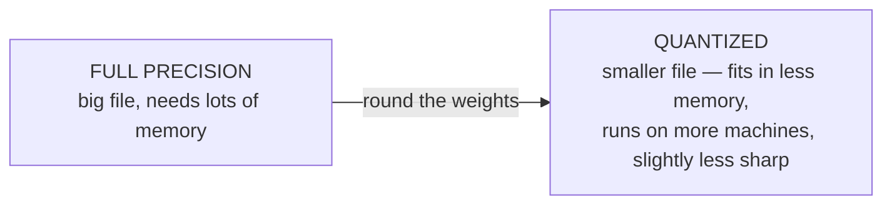

# Hardware, Quantization & Reality

This is the phase that turns "I pulled a model and it was painfully slow" or "it just wouldn't load" from a mystery into a prediction you can make *before* you download anything. Whether a model runs, and how fast, comes down to a small number of physical facts about your machine. Once you can read them, model pages stop being a wall of cryptic names and start being a menu you can order from.

There are exactly two questions: **will it fit?** and **will it be fast enough?**

## Will it fit? Parameters versus memory

**What it actually is.** A model's size is measured in **parameters** — the count of numbers (weights) it learned during training. You'll see models labeled `7B`, `13B`, `70B`: that's 7 billion, 13 billion, 70 billion parameters. More parameters generally means a more capable model — and a bigger file that needs more memory to run.

> 📝 **Terminology.** **Parameters** are the learned numbers that *are* the model. "A 7B model" means 7 billion of them — the headline number on almost every open-weights model, and the first thing to look at.

**Why this is the whole game.** To run, every one of those parameters has to be loaded into memory at once, so a model's memory appetite scales directly with its parameter count. That's why a 70B model won't load on a laptop and a 3B model will — it's not subtle, it's arithmetic.

⚠️ **Gotcha — the big one.** A giant model will not fit a small machine, period. If a model needs more memory than you have, it either refuses to load or spills onto disk and crawls so slowly it's unusable. Match the model to the machine *before* you pull it, not after.

**RAM versus VRAM.** There are two kinds of memory that matter, and which one gets used depends on where the model runs:

```text
   ┌──────────────┐         ┌──────────────┐
   │     CPU      │         │     GPU      │
   │  uses RAM    │         │  uses VRAM   │
   │  (system     │         │  (memory on  │
   │   memory)    │         │   the card)  │
   └──────────────┘         └──────────────┘
       8–64 GB                 often 8–24 GB
       typical                 on consumer cards
```

> 📝 **Terminology.** **RAM** is your computer's main system memory. **VRAM** is the separate, faster memory built onto a graphics card. A model running on the GPU must fit in VRAM; a model on the CPU uses ordinary RAM. (Full picture: [CPU, RAM & Storage, Explained](/guides/cpu-ram-and-storage).)

VRAM is usually the tighter constraint, because consumer graphics cards ship with less of it than a machine has system RAM. A model that fits comfortably in 32 GB of RAM might be far too big for an 8 GB graphics card. When checking "will it fit," check against the memory it'll actually use.

## Quantization — shrinking the weights to fit

Here's the lever that makes local models practical — the one concept most worth understanding in this whole guide.

**What it actually is.** Each parameter is a number, and a number can be stored with more or less precision. By default, models are often stored at high precision — many bits per parameter. **Quantization** stores each parameter using *fewer* bits, rounding the numbers to a coarser scale. Fewer bits per parameter means a dramatically smaller file and dramatically less memory needed to run it.

**The trade.** Rounding the weights loses a little accuracy, so a quantized model is slightly less sharp than the full-precision original. But the memory savings are large and the quality loss is usually small — for most everyday use you'd struggle to notice. That lopsided trade — *a little quality for a lot of memory* — is exactly why quantization is the default way people run models locally. It's what lets a model that wouldn't fit your machine suddenly fit.



**What it looks like in practice.** On model pages and in Ollama's tags you'll see labels like `Q4` or `Q8` — roughly the number of bits per parameter. Lower numbers mean a smaller, lighter model with a bit more quality lost; higher numbers mean larger and closer to the original. A 4-bit quantization (`Q4`) is a common, practical default — small enough to fit modest hardware, good enough for most work. When a model "wouldn't fit," the fix is frequently "use a more quantized version of it."

💡 **Key point.** Two dials decide if a model fits your memory: **how many parameters** (pick a smaller model) and **how aggressively quantized** (pick fewer bits). If a model won't fit, turn one of those dials before giving up.

## Will it be fast enough? CPU versus GPU

Fitting is pass/fail; speed is a spectrum, and it's mostly about *what does the math*.

**What it actually is.** The model's work is an enormous pile of parallel arithmetic. A **GPU** is built for exactly that kind of massively parallel math, so it runs models much faster than a CPU doing the same work. A **CPU** can absolutely run a model — that's what happens on a machine without a capable GPU — just slower, especially as models get bigger.

**What it feels like.** On a GPU with enough VRAM, a reasonably sized model replies briskly, words streaming out at a comfortable reading pace or faster. On a CPU, the same model still works but the words come more slowly, and a large model on CPU can be slow enough to frustrate. (Apple Silicon Macs are a happy middle case — their unified memory lets the GPU portion use system RAM, punching above what you'd expect from the spec sheet.)

⚠️ **Gotcha.** "It loaded but it's crawling" usually means one of two things: the model barely fit and is spilling between memory tiers, or it's running on the CPU when you hoped it'd use the GPU. The fix is the same as for fitting — a smaller or more quantized model that comfortably fits the faster memory.

## One more reality: the license

A practical warning that has nothing to do with hardware.

⚠️ **Gotcha — open-weights licenses vary.** "Open-weights" means you can download and run the model; it does *not* automatically mean you can do anything you want with it. Some models are permissively licensed; others restrict commercial use, large-scale deployment, or specific applications, and some require you to accept terms before downloading. Before you build something real — especially anything commercial — read the license for the specific model. Downloadable weights are not the same as unrestricted use.

## Matching a model to your machine

Put it together as a quick mental checklist, in order:

1. **Start from your memory.** How much RAM? A GPU, and how much VRAM? That's your budget.
2. **Pick a parameter size that fits the budget**, with room to spare — a model should fit *comfortably*, not exactly.
3. **Use a quantized version** (`Q4`-style is a sensible default) to stretch that budget further.
4. **Try it** — `ollama run` it, ask real questions. Good enough and fast enough? Done.
5. **If it doesn't fit or it's too slow**, step down: smaller parameter count, more aggressive quantization, or both.
6. **If quality isn't enough** even at the largest model you can fit, that's the honest signal to use a hosted API for that task — the trade from [Phase 1](01-why-run-locally.md).

> 💡 The numbers in this phase — typical RAM and VRAM amounts, model sizes — are approximate ballparks meant to build intuition, not precise requirements. The real figures shift with each model, version, and quantization, so always check the specific model's page for its actual size before pulling it.

## Recap

1. **Parameters (7B, 13B, 70B…)** measure model size; every parameter must fit in memory to run.
2. A model must fit your **RAM** (if running on CPU) or your **VRAM** (if running on GPU) — VRAM is usually the tighter limit.
3. **Quantization** stores each parameter in fewer bits — much less memory for a little quality loss; it's how big models become runnable, and `Q4`-style builds are a common default.
4. **GPUs run models much faster** than CPUs; "loaded but crawling" usually means it barely fit or is running on the CPU.
5. **Open-weights licenses vary** — downloadable is not the same as unrestricted; read the license before building something real.
6. Match model to machine: start from your memory, pick a size and quantization that fit comfortably, try it, and step down if needed — or reach for a hosted API when local quality isn't enough.

You can now read any model on a download page and predict whether it'll run on your machine, and why. From here, the natural next steps are feeding a local model your own documents and, eventually, fine-tuning one — each its own guide.

---

[← Phase 2: Getting One Running (Ollama)](02-getting-one-running.md) · [Guide overview](_guide.md)

**Related guides:** [Using an LLM API](/guides/using-an-llm-api) · [What AI and ML Are](/guides/what-ai-and-ml-are)
