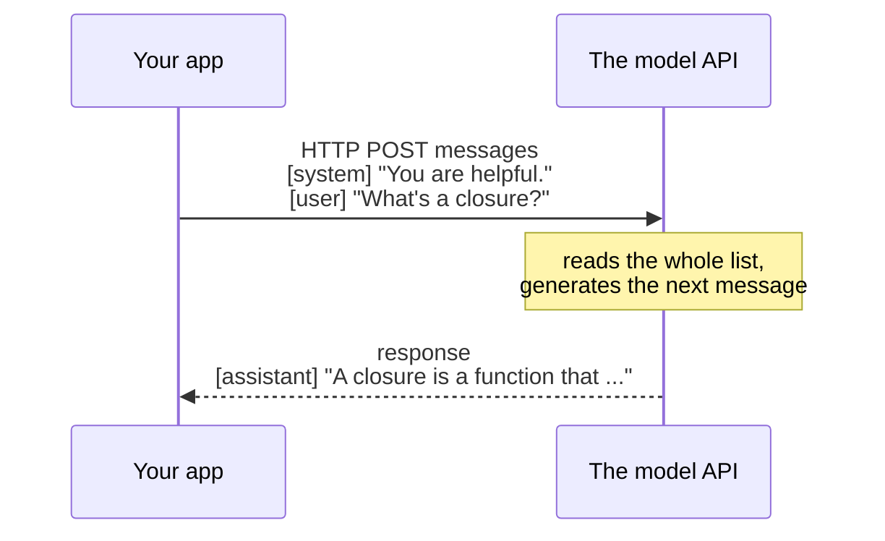

# It's Just an API Call

If you've been picturing some special "AI connection" — a socket, a model loaded into your process, a thing you have to install — let that picture go. Calling a hosted model is an ordinary HTTP request to a URL, with a JSON body and an API key in the header. The same shape as nearly every web API you've ever touched.

What's different is only *what you send* and *what comes back*. Let's look at exactly that.

## The mental model: you send a conversation, you get back the next line

**What it actually is.** A chat-style LLM API takes a *conversation so far* and returns *what the assistant would say next*. You hand it a list of messages — who said what — and it generates one more message: the assistant's reply.

That's the whole interaction. There's no hidden session living on the server remembering your last call. Each request is self-contained: the model only knows what's in the messages you send *this time*. (That detail matters a lot in Phase 2, so tuck it away.)



📝 **Terminology.** This style is usually called the **chat completions** API (you give it a chat, it *completes* it with the next turn). Different providers name their endpoint slightly differently, but the shape — a list of role-tagged messages in, one assistant message out — is the same across the major ones.

## The three roles

Each message in the list has a **role**. Three you'll use constantly:

- **`system`** — your standing instructions to the model. The personality, the rules, the job. "You are a terse assistant that answers in one sentence." The user usually never sees this. It's how you set the model's behavior for the whole conversation.
- **`user`** — what the person typed. The question, the request, the text to summarize.
- **`assistant`** — what the model said *previously*. You only include these when you're continuing a multi-turn conversation, so the model can see what it already told the user.

For a single one-shot request, you send a `system` message and a `user` message, and that's enough.

## A real request

Here's a complete, provider-neutral request. It's `curl`, but it's the same JSON whatever language you're in:

```console
$ curl https://api.example-llm.com/v1/chat/completions \
    -H "Authorization: Bearer $LLM_API_KEY" \
    -H "Content-Type: application/json" \
    -d '{
      "model": "some-chat-model",
      "messages": [
        { "role": "system", "content": "You are a concise assistant. Answer in one short paragraph." },
        { "role": "user",   "content": "In plain terms, what is a closure in programming?" }
      ]
    }'
```

*What just happened:* You made a `POST` to the model's endpoint. Three things do the work:

- **The header `Authorization: Bearer ...`** carries your API key, so the provider knows it's you (and whom to bill). We read it from an environment variable, `$LLM_API_KEY` — never paste the key itself into the command or your code (more on that below).
- **`"model"`** picks *which* model answers. Providers offer several, trading speed and cost against capability.
- **`"messages"`** is the conversation — here, a `system` instruction setting the behavior, then the `user` question.

Notice what's *not* here: no GPU, no model download, no special protocol. A URL, a key, some JSON.

## A real response

The reply is JSON too. Trimmed to the parts that matter:

```json
{
  "id": "resp_8c1f2a",
  "model": "some-chat-model",
  "choices": [
    {
      "index": 0,
      "message": {
        "role": "assistant",
        "content": "A closure is a function that remembers the variables from the place where it was created, even after that place has finished running. It carries that little bundle of context around with it, so it can still use those variables later."
      },
      "finish_reason": "stop"
    }
  ],
  "usage": {
    "prompt_tokens": 31,
    "completion_tokens": 52,
    "total_tokens": 83
  }
}
```

*What just happened:* The model generated the next message and handed it back. The pieces you'll actually use:

- **`choices[0].message.content`** is the generated text — the answer. This is the string you show your user. (It's an array because some APIs can return more than one candidate reply, but you'll almost always read `choices[0]`.)
- **`finish_reason: "stop"`** means the model finished naturally. If you ever see `"length"` instead, it means the reply got cut off because it hit a length limit — a sign to allow more output room (Phase 2 explains the limit it hit).
- **`usage`** counts the tokens this call used: input (`prompt_tokens`), output (`completion_tokens`), and the total. That's what you're billed on, and it's why Phase 2 exists. For now, just notice the model *tells you* the count on every call.

So the entire loop is: build a `messages` list → POST it → read `choices[0].message.content`. Everything else in this guide is about doing that *well*.

## Continuing a conversation

Because the server doesn't remember anything between calls, "memory" is something *you* provide — by sending the earlier turns back each time. To ask a follow-up, you append the model's last reply and the new user message to the list:

```json
{
  "model": "some-chat-model",
  "messages": [
    { "role": "system",    "content": "You are a concise assistant." },
    { "role": "user",      "content": "What is a closure?" },
    { "role": "assistant", "content": "A closure is a function that remembers the variables ..." },
    { "role": "user",      "content": "Can you give me a tiny example?" }
  ]
}
```

*What just happened:* You replayed the whole conversation and added the new question at the end. The model reads the entire list as context and answers the follow-up knowing what it said before. This is the idea that surprises people most: **the conversation is something you carry and resend, not something the server holds for you.** It's also exactly why long chats get expensive — you'll feel that in Phase 2.

## Keep your API key out of your code

⚠️ **Gotcha — the big one.** That API key is a password that spends your money. Do **not** write it into your source code, and *never* commit it to git. People do this constantly, push to a public repo, and wake up to a key that strangers are running up a bill on. Scanners crawl public repositories looking for exactly these strings.

The fix is the same as for any secret: load it from an environment variable or a secrets manager at runtime, and keep the actual value out of the files you check in. There's a whole guide on doing this properly, read it before you ship anything: [Secrets Management](/guides/secrets-management).

A second, related trap: don't call the model directly from your *frontend* (browser or mobile) code, because anything shipped to the user's device can be read by the user. The key belongs on a server you control, which calls the model on the user's behalf.

## Recap

1. An LLM API is a normal **HTTP POST** — a URL, your key in a header, JSON in the body.
2. You send a **`messages`** list of role-tagged turns; the main roles are **`system`** (your instructions), **`user`** (the person), and **`assistant`** (the model's earlier replies).
3. You read the answer from **`choices[0].message.content`**, and `usage` tells you the token cost of the call.
4. The server is **stateless** — to continue a conversation, you resend the prior turns yourself.
5. The API **key is a password.** Keep it out of code and out of the frontend; load it from a secret at runtime.

Next: what those tokens in the `usage` block actually are, why they're the unit of both memory and money, and how to keep both under control.

---

[← Guide overview](_guide.md) · [Phase 2: Tokens, Context & Cost →](02-tokens-context-and-cost.md)
