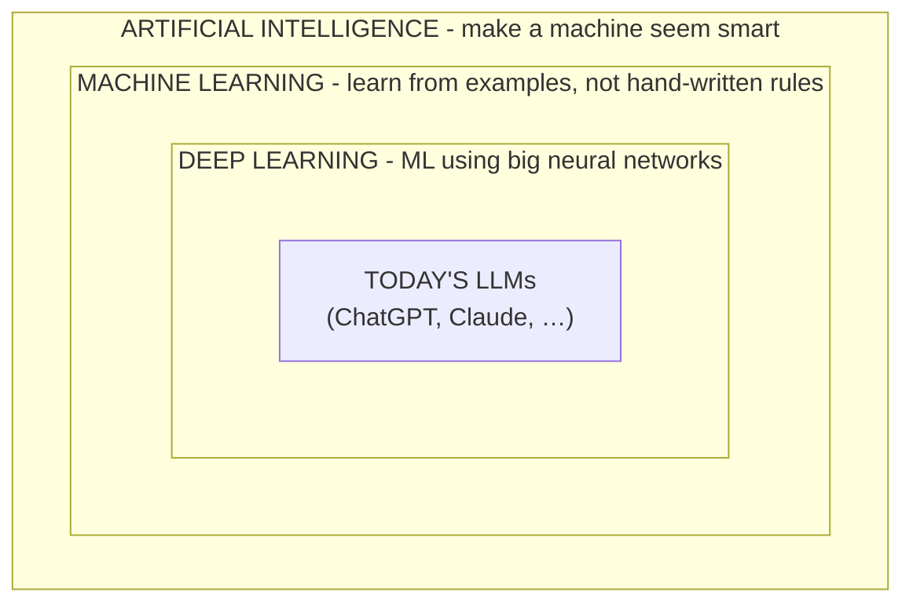

# AI vs ML vs Deep Learning vs LLMs

Here's the thing nobody tells you up front: these four words are not four competing technologies. They're four circles nested inside each other, like Russian dolls. Once you see the nesting, the buzzword soup separates into a clear picture - and you'll never again wonder whether "AI" and "machine learning" are the same thing (they're not, but one lives inside the other).

Let's build that picture before we define anything.

## The one diagram that untangles it all

Every inner circle *is* an example of the circle around it. An LLM is a kind of deep learning. Deep learning is a kind of machine learning. Machine learning is a kind of AI. So when someone says "we use AI" and someone else says "we use machine learning," they might be describing the exact same system - just at different zoom levels. Now let's define each ring, from the outside in.

## Artificial Intelligence - the outermost circle

**What it actually is.** AI is the oldest and broadest term, and it's deliberately vague. It just means: *getting a machine to do something that, if a human did it, you'd call "intelligent."* Playing chess. Recognizing a face. Understanding a sentence. Planning a route. That's the whole umbrella.

**Why people get this wrong.** Most people hear "AI" and picture a thinking, conscious mind - the movie robot. But the word has covered far humbler things for decades. The chess opponent on an old computer was AI. The little ghosts chasing you in Pac-Man were running AI. None of those "think." AI is a goal ("seem smart at this task"), not a claim about consciousness.

📝 **Terminology.** *Artificial Intelligence (AI)* = the broad field of making machines perform tasks that normally require human intelligence. It says nothing about *how* - only about the goal.

**The gotcha.** Because AI is so broad, it's the favorite word of marketing departments. "Powered by AI" can mean a genuine learning system - or a handful of `if` statements someone wrote on a Tuesday. The word alone tells you almost nothing. The next ring in is where the real distinction lives.

## Machine Learning - the circle that learns

**What it actually is.** Machine learning is the slice of AI where the machine isn't handed the rules by a human - it *figures the rules out itself* by studying examples. You don't write "a cat has pointy ears and whiskers." You show it thousands of labeled photos and let it work out, on its own, what separates "cat" from "not cat."

**Why this is the important ring.** This is the shift that made the last decade possible, and it's so central that the whole next phase is devoted to it. For now, hold onto this: *traditional code is rules written by a human; machine learning is rules learned from data.* Same goal (do the smart task), opposite method.

📝 **Terminology.** *Machine Learning (ML)* = a way of building AI where the system learns patterns from data rather than following rules a programmer wrote by hand.

**The gotcha.** Not all AI is machine learning. A rule-based system - even a clever, useful one - is AI but *not* ML, because a human still wrote every rule. When someone says "machine learning," they're making a specific claim: this thing *learned*. That's a stronger, more meaningful statement than "AI."

## Deep Learning - ML with neural networks

**What it actually is.** Deep learning is machine learning done with a particular tool: a **neural network** - a model loosely inspired by how brain cells connect, built from many simple math units wired in layers. "Deep" refers to having *many* layers stacked up, one feeding the next.

You don't need to know how a neural network works internally to use this guide. The only thing to hold onto: deep learning is *still machine learning* (it learns from examples) - it's just the flavor of ML that uses these layered networks, and it turned out to work astonishingly well on messy real-world data like images, audio, and language.

📝 **Terminology.** *Neural network* = a model made of many small, connected math units arranged in layers, whose connection strengths are adjusted during learning. *Deep learning* = machine learning that uses neural networks with many layers.

**Why it matters.** For a long time, ML worked best when humans pre-digested the data - picking out which features mattered. Deep learning's superpower is that, given enough data and computing power, the network figures out the useful features *itself*. That's why nearly every "AI" breakthrough you've heard about recently - image recognition, voice assistants, chatbots - is deep learning under the hood.

## Today's LLMs - the innermost circle

**What it actually is.** An **LLM** - Large Language Model - is one specific, wildly successful kind of deep learning, aimed at language. ChatGPT, Claude, Gemini, and their kin are all LLMs. "Large" is literal: they're neural networks trained on an enormous amount of text. Their core trick is almost embarrassingly simple to state: *given some text, predict what word probably comes next* - over and over, one piece at a time, until they've produced a whole answer.

📝 **Terminology.** *LLM (Large Language Model)* = a very large neural network trained on huge amounts of text to predict and generate language, one piece at a time.

**Why people get this wrong.** Because an LLM writes in fluent, confident sentences, it's natural to assume there's understanding behind the words. But the machinery underneath is prediction, not comprehension. That distinction is the whole subject of Phase 3 - for now, just notice that the most human-*seeming* AI sits at the very center of these circles, and is still, mechanically, a pattern-predictor.

**The gotcha.** "AI" in 2026 conversation usually means "an LLM," because that's the kind that went mainstream. But remember the diagram: LLMs are the smallest circle. Spam filters, recommendation feeds, fraud detection, and photo tagging are all AI/ML too - and most of them aren't LLMs. Don't let the newest, loudest example shrink your picture of the whole field.

## Recap

1. The four words are **nested circles**, not rivals: AI ⊃ machine learning ⊃ deep learning ⊃ today's LLMs.
2. **AI** is the broad goal - "make a machine seem smart" - and says nothing about how.
3. **Machine learning** is the part of AI where the machine *learns rules from examples* instead of being hand-coded.
4. **Deep learning** is ML using **neural networks** with many layers - the flavor behind most modern breakthroughs.
5. **LLMs** are one famous kind of deep learning, aimed at language, that work by predicting the next piece of text.

That middle ring - learning instead of being told - is the idea the whole field turns on. Next, we'll slow right down and look at what that shift really means.

---

[← Guide overview](_guide.md) · [Phase 2: Rules vs Learning →](02-rules-vs-learning.md)
