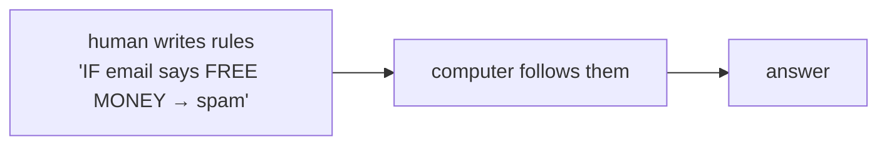
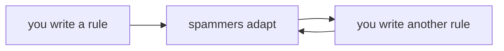
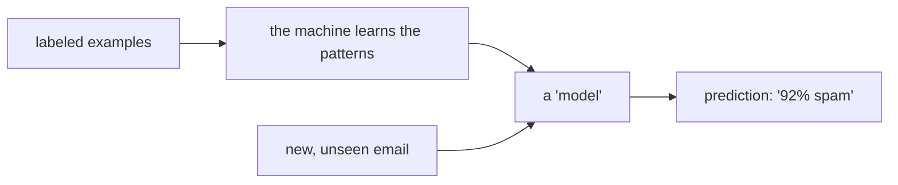

# Rules vs Learning

If you remember one idea from this whole guide, make it this one. Everything strange, powerful, and sometimes frustrating about AI flows from a single shift in *how the rules get made*. Get this, and machine learning stops being magic and becomes something you can reason about.

## The old way: a human writes the rules

For most of computing history, software worked one way. A person thought hard about a problem, worked out the rules, and typed those rules into the computer as explicit instructions. The computer didn't decide anything - it followed orders, exactly, forever.



**What it does in real life.** Say you want to block spam email. The old way: you sit down and write rules. *If the subject says "FREE MONEY," mark it spam. If it has more than five exclamation marks, mark it spam. If the sender isn't in the contact list and mentions "winner," mark it spam.* You, the human, supplied every rule, and the computer applied them mechanically.

This works beautifully when you actually *can* write the rules down. Calculating tax, sorting a list, checking a password - the rules are known, exact, and finite. For those, hand-written code is the right tool, full stop.

**The gotcha.** The trouble starts when the rules are real but too messy and numerous to ever finish writing. Spam is exactly that kind of problem - and watching it break is the best way to feel why machine learning had to exist.

## Where hand-written rules fall apart

Picture yourself maintaining that spam filter. You write your rules, and for a week they work. Then:

- Spammers learn to write "F.R.E.E M0NEY" to slip past your "FREE MONEY" rule. You add a rule. They change the spelling again. You add another rule.
- A legitimate email from your bank gets caught because it said "winner" (you'd won a survey raffle). You add an *exception*. Now your rule list has rules about its own rules.
- Spam in a new language shows up. None of your English rules apply. You start over.



You're in an endless arms race, hand-writing more and more brittle rules, and the list never converges. The real "rule" for what counts as spam genuinely exists - you can recognize spam instantly - but it's a fuzzy, shifting pattern made of thousands of subtle signals. It lives in your gut, not in any list you could finish typing.

💡 **Key point.** Some patterns are real but too complex, fuzzy, or fast-changing for a human to write down as explicit rules. That gap - "I know it when I see it, but I can't write the rule" - is exactly the gap machine learning was built to fill.

## The new way: show it examples, let it learn the rules

Machine learning flips the arrow. Instead of you writing the rules, you give the machine a big pile of *examples* - emails already labeled "spam" or "not spam" - and let it work out the rules itself.



📝 **Terminology.** *Training data* = the labeled examples you feed the machine to learn from (here: thousands of emails each marked spam or not-spam). *Model* = the result of that learning - the bundle of learned patterns that you can now feed a new email to get a prediction.

**What it does in real life.** You collect, say, a hundred thousand emails already marked as spam or not, and hand the whole pile to a learning algorithm. It chews through them and adjusts itself until it's good at telling the two groups apart - discovering on its own that certain word combinations, sender patterns, and link styles tend to mean spam. You never wrote "F.R.E.E M0NEY is suspicious." It learned that, and ten thousand subtler signals you'd never have thought of, straight from the examples.

**A real example.** Here's the shape of it in plain pseudo-code - not a real library, just the *flow*, so you can see how different it is from writing rules:

```text
# You don't write the rules. You provide examples and let it learn.

examples = load_emails_already_labeled_spam_or_not()   # the training data

model = learn_from(examples)                            # the machine finds the patterns

new_email = "Congratulations! You are a WINNER!!!"
model.predict(new_email)
# ► { label: "spam", confidence: 0.92 }
```

*What just happened:* You never told the machine what spam looks like. You handed it labeled examples, it learned the patterns into a `model`, and now that model can look at an email it has never seen and give its best guess - here, "probably spam, 92% sure." When spammers change tactics, you don't rewrite rules; you feed it fresh examples and it re-learns. The arms race becomes "keep showing it new examples," not "keep hand-coding new rules."

**Why this saves you later.** This is why so many products quietly switched to ML. Anywhere the pattern is real but too messy to spell out - spam, fraud, "you might also like…", recognizing your friend in a photo, flagging a weird login - learning from examples beats hand-written rules, and keeps up as the world changes.

## So when does learning *not* win?

Being clear-eyed matters here, because the hype pretends ML is always the answer. It isn't. Hand-written rules are the better choice when:

- **The rules are simple and known.** Calculating sales tax doesn't need a model. The rule is exact, it won't drift, and a model would only add cost, unpredictability, and a way to be subtly wrong.
- **You need a guaranteed, explainable answer.** A model gives you "92% spam," a *probability*. For something like "is this user old enough to sign up?" you want a hard, auditable yes/no - a rule, not a guess.
- **You don't have the examples.** Learning needs data. No big pile of labeled examples means nothing to learn from, and a half-trained model is worse than a plain rule.
- **Mistakes are unacceptable and the logic is clear.** If you can write the correct rule and a wrong answer is dangerous, write the rule. Don't reach for a probabilistic guesser where certainty is available.

⚠️ **Gotcha: "AI" is not automatically the smarter choice.** Reaching for machine learning when a five-line rule would do is a classic, expensive mistake. Learning shines on fuzzy, shifting, example-rich problems; rules shine on exact, stable, explainable ones.

## Recap

1. **Traditional code = rules a human writes by hand.** The computer just follows them.
2. **Machine learning = rules the machine learns from examples** (the *training data*), bundled into a *model* that predicts on new, unseen inputs.
3. ML earns its keep when the pattern is **real but too messy, fuzzy, or fast-changing to write down** - like spam.
4. Hand-written rules still win when the logic is **simple, known, stable, or must be exact and explainable.**
5. The skill is **choosing the right one** - "use AI" is not automatically the smarter answer.

We've said machine learning "learns the patterns." But it's worth being brutally clear about what that does and doesn't give you - because a pattern-learner that sounds human is easy to overtrust. That's next.

---

[← Phase 1: AI vs ML vs Deep Learning vs LLMs](01-the-nested-circles.md) · [Phase 3: What AI Is and Isn't →](03-what-ai-is-and-isnt.md)
