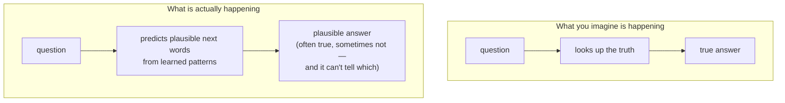

# What AI Is and Isn't

This is the phase that protects you. By now you know AI is mostly machine learning, and machine learning is pattern-matching learned from examples. That single fact — *it's a pattern-matcher, not a mind* — explains almost every way modern AI surprises, delights, and burns people. Hold onto it, and you'll trust these tools exactly as much as they deserve: a lot for some things, not at all for others.

## What today's AI actually is: prediction, not understanding

**What it actually is.** When an LLM answers you, it is not looking up a fact or reasoning the way you imagine. At its core it's doing what Phase 1 described: predicting the next likely piece of text, then the next, based on patterns absorbed from a vast amount of training data. It's extraordinary at producing text that *sounds* right — because sounding right is literally what it learned to do.

**Why people get this wrong.** The output is so fluent, so confident, so human in shape, that your brain fills in a mind behind it. It feels like talking to someone who *knows*. But "writes a convincing sentence about X" and "understands X" are different abilities, and today's AI has the first far more than the second.

💡 **Key point.** Today's AI is **powerful pattern-matching and prediction** — not understanding, not reasoning the way you do, and not magic. Almost everything surprising about it makes sense once you hold that picture instead of "tiny mind in a box."

⚠️ **Gotcha: don't anthropomorphize it.** It's natural to say the model "thinks," "knows," "wants," or "believes." Those words quietly smuggle in a mind that isn't there, and they'll lead you to trust it in exactly the wrong moments. A safer habit: "the model *predicts*," "the model *produces*," "the model's output *suggests*." Keep the human verbs for humans.

## It can be confidently wrong

**What it does in real life.** Because the goal is plausible-sounding text — not true text — an AI will sometimes produce an answer that is fluent, confident, and completely made up. It might invent a citation, a quote, a function that doesn't exist, or a "fact" that was never true. This has a name.

📝 **Terminology.** *Hallucination* = when an AI generates confident, plausible-sounding output that is flatly false. It's not lying (lying needs an intent it doesn't have) — it's producing text that fits the pattern of a good answer without any check on whether it's real.

⚠️ **Gotcha: confidence is not accuracy.** The model has the same smooth, assured tone whether it's right or catastrophically wrong — because tone is part of the pattern, and truth isn't something it's checking. A human expert usually *sounds* unsure when they're unsure. An LLM often doesn't. Never read confidence as a signal of correctness. For anything that matters, *verify* against a real source.

**Why this matters.** This is the single most expensive misunderstanding people have about AI: treating a fluent answer as a checked answer and shipping it — a fake legal citation, a wrong dosage, a bug-ridden snippet pasted straight into production. The fix isn't "don't use AI." It's "use it as a fast, fallible draft-maker, and keep a human responsible for what's true."

## It mirrors its training data — including the bias

**What it actually is.** A model knows only what it learned from. It has no experience of the world beyond its training data, so whatever patterns are *in* that data, good and bad, get baked into the model. Human-generated data always carries human biases, and the model tends to reproduce them, fluently and without flagging that it's doing so.

**A real example.** Imagine a hiring tool trained on a company's past ten years of hiring decisions to predict "good candidate." If that company mostly hired one kind of person, the patterns in that data encode the skew. The model dutifully learns it and starts down-ranking everyone else — not out of malice, but because it learned exactly what it was shown.

*What just happened:* The model didn't "decide" to be unfair. It learned the pattern in its examples, and the pattern was unfair. The bias was in the data; the model just made it scalable and gave it an authoritative, neutral-sounding voice. "The computer said so" can be biased precisely *because* a human process was biased first.

**Why this saves you later.** When an AI's output feels off, lopsided, or stereotyped, look at the data it learned from, not at a malfunctioning mind. A model is a mirror of its inputs, and mirrors don't correct what they reflect.

## It has no ground truth of its own

**What it actually is.** Pull all of the above together and you reach the deepest point: an LLM has no independent connection to reality — no senses, no memory of having checked anything, no built-in fact that "Paris is the capital of France," only the statistical fact that those words tend to go together in its training data. There's just the learned pattern of what text usually looks like.

⚠️ **Gotcha: it predicts *plausible*, not *true*.** This is the whole phase in one line. The model is optimized to produce text that *fits* — that looks like a right answer. Most of the time, fitting and being true line up, which is why these tools are genuinely useful. But when they diverge, the model has no way to notice, because it was never tracking truth in the first place.

## So what is it actually good for?

None of this means AI is useless — it means you aim it at the right jobs. Pattern-prediction trained on oceans of text is genuinely excellent at:

- **Drafting and rephrasing** — first drafts, summaries, tone changes, where *you* are the final judge.
- **Surfacing and brainstorming** — options, angles, starting points you'll then check.
- **Transforming text you already trust** — reformatting, translating, extracting, where the source is known-good.

…and genuinely risky, used unsupervised, at anything where being *confidently, invisibly wrong* is expensive: facts you can't verify, math you won't check, decisions about real people, code you paste without reading. Lean on it where plausible-and-fast helps and you stay responsible for the truth; distrust it where only true-and-checked will do.

## Recap

1. Today's AI is **pattern-matching and prediction**, not understanding — fluent text is the thing it learned to make.
2. **Don't anthropomorphize it.** "Predicts" and "produces," not "thinks" and "knows."
3. It can be **confidently wrong** (*hallucination*), and **confidence is not accuracy** — verify what matters.
4. It **mirrors its training data**, biases and all, in an authoritative-sounding voice.
5. It has **no ground truth** of its own: it predicts *plausible*, not *true* — they usually agree, until they don't.
6. Used for the right jobs, with a human owning correctness, that pattern-matcher is genuinely powerful.

That's the honest foundation for everything else in this track. With this mental model in place, you're ready to go a level deeper.

## Where to go next

- **[How a Model Learns](/guides/how-a-model-learns)** — how a model is actually trained from data.
- **[Using an LLM API](/guides/using-an-llm-api)** — call a model from your own code, now that you know what it really is.
- **[ML Basics for Data People](/guides/ml-basics-for-data-people)** — the everyday craft of working with data and models, if that's your world.

---

[← Phase 2: Rules vs Learning](02-rules-vs-learning.md) · [Guide overview →](_guide.md)
