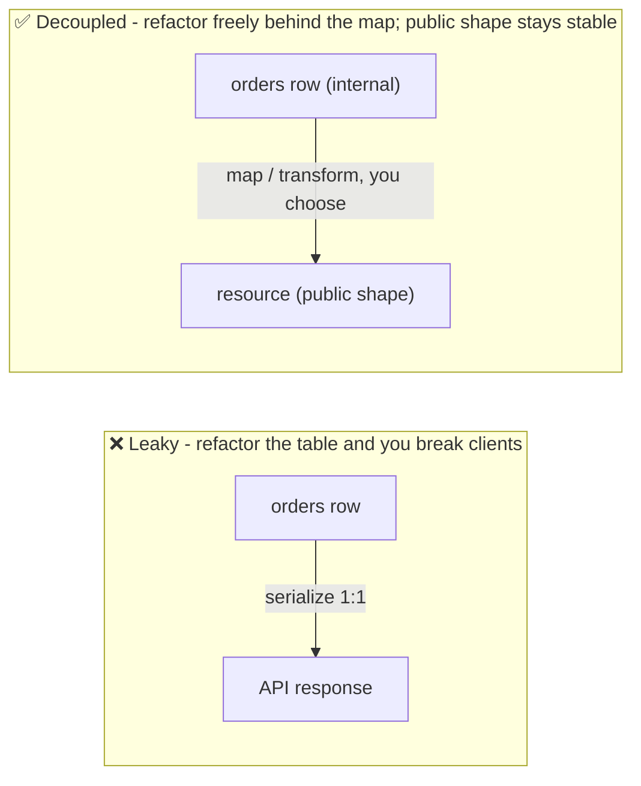

# Designing for Longevity

The cheapest breaking change is the one you never have to make. Phases 1 and 2 were about surviving
change; this phase is about needing less of it. Almost every painful version bump traces back to a
day-one decision - a shape that felt fine for the first three endpoints and became a straitjacket by
the thirtieth, a list endpoint that returned everything because the table was small, a retry that
charged a customer twice.

None of the choices below are exotic. They're the handful of decisions that, made early, let an API
grow for years without forcing clients to keep rewriting their integration - a pre-flight checklist to
run *before* you publish, while changing your mind is still free.

## 1. Consistent shapes - pick a pattern and never deviate

Every resource in your API should be shaped the same way, and so should every error. If an `order`
has `id`, `created_at`, and nests its items under `items`, a `customer` should follow the same
pattern. Consistency means a client who learns one endpoint has learned them all.

Inconsistency is a permanent tax: every endpoint that does things its own way is a special case
clients must learn, you must document, and neither of you can change later without breaking
something. Pick the conventions once - field naming (`snake_case` vs. `camelCase`), timestamps (ISO
8601 UTC strings is the safe default), how you nest related data - and hold the line.

```console
$ # Same envelope everywhere - learn it once, know it for every resource:
$ curl https://api.example.com/v1/orders/1138
{
  "data": {
    "id": 1138,
    "type": "order",
    "created_at": "2026-06-19T14:30:00Z",
    "status": "shipped"
  }
}
```
A client that handles this `data` envelope for orders handles it for customers, invoices, and
everything you add later - for free. It also leaves room to add top-level siblings (like `meta` for
pagination, below) without disturbing `data`.

### Error shapes are part of the contract too

The most-overlooked consistency failure is errors. Clients write error handling *once*, against
whatever your errors looked like the day they integrated. If every endpoint fails differently, you've
forced every client into a tangle of special cases.

```console
$ curl -i https://api.example.com/v1/orders/99999
HTTP/1.1 404 Not Found
{
  "error": {
    "code": "order_not_found",
    "message": "No order exists with id 99999.",
    "request_id": "req_8a2b..."
  }
}
```
The HTTP status (`404`) gives the broad category a client can branch on; the stable `code`
(`order_not_found`) is machine-readable and won't change even if you reword the message; `message` is
for humans reading logs; `request_id` lets a client quote one string in a support ticket. Use this
same shape for *every* error. (RFC 9457 defines a standard "problem details" JSON shape if you'd
rather adopt a convention than invent one.)

💡 **Key point.** Treat your error format as frozen as firmly as your success responses - changing it
later breaks every client's `catch` block.

## 2. Pagination from day one

A list endpoint that returns the whole collection works beautifully at 12 rows and is a catastrophe
at 12 million. The trap: adding pagination *later* is itself a breaking change, since clients coded
against "this returns the full array" will silently process only a fraction of the data once you
start paging. So you paginate **before** you have the data to justify it.

```console
$ curl "https://api.example.com/v1/orders?limit=2"
{
  "data": [ { "id": 1138 }, { "id": 1139 } ],
  "meta": {
    "next_cursor": "eyJpZCI6MTEzOX0",
    "has_more": true
  }
}

$ # Follow the cursor for the next page:
$ curl "https://api.example.com/v1/orders?limit=2&cursor=eyJpZCI6MTEzOX0"
```
The list never promises "everything" - it returns a page plus a `next_cursor`, and `has_more` tells
the client when to stop. Because this was the contract from day one, the shape never has to change as
the collection grows. (This is **cursor-based** pagination - the cursor encodes "where you left off."
It's sturdier than `?page=2&size=20` **offset** pagination, which can skip or duplicate rows when
items are inserted or deleted between requests, and gets slow on deep pages. Offset is simpler and
fine for small, stable datasets; cursor is the safer default for anything that grows.)

⚠️ **Gotcha.** Even if you launch with offset pagination for simplicity, *launch with pagination*. The
breaking change is "unpaginated → paginated," and you only avoid it by paginating from the start.

## 3. Idempotency keys - make retries safe

Networks fail in the cruelest way: the request arrives, your server processes it, and the *response*
gets lost on the way back. The client never heard "success," so it retries - and now the charge, the
order, the email happens twice. For anything that creates or moves money, "just retry" is how you
double-charge a customer.

An **idempotency key** is a unique value the *client* generates and sends with a request. Your server
remembers the result it produced for that key; if the same key comes in again, it returns the
*stored* result instead of redoing the work.

📝 **Terminology.** An operation is **idempotent** if doing it twice has the same effect as doing it
once. `GET` and `DELETE` are naturally idempotent; `POST` (create) is the dangerous one, which is why
idempotency keys target it.

```console
$ # First attempt - client generates a key, server does the work:
$ curl -X POST https://api.example.com/v1/charges \
    -H "Idempotency-Key: a1b2c3-d4e5-charge-once" \
    -d '{ "amount_cents": 4200, "currency": "usd" }'
HTTP/1.1 201 Created
{ "id": "ch_77", "amount_cents": 4200, "status": "succeeded" }

$ # Response got lost; client retries with the SAME key:
$ curl -X POST https://api.example.com/v1/charges \
    -H "Idempotency-Key: a1b2c3-d4e5-charge-once" \
    -d '{ "amount_cents": 4200, "currency": "usd" }'
HTTP/1.1 200 OK
{ "id": "ch_77", "amount_cents": 4200, "status": "succeeded" }
```
The retry carries the same key, so the server recognizes it already created charge `ch_77` and
returns that *same* charge instead of a second one. The customer is charged once, the client gets a
clean success on retry, and a lost-response network blip stops being a financial incident. Offering
this on your write endpoints is one of the highest-trust things an API can do.

## 4. Rate limits - protect the API and tell clients the rules

Without limits, one buggy client in a retry loop - or one abusive one - can degrade the API for
everyone. But limits clients can't *see* are just random failures from their side, so the design is
half "enforce" and half "communicate."

```console
$ curl -i https://api.example.com/v1/orders
HTTP/1.1 200 OK
RateLimit-Limit: 100
RateLimit-Remaining: 6
RateLimit-Reset: 30
...

$ # A few requests later, over the limit:
HTTP/1.1 429 Too Many Requests
Retry-After: 30
{ "error": { "code": "rate_limited", "message": "Rate limit exceeded. Retry in 30 seconds." } }
```
The `RateLimit-*` headers tell a well-behaved client how much budget is left and when it resets, so it
can slow itself down *before* hitting the wall. When it does exceed the limit, the `429` carries a
`Retry-After` telling it exactly how long to wait - a predictable rule to program against, not a
mysterious intermittent failure. (`429` is RFC 6585; `RateLimit-*` headers are an emerging IETF
standard - check current support before relying on the exact names.)

## 5. Sensible defaults - make the easy path the safe path

A durable API makes the *common* call simple and the *full* call possible, and never punishes a
client for not knowing about an option added after they integrated.

- **List endpoints default to a sane page size** (not "everything"), so a naive `GET /orders` can't
  accidentally pull a million rows.
- **New optional parameters default to the old behavior** - the default *is* the backward-
  compatibility guarantee from Phase 2.
- **Be liberal in what you accept, strict and predictable in what you return.** Tolerate fields you
  don't recognize in requests, and design clients to tolerate fields and enum values they don't
  recognize in *responses* - that tolerance is what makes your additive changes (Phase 1) safe in
  practice.

💡 **Key point.** Every default is a promise about what happens when a client says nothing. Choose
defaults so the client who knows the least still gets safe, correct behavior.

## 6. Great docs - the part of the API people actually touch

Clients integrate against your *docs* far more than your source. Docs that are wrong, stale, or
missing examples generate the same support load as a buggy API - documentation largely *is* the API
to the person integrating.

- **A real example request and response for every endpoint** - copy-pasteable, realistic values, not
  `string` and `0`.
- **The error catalog** - every `code` you return and what it means.
- **A changelog** - the running record of what changed and when; also where deprecation
  announcements (Phase 2) live.
- **A way to try it** - see [Reading API Docs (and Using Postman)](/guides/reading-api-docs-postman)
  for getting hands-on and learning to read docs effectively.

## ⚠️ The big trap: leaking your internal database into your public contract

The fastest way to ship an API is to serialize your database rows straight to JSON - your `orders`
table becomes your `GET /orders` response, column-for-column. It feels efficient. It is a trap:
your *internal schema becomes your public contract*. Now you can't:

- **Rename a column** without breaking clients (Phase 1: renaming is breaking).
- **Split or merge a table**, normalize, denormalize, or switch databases - every refactor your data
  layer needs is now a breaking API change.
- **Hide a column you never meant to expose** - an internal flag, a soft-delete marker, a cost field - 
  once it's out, removing it breaks someone.

Your database schema changes for *database* reasons (performance, normalization, a new feature's
needs). Your API contract should change only for *API* reasons. Wiring them together means every
internal refactor leaks out as a breaking change to people who have no idea your database even exists.



**The fix.** Put a deliberate translation layer between your storage and your API - a serializer,
mapper, view model, DTO, whatever your stack calls it. It does one job: turn internal data into the
*public shape you chose on purpose*. With that layer in place, you can rename columns, switch
databases, and restructure storage all day, and the public contract never flinches. A little more code
today, a wall of avoided breaking changes for years.

📝 **Terminology.** A **DTO** (Data Transfer Object) or **serializer** is that translation layer: a
deliberate definition of "what this resource looks like to the outside world," kept separate from
"how it's stored inside."

## A note on auth

We've stayed off authentication and authorization deliberately - API keys, OAuth flows, scopes, token
rotation are a security discipline of their own and live in the future **security** category. Design
your durable shapes now; treat auth as its own first-class topic when you get there.

## The durable-API checklist

Run this before you publish, while changing your mind is still free:

1. **Consistent shapes** - one resource envelope, one error format, one naming convention, frozen.
2. **Pagination from day one** - every list endpoint, before you have the data to justify it.
3. **Idempotency keys** - on every write that creates or charges, so retries are safe.
4. **Rate limits** - enforced *and* communicated via headers + `429` + `Retry-After`.
5. **Sensible defaults** - the easy path is the safe path; new options default to old behavior.
6. **Great docs** - real examples, an error catalog, a changelog, a way to try it.
7. **Don't leak your database** - a deliberate mapping layer between storage and contract.

Every item is the same move from Phase 1, applied early: decide what you can promise, make it
something you can keep, and keep it. Do that on day one, and the breaking changes you spent two
phases learning to survive mostly never have to happen.

## Recap

1. **Consistency is a longevity feature** - uniform resource and error shapes mean a client learns
   your API once and you can grow it without surprises.
2. **Paginate from day one** - adding pagination later is a silent breaking change.
3. **Idempotency keys** turn dangerous retries into safe ones on create/charge endpoints.
4. **Rate limits** keep a shared API healthy, but only if you *communicate* them with headers and `429`.
5. **Sensible defaults** make the naive call safe and let new options stay backward compatible.
6. **Docs are the API** to the person integrating - examples, error catalog, changelog, a way to try it.
7. **Never serialize your database rows straight out** - a mapping layer keeps internal refactors from
   leaking as breaking changes.
8. **Auth is its own topic** - design durable shapes now; treat security as a first-class subject later.

Watch it animated: [idempotency keys](/explainers/IdempotencyKeys.dc.html)

---

[← Guide overview](_guide.md) · [Phase 2: Versioning Strategies →](02-versioning-strategies.md)
