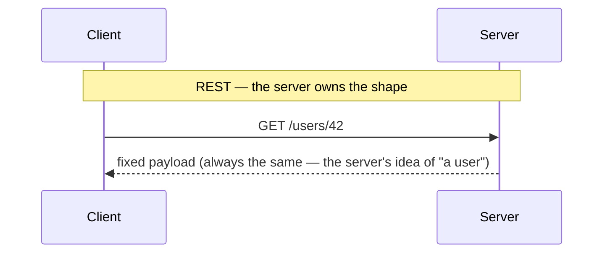
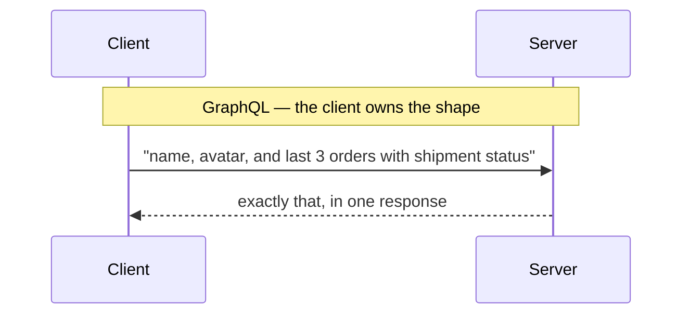

# The Problem REST Leaves

Before GraphQL can make sense, you have to feel the specific ache it was built for. If you've shipped a few screens against a REST API, you already have — you just might not have a name for it. There are two aches, and they're opposites of each other.

The good news: both come from the *same* root cause, and once you see it, GraphQL's whole design reads as one long response to it.

## The mental model: who decides the shape?

**What it actually is.** A REST endpoint is a fixed door. The *server* decides, ahead of time, what comes through it. `GET /users/42` returns whatever the team that built that endpoint chose to put in the user representation — every time, for every caller, whether you wanted all of it or none of it.

That single design choice — *the server owns the shape of the response* — is the source of both problems below. Hold onto it; it's the hinge the entire guide turns on.



## Problem 1: over-fetching — more than you asked for

**What it actually is.** Over-fetching is when an endpoint returns far more data than the screen in front of you needs. You wanted a name and an avatar; you got the name, avatar, bio, settings blob, billing address, notification preferences, and a timestamp for every one of them.

**What it does in real life.** Picture a comment list. Each comment shows an author's name and photo — two fields. But the only endpoint you have is the full user resource:

```console
$ curl https://api.example.com/users/42
{
  "id": 42,
  "name": "Dana Okoro",
  "avatarUrl": "https://cdn.example.com/u/42.jpg",
  "bio": "Backend engineer, coffee skeptic.",
  "email": "dana@example.com",
  "phone": "+1-555-0142",
  "timezone": "America/Chicago",
  "billingAddress": { "line1": "...", "city": "...", "postalCode": "..." },
  "notificationPrefs": { "email": true, "push": false, "sms": false },
  "createdAt": "2023-04-11T09:22:00Z",
  "updatedAt": "2026-05-30T14:08:11Z"
}
```
*What just happened:* You asked for one user and the server handed back its complete idea of a user — a dozen fields, a nested address, a preferences object. To render two of them, you downloaded all of them. On one comment that's harmless. On a list of fifty comments, over a phone connection, it's wasted bytes and slower screens, every single time.

⚠️ **Gotcha — over-fetching hides on fast networks.** On your laptop on office wifi, the extra fields cost nothing you'll notice. The bill arrives on a mid-range phone on a weak connection, which is exactly where you're least able to debug it. "It's fast on my machine" is how over-fetching survives to production.

## Problem 2: under-fetching — fewer round trips would be nice

**What it actually is.** Under-fetching is the opposite squeeze: a single endpoint doesn't give you enough to build one screen, so you fire several requests and wait for each before you can fire the next.

**What it does in real life.** You're building a dashboard header: the logged-in user, their three most recent orders, and the status of each order's shipment. With typical REST resources that's a waterfall:

```console
$ curl https://api.example.com/users/42
# ...returns the user, including an "orderIds": [9001, 9002, 9003]

$ curl https://api.example.com/orders/9001
$ curl https://api.example.com/orders/9002
$ curl https://api.example.com/orders/9003
# ...now, for each order, its shipment:

$ curl https://api.example.com/shipments/by-order/9001
$ curl https://api.example.com/shipments/by-order/9002
$ curl https://api.example.com/shipments/by-order/9003
```
*What just happened:* To fill one header you made seven requests, and they're not all parallel — you couldn't ask for the orders until the user response told you their IDs, and you couldn't ask for shipments until you had the orders. Each step waits on the one before it. That chained waiting is what makes screens feel sluggish, and it's the part you can't fix by adding a faster server.

📝 **Terminology — round trip.** One round trip is a full request out to the server and its response back. Latency (the travel time of a round trip) is often the dominant cost on mobile and far-away networks, which is why "seven requests instead of one" matters more than the raw byte count.

The usual REST escape hatch is to build a bespoke endpoint — `GET /dashboard-header` — that gathers everything server-side. It works, but now you own a custom endpoint per screen, and the next screen with slightly different needs gets its own. The shapes multiply.

## GraphQL's pitch, in one sentence

Both problems trace back to the same root: *the server decided the shape.* GraphQL inverts that.

**The pitch:** ask for exactly the fields you want, get exactly those fields back, in a single request.



For over-fetching, that means the comment list asks for `name` and `avatarUrl` and receives a payload with two fields — no bio, no billing address. For under-fetching, the dashboard header describes the user, their last three orders, *and* each shipment's status in one query, and the server walks the relationships and returns the whole nested shape in one round trip.

💡 **Key point.** GraphQL didn't invent a faster network or a smaller payload format. It moved the decision of *what to return* from the server to the client. Everything else in this guide — the good parts in Phase 2 and the costs in Phase 3 — follows from that one move.

That's the promise. The next phase shows the machinery that makes it real: a typed schema that defines what's askable, a single endpoint, and a response that mirrors the request exactly.

## Recap

1. **A REST endpoint is a fixed door** — the server decides the response shape, the same way for every caller.
2. **Over-fetching** is getting more fields than the screen needs; it hides on fast networks and bites on slow ones.
3. **Under-fetching** is needing several chained round trips to build one screen; the waiting, not the bytes, is what hurts.
4. **Both come from one root cause:** the server owns the shape.
5. **GraphQL's pitch:** let the client ask for exactly the fields it wants and get exactly those, in a single request.

---

[← Guide overview](_guide.md) · [Phase 2: How GraphQL Works →](02-how-graphql-works.md)
