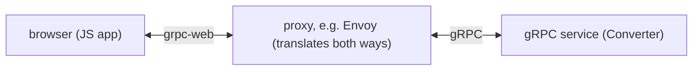

# The Real Trade-offs

Everything in Phases 1 and 2 was the case *for* gRPC. This phase is the part a battle-hardened friend owes
you: what it costs, and where it's the wrong tool. gRPC is genuinely excellent for one job and genuinely
awkward for others, and knowing the difference saves you from adopting it somewhere it'll fight you every
day. If you only read one thing, read the table below - then come back for the *why* underneath it.

## When to use which - REST vs GraphQL vs gRPC

> No tool here wins outright. Each made different choices for different problems. This table covers both the
> strengths and the costs of each, so you can match the tool to the situation.

| | REST | GraphQL | gRPC |
|---|---|---|---|
| **Core idea** | Resources + HTTP verbs (`GET /users/42`) | One query language; client asks for exactly the fields it wants | Typed function calls (RPC) from a shared contract |
| **Payload format** | JSON (text, human-readable) | JSON (text, human-readable) | Protocol Buffers (compact **binary**, not readable by eye) |
| **Typed contract** | Optional (OpenAPI, if you maintain it) | Yes - the schema | Yes - the `.proto`, enforced by code generation |
| **Browser support** | Native - any browser, `fetch`, `curl` | Native - it's HTTP + JSON | **Not directly** - needs grpc-web + a proxy |
| **Streaming** | Awkward (workarounds like SSE/long-poll) | Subscriptions (over WebSocket) | First-class - server, client, and bidirectional |
| **Debuggability** | Easy - read it in a browser or `curl` | Easy - readable queries and responses | Harder - binary needs special tooling to inspect |
| **Best fit** | Public APIs, simple CRUD, broad reach | Client-driven UIs that need flexible, exact data | Internal service-to-service, high call volume, low latency |
| **Weakest at** | Chatty multi-resource fetches; no enforced types | Server complexity; caching is harder than REST | Anything public or browser-facing |

💡 **Key point - the one-line rule of thumb.** Public or browser-facing? Reach for REST (or GraphQL if
clients need flexible queries). Internal services calling each other at high volume where you want speed and
a strict contract? That's gRPC's home turf. Many real systems use **both**: gRPC behind the scenes between
services, and a REST or GraphQL gateway at the public edge.

Now the costs in detail, because each row above hides a real day-at-work consequence.

## Cost #1: Binary isn't human-readable

This is the trade you make the moment you choose Protocol Buffers. With REST, when something goes wrong you just look:

```console
$ curl https://api.internal/convert -d '{"amount":1299,"from":"USD","to":"EUR"}'
{"amount":1187,"currency":"EUR"}
```

You saw the exact request and response in plain text, with your own eyes, in two seconds. That readability
is REST's superpower for debugging.

A gRPC call on the wire is binary. You can't `curl` it into something readable, and a packet capture shows
bytes, not fields. ⚠️ **Gotcha - don't try to debug gRPC with the JSON tools you know; they'll show you
noise.** gRPC has its own tooling that *does* make it readable - you point a tool at the service and call
methods by name, and it uses the contract to render requests and responses as text:

```console
$ grpcurl -d '{"amount":1299,"from":"USD","to":"EUR"}' \
    localhost:50051 currency.Converter/Convert
{
  "amount": "1187",
  "currency": "EUR"
}
```

`grpcurl` (the gRPC cousin of `curl`) used the service's contract to turn your text into the right binary
call, sent it, and turned the binary reply back into readable JSON for you. The point isn't that gRPC is
undebuggable - it's that the easy, universal `curl`-it reflex doesn't work, and you have to learn a new
tool to get the same comfort.

## Cost #2: Browsers can't speak gRPC directly

A browser cannot make a raw gRPC call: gRPC needs fine-grained control over HTTP/2 frames that browser
JavaScript isn't given access to, so a web page can't call your gRPC service the way it calls a REST
endpoint.

The workaround is **grpc-web**: a variant of the protocol that browsers *can* speak, paired with a small
**proxy** that translates between grpc-web and real gRPC.



The browser talks grpc-web to a proxy; the proxy talks native gRPC to your service and relays the answer
back. It works, and plenty of teams run it - but you now have an extra moving piece to deploy and operate,
and grpc-web doesn't support every streaming mode (client and bidirectional streaming are limited).
📝 **Terminology - a "proxy" here is a server that sits in the middle, receiving requests in one protocol
and forwarding them on in another.**

This is the single biggest reason gRPC is a poor fit for *public, browser-facing* APIs: you're signing up
for infrastructure and limitations to do something REST does for free.

## Cost #3: The tooling and learning curve are real

With REST, a new teammate can be productive in an afternoon - it's HTTP and JSON, tools they already know.
gRPC asks more up front:

- You add a **code-generation step** to your build, and everyone needs `protoc` and the right plugins set up.
- You and your team have to learn the `.proto` language, the field-tag rules, and the four call types.
- Your debugging, testing, and observability tools may need gRPC-aware versions or plugins.

None of this is hard once learned, and it's wholly worth it for the right use case. But it's a genuine cost,
and pretending otherwise would be the kind of hand-waving this guide exists to avoid. For a small service
with a handful of public JSON endpoints, that cost buys you very little. For a fleet of internal services
exchanging huge call volumes, it pays for itself quickly.

## Where gRPC genuinely shines

To end on the fair note: when the use case matches, gRPC is hard to beat.

- **Internal microservice-to-microservice traffic** - the exact scenario from Phase 1. High volume, latency
  matters, both ends are yours, and you want a contract a machine enforces.
- **Polyglot backends** - a Go service and a Python service and a Java service all generating type-safe
  stubs from one `.proto` is a real, daily win.
- **Streaming workloads** - live feeds, telemetry pipelines, long-lived bidirectional channels. gRPC's
  streaming is first-class where REST has only workarounds.

And where it doesn't:

- **Public APIs** you want third parties to consume with `curl` and zero special tooling.
- **Browser-facing endpoints**, unless you're ready to run grpc-web and a proxy.
- **Simple CRUD** where REST's readability and ubiquity already give you everything you need.

## Recap

1. **Binary payloads aren't human-readable** - you trade `curl`-it-and-read for tools like `grpcurl` that
   use the contract to render calls as text.
2. **Browsers can't speak gRPC directly** - you need **grpc-web** plus a translating **proxy**, with some
   streaming limits. That's why gRPC is a poor fit for public, browser-facing APIs.
3. **The learning and tooling curve is real** - code generation, `.proto` rules, gRPC-aware tools - and only
   pays off at the right scale.
4. **gRPC shines** for internal, high-volume, polyglot, and streaming service-to-service traffic; **REST and
   GraphQL win** at the public, browser-facing, readable-by-default edge.
5. Many systems use **both**: gRPC between services, REST/GraphQL at the public boundary.

You now have the whole picture - what gRPC is, how it works, and the real cost of using it. When someone
puts a `.proto` file in front of you, you'll know exactly what you're looking at and whether it belongs
there.

---

[← Phase 2: How gRPC Works](02-how-grpc-works.md) · [Guide overview](_guide.md)

**Related guides:** [REST APIs, Explained](/guides/rest-apis-explained) · [GraphQL, Explained](/guides/graphql-explained)
