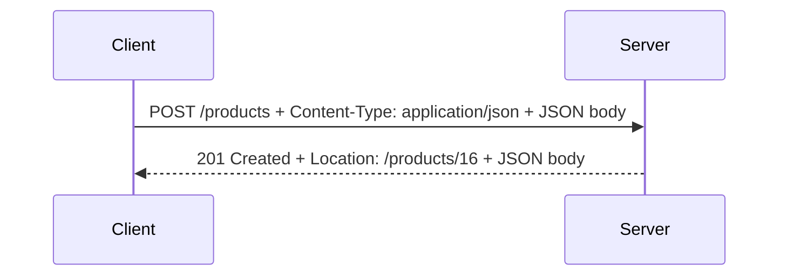

# A Real API Call

You've met both halves: HTTP carries the message, JSON carries the data. Now you'll put them together the
way every real API call does — first reading data with a `GET`, then sending data with a `POST`. We'll use
`curl` so nothing hides the request or the response from you.

The examples use a public-style JSON API at `https://api.example.com` — a stand-in for the kind of endpoint
you'll meet in the wild. The *shapes* of the requests and responses are exactly what real APIs produce.

## Reading data: GET that returns JSON

The most common thing you'll ever do with an API is ask it for some data. That's a `GET`: name the thing
you want in the URL, and read the JSON that comes back.

```console
$ curl -i https://api.example.com/products/15
HTTP/1.1 200 OK
Content-Type: application/json
Content-Length: 96

{"id":15,"name":"Mechanical Keyboard","price":129.99,"in_stock":true,"tags":["peripherals","input"]}
```
You sent a `GET` for `/products/15`. The server replied `200 OK` (it worked), and the
`Content-Type: application/json` header told you the body is JSON. The body is one JSON object describing
product 15 — and you can already read every field: a number `id`, a string `name`, a number `price`, a
boolean `in_stock`, and an array of `tags`. Everything from Phase 2, on the wire, for real.

That single line of JSON is compact because the server didn't add spaces. If you want it laid out for human
eyes, pipe it through a formatter. Many systems have `jq` installed for exactly this:

```console
$ curl -s https://api.example.com/products/15 | jq
{
  "id": 15,
  "name": "Mechanical Keyboard",
  "price": 129.99,
  "in_stock": true,
  "tags": [
    "peripherals",
    "input"
  ]
}
```
The `-s` flag silences `curl`'s progress meter so only the body is passed along, and `jq` pretty-prints the
JSON with indentation — same data, same bytes from the server, just spaced out so the structure is obvious.
(`jq` is a separate tool, not part of `curl`; if you don't have it, the compact line above is still
perfectly valid JSON.)

⚠️ **Gotcha.** `-i` (show response headers) and `-s` (silent) do different jobs — don't confuse them.
Reach for `-i` when you want to *see the status code and headers*; reach for `-s` when you want *only the
body*, usually to pipe it somewhere like `jq`.

## Sending data: POST with a JSON body

When you want the API to *create* something — a new user, an order, a comment — you send the data in the
request body, as JSON, with a `POST`. Two things have to be right for the server to accept it: the body
must be valid JSON, and you must tell the server it *is* JSON with a `Content-Type` header.

```console
$ curl -i -X POST https://api.example.com/products \
    -H "Content-Type: application/json" \
    -d '{"name": "Wireless Mouse", "price": 49.99, "in_stock": true}'
HTTP/1.1 201 Created
Content-Type: application/json
Location: /products/16

{"id":16,"name":"Wireless Mouse","price":49.99,"in_stock":true,"tags":[]}
```
You sent a `POST` to `/products` — the collection of products — asking it to create a new one. Read each
flag, because this is the pattern you'll reuse constantly:

- `-X POST` sets the **method** to `POST` (the default is `GET`).
- `-H "Content-Type: application/json"` adds the **header** that announces "my body is JSON." Without it,
  many servers won't know how to read what you sent and will reject it.
- `-d '{...}'` is the **request body** — the JSON data you're sending. (Using `-d` also makes `curl` send a
  `POST` automatically, but writing `-X POST` keeps the intent obvious.)

The response is `201 Created` — a more specific `2xx` than `200`, meaning "I made the new thing." The
server filled in an `id` (16) and an empty `tags` array, and the `Location` header points at the URL of the
resource you just created. You sent JSON; you got JSON back. That round trip is the heart of working with
any web API:



📝 **Terminology.** The single quotes around the `-d '...'` value are your **shell's** way of passing the
JSON to `curl` as one piece without mangling it — they are not part of the JSON. Inside, the JSON itself
still uses **double quotes**, exactly as Phase 2 requires.

⚠️ **Gotcha.** If you forget the `Content-Type: application/json` header, a server will often reply
`400 Bad Request` or `415 Unsupported Media Type` even though your JSON is perfect — because it didn't know
to read the body as JSON. When a `POST` is rejected, check that header first. (And recheck your JSON for a
stray trailing comma — the other usual suspect.)

## You can now read any API call

Look back at what you did. You sent a method to a URL, attached the right headers, put JSON in the body when
you had data to send, and read the status code and JSON that came back. There was no magic — only the two
building blocks, used together:

```text
   ┌─────────────────────── one API call ───────────────────────┐
   │                                                             │
   │   YOU send:   METHOD  +  URL  +  headers  +  JSON body      │   ← HTTP carries it,
   │                                                             │     JSON is the data
   │   YOU get:    status code  +  headers  +  JSON body         │
   │                                                             │
   └─────────────────────────────────────────────────────────────┘
```

That diagram is every web API request you'll ever make, in one frame. The specifics change — different
URLs, different fields, an `Authorization` header once you need to log in — but the shape is always this.
You now have the vocabulary to read it.

💡 **Key point.** HTTP and JSON are the two building blocks, and you've now used both together. What you
*haven't* learned yet is how APIs are *organized* — why it's `GET /products/15` and `POST /products`, how
URLs map to "resources," and the conventions that make different APIs feel familiar. That organizing layer
is **REST**, and it's the natural next step.

## Recap

1. A **`GET`** asks for data; read the JSON in the response body (use `jq` to pretty-print it).
2. A **`POST`** sends data; put valid JSON in the body with `-d` and announce it with
   `-H "Content-Type: application/json"`.
3. `curl` flags to know: `-X` sets the method, `-H` adds a header, `-d` sends a body, `-i` shows response
   headers, `-s` shows only the body.
4. `201 Created` is the typical success for a `POST`; a missing `Content-Type` header is the usual reason a
   good JSON body gets rejected.
5. Every web API call is the same shape: **method + URL + headers + JSON body** out, **status + headers +
   JSON body** back.

---

[← Phase 2: JSON, the Data Format](02-json-the-data-format.md) · [Guide overview](_guide.md) · Next up: [REST APIs Explained →](/guides/rest-apis-explained)
