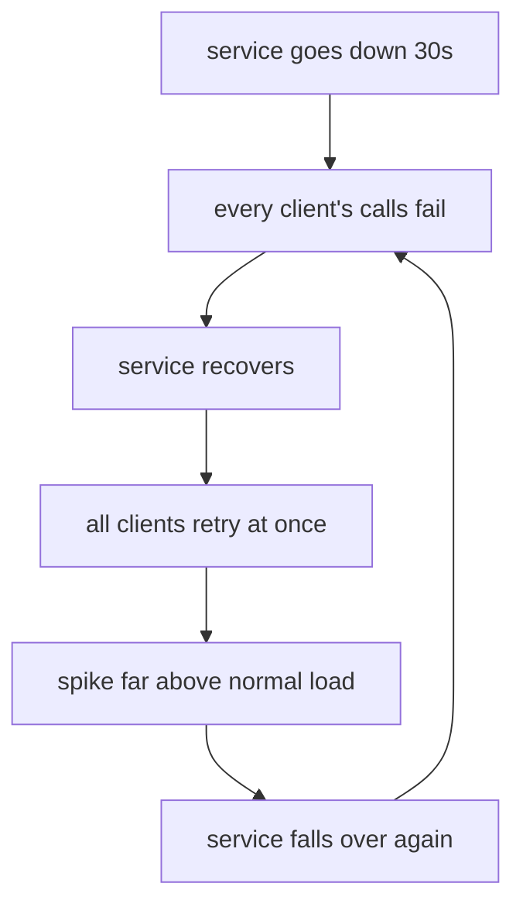
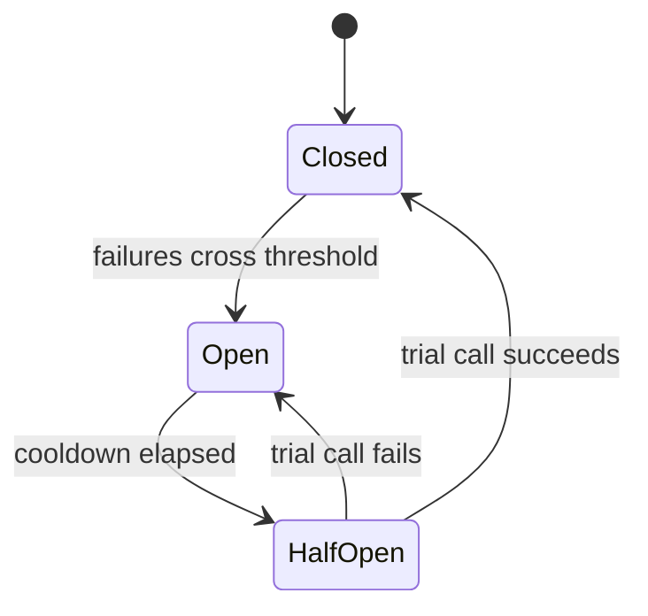

# When Retrying Isn't Enough

You did everything right in Phase 2 — backoff, jitter, a budget, idempotency keys. And there's still a
failure mode that recipe can't fix: the dependency isn't *blipping*, it's *down*. When that happens, even
polite retries from enough clients become an attack, and retrying a corpse wastes your own resources
and makes recovery harder. This phase is about recognizing "stop trying for a bit" as the resilient move,
and the patterns that do it for you.

## The thundering herd, properly

You met the herd in Phase 2 as the reason for jitter. Now see its bigger, scarier form. A popular service
goes down for thirty seconds. During that window, every client's request fails. The instant it comes back
up, *all of those clients retry at once* — plus all the new traffic that arrived in the meantime. The
service, already fragile from rebooting, gets slammed by a spike far larger than its normal load and falls
over again. Now it's down longer, more clients pile up, and the next recovery attempt faces an even bigger
wall. That's a **retry storm**, and it can keep a service down long after the original problem is gone.



*What just happened:* the diagram is a *loop* on purpose — the retries feed the very outage they're
reacting to. Jitter softens each wave, but past a certain scale, smearing the spike isn't enough. You need
clients that recognize "this thing is down" and *stop calling it entirely* for a while. That's the
circuit breaker.

## The circuit breaker

The name comes from the electrical panel in your home. When a circuit draws too much current, the breaker
*trips* — it cuts the connection so the wiring doesn't catch fire. You don't keep jamming the switch back;
you wait, fix the cause, then reset it. A software **circuit breaker** does the same for a failing
dependency: after enough failures, it *opens* and makes your calls fail instantly — without even touching
the network — for a cooldown period. This protects two parties at once: the struggling service gets
breathing room, and *you* stop wasting time and threads waiting on calls that are going to fail anyway.

A breaker has three states:



- **Closed** — normal. Calls flow through. The breaker counts failures.
- **Open** — tripped. Calls fail *instantly* (no network call) for a cooldown window. This is the herd
  protection: a thousand clients with open breakers send *zero* requests instead of a storm.
- **Half-open** — after the cooldown, the breaker lets *one* trial call through. If it succeeds, the
  service is back: close the breaker and resume. If it fails, re-open and wait again.

*What just happened:* the half-open state is the clever bit — instead of all clients rushing back the
instant the cooldown ends (which would re-create the herd), the breaker probes with a single request and
only fully reopens the floodgates once that probe proves the service is healthy. It recovers *gently*.

📝 **Terminology.** *Trip / open* = the breaker has decided the dependency is unhealthy and is short-
circuiting calls. *Cooldown* = how long it stays open before testing again. *Half-open* = the cautious
"let one through and see" probe state. Most resilience libraries implement all of this for you; you mostly
tune the thresholds.

💡 **Key point.** Retries handle a service that's *struggling*; a circuit breaker handles a service that's
*down*. Retrying says "try again soon"; the breaker says "stop trying for now." A robust client uses both
— retry the blips, trip the breaker on a real outage.

## When the breaker is open: degrade gracefully

A breaker that's open means a feature is unavailable *right now*. The question becomes: what does your app
do instead of the call? Failing instantly is good for the *dependency*, but your user still needs an
answer. The art is **graceful degradation** — a reduced but working experience instead of a hard crash.

Common fallbacks, roughly best to worst:

- **Serve a cached or stale value.** "Last known price" beats a spinner that never resolves.
- **Use a sensible default.** Recommendations service down? Show the popular-items list.
- **Queue the work for later.** Can't process the upload now? Accept it, enqueue it, confirm when done.
- **Fail with a clear, honest message.** "Search is temporarily unavailable, try again shortly" — not a
  blank page or a stack trace.

```text
checkout flow, fraud-check service is down (breaker open):

  bad:   call fraud-check -> hang 30s -> time out -> 500 -> customer lost
  good:  breaker open -> skip the call -> flag order for manual review -> complete checkout
```

*What just happened:* the good path didn't pretend the dependency was up and didn't crash the whole
checkout because one service was down. It chose a safe fallback (review the order later) so the *core*
flow — taking the order — still worked. Deciding these fallbacks ahead of time is what separates an app
that *bends* in an outage from one that *breaks*.

## Being a genuinely good client

Pull the whole guide together into the posture that keeps you off everyone's incident reports — including
your own:

- **Listen to what the server tells you.** Honor `Retry-After`. Watch `X-RateLimit-Remaining` and slow
  down *before* you hit the wall, instead of bouncing off it repeatedly.
- **Never retry without backoff and jitter.** Instant or synchronized retries are how you turn one blip
  into an outage.
- **Bound your effort.** A retry budget and (where it fits) a circuit breaker keep a downstream failure
  from becoming *your* failure.
- **Retry only what's safe.** Idempotent calls freely; non-idempotent writes only with an idempotency key.
- **Cache and batch to need fewer calls.** The cheapest request is the one you didn't have to make. Cache
  responses that don't change often; batch many small calls into one where the API supports it.
- **Spread out scheduled work.** If a hundred of your machines all hit an API exactly on the minute via
  cron, you've built a thundering herd on a timer. Add a little randomness to scheduled jobs too.

> The throughline of this entire guide: a rate limit or an outage is the *system asking you to behave*.
> A good client *listens* — it slows down when asked, backs off when refused, and stops knocking when the
> door is clearly bolted. That's not only courtesy; it's what keeps the service (and you) alive.

## For builders

You don't have to hand-build breakers or backoff — mature resilience libraries exist in every major
ecosystem (think "retry + circuit-breaker" toolkits) and they've already handled the edge cases. Your
engineering judgment goes into the *policy*: which dependencies get a breaker, what the thresholds and
cooldowns are, and — most importantly — what each feature *falls back to* when its dependency is gone.
Decide those fallbacks during calm design time, not at 2am during the incident. For where this fits in the
wider picture of how services talk to each other, see [REST APIs, Explained](/guides/rest-apis-explained)
and [What an API Is](/guides/what-an-api-is).

## Recap

1. A **retry storm / thundering herd** is when many clients retry in sync and re-crash a service that was
   trying to recover. Jitter softens it; at scale you need more.
2. A **circuit breaker** *opens* after repeated failures and makes calls fail instantly during a cooldown,
   sparing both the downed service and your own resources.
3. The breaker's **half-open** state probes with a single call so recovery is gentle, not another stampede.
4. When the breaker is open, **degrade gracefully** — cache, default, queue, or a clear message — instead
   of crashing the whole flow.
5. A **good client** listens to the server's signals, always backs off with jitter, bounds its effort,
   retries only what's safe, and makes fewer calls by caching, batching, and de-syncing scheduled jobs.

You came in panicking at `429`s and a tight retry loop that made things worse. You leave knowing *why*
APIs push back, how to retry so it helps instead of harms, and what to do when retrying alone won't cut
it. That's the full toolkit for calling a flaky, throttled, or down dependency like someone who's been
paged for it before — and built so they won't be again.

```quiz
[
  {
    "q": "What problem does a circuit breaker solve that retries with backoff and jitter do not?",
    "choices": [
      "It encrypts requests to a failing service",
      "It stops a client from calling a service that is genuinely down, instead of repeatedly waiting on doomed calls",
      "It guarantees the request will eventually succeed",
      "It removes the need for a Retry-After header"
    ],
    "answer": 1,
    "explain": "Retries handle a struggling service; a breaker handles a down one. When open, it fails calls instantly — sparing the downed service and freeing your own resources instead of waiting on calls that will fail."
  },
  {
    "q": "Why does a circuit breaker use a 'half-open' state instead of fully closing as soon as the cooldown ends?",
    "choices": [
      "To make the code more complicated on purpose",
      "So it can probe with a single trial call and only fully reopen if the service is actually healthy, avoiding a new stampede",
      "Because half-open requests are faster than closed ones",
      "To bill the dependency for the downtime"
    ],
    "answer": 1,
    "explain": "If every client resumed at once when the cooldown ended, that's another thundering herd. Half-open lets one trial call test the waters, so recovery is gentle."
  },
  {
    "q": "A dependency's circuit breaker is open during checkout's optional fraud check. What is the most graceful behavior?",
    "choices": [
      "Keep calling the fraud service in a tight loop until it answers",
      "Crash the entire checkout with a 500 error",
      "Skip the call and flag the order for later manual review so checkout still completes",
      "Silently approve nothing and show the customer a blank page"
    ],
    "answer": 2,
    "explain": "Graceful degradation keeps the core flow working with a safe fallback. Flagging the order for review lets checkout complete instead of crashing the whole flow because one service is down."
  }
]
```

---

[← Phase 2: Retrying Without Making It Worse](02-retrying-without-making-it-worse.md) · [Guide overview](_guide.md)
