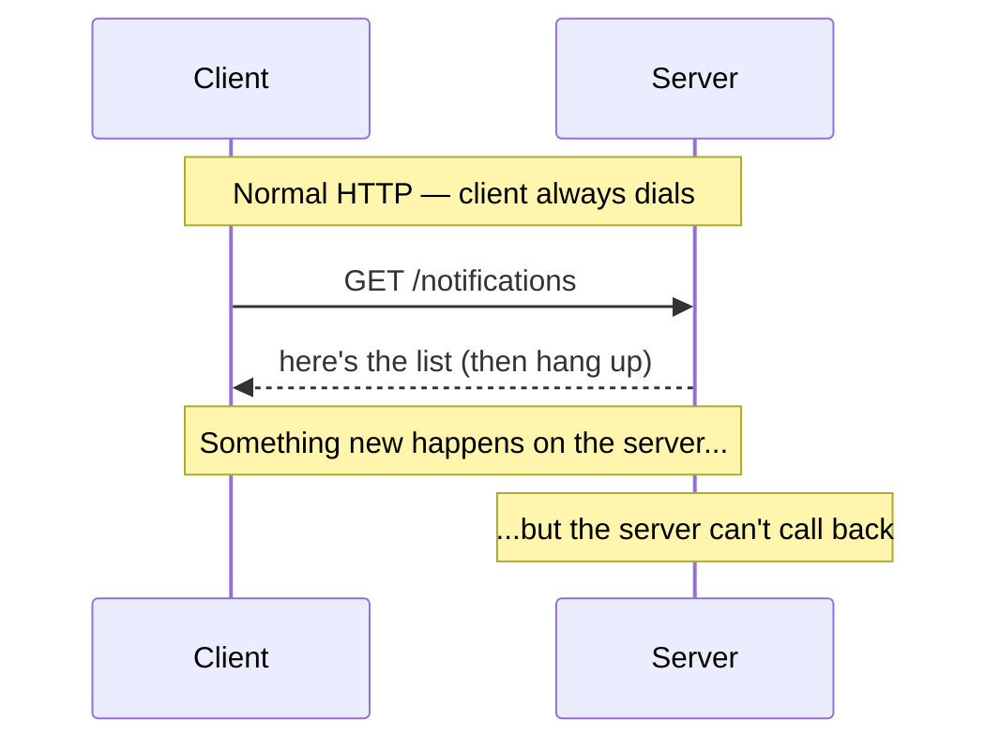

# Why HTTP Can't Push

Here's the thing nobody says out loud when you first learn web development: a normal HTTP request is a
phone call where *only the client is allowed to dial.* You (the browser) call the server, say what you
want, the server answers, and then the line hangs up. The server never calls you back. It *can't* — it
doesn't have your number, and even if it did, the connection is already closed.

That's completely fine for "show me my profile" or "save this form." It falls apart the instant you want
something *live*. A new message, a price tick, a build that turned green — those happen on the
server's side, on the server's schedule, and the server has no way to lean over and tell you. This phase
is about why that limitation exists, and the three honest ways around it.

## The shape of a normal request

**What it actually is.** HTTP is request/response. One request, one response, then done. The client
always speaks first; the server only ever *replies*. There is no slot in the protocol for the server to
say something unprompted.

**What it looks like.**
```console
$ curl https://api.example/v1/notifications
[{"id":1,"text":"Welcome!"}]
$
```
*What just happened:* You asked once, got the current list, and the connection closed. If a new
notification arrives one second later, this terminal has no idea. The server can't reach back through a
hung-up line — you'd have to run `curl` again to find out.

📝 **Terminology.** "Realtime" on the web rarely means microsecond-precise. It means *the user sees the
change within a second or so of it happening, without doing anything.* That's the bar these patterns
clear — not hard-realtime like a flight controller.

## The pull-vs-push problem, in one picture



The whole problem fits in that gap after "something new happens." Every realtime pattern is an answer to
*one* question: how does the server get a message to a client who isn't currently asking?

## The three answers, from simplest to strongest

There are exactly three patterns you need, and they sit on a ladder. Climb only as high as you must.

**1. Polling — fake the push by asking on a loop.**
The client keeps asking, over and over: "anything new? anything new?" It's not really a push at
all — it's a pull on a timer. Dead simple, works with the HTTP you already have, and wasteful: most
answers are "nope." There's a smarter cousin, **long-polling**, where the server *holds the request
open* until it has something to say — we'll build it in Phase 2.

**2. Server-Sent Events (SSE) — a one-way pipe, server to client.**
The client opens *one* HTTP request and the server, instead of answering and hanging up, keeps the line
open and *streams* events down it as they happen. Traffic flows one direction: server → client. It runs
over plain HTTP, the browser has it built in (`EventSource`), and it reconnects automatically if the
line drops. Perfect for feeds, notifications, live dashboards, progress bars — anything where the client
mostly listens.

**3. WebSockets — a two-way pipe, both directions.**
Both sides can send at any time, independently, over a single long-lived connection. This is *full-
duplex*: the server can push to you and you can push to the server in the same breath. It's the right
tool when both ends genuinely talk — chat, multiplayer games, collaborative editing, a shared cursor.
It's also the most machinery, so don't reach for it out of habit.

💡 **Key point.** These aren't competitors to grade. They're a ladder of capability and cost. The
question is never "which is best" — it's "what's the *least* I need?"

## The one-line decision rule

When someone asks for realtime, run this in your head before writing any code:

- **Does the client only need to *receive* updates?** → SSE. (Or polling, if updates are rare.)
- **Do *both* sides need to send, constantly and independently?** → WebSockets.
- **Are updates rare and latency-tolerant (every 30s is fine)?** → Polling. Don't open a persistent
  connection for a number that changes twice an hour.

```text
receive only ............. SSE   (or polling if rare)
two-way, constant ........ WebSockets
rare + lazy .............. Polling
```
*What just happened:* You turned a vague "make it realtime" into a concrete pick in three questions. The
default answer for "show me live stuff" is SSE, not WebSockets — most teams reach for the heavy tool out
of reflex and regret the scaling bill later.

⚠️ **WebSockets are not the default.** They feel like the "real" realtime tech, so people grab them for
a one-way notification feed and inherit a pile of complexity (no automatic reconnect, harder to scale,
trickier through proxies) they didn't need. If data flows one way, SSE is almost always the calmer
choice.

🪖 **War story.** A team built a stock-ticker dashboard — pure server-to-client price updates — on
WebSockets because "realtime means WebSockets." Six months in, they were hand-rolling reconnect logic,
heartbeats, and fighting a corporate proxy that kept killing the socket. They eventually rewrote it on
SSE in an afternoon. The browser handled reconnect for free, and the proxy stopped complaining because
it was plain HTTP the whole time.

## For builders

Before you add *any* realtime layer, ask whether the feature needs it at all. A "live" view that updates
on the user's next click or navigation often feels fine and costs nothing. Realtime is a recurring
operational cost — open connections, more servers, more failure modes. Spend it where the user actually
notices the delay (chat, collaboration, fast-moving numbers), not everywhere you *could*.

If you're coming from the request/response world, these patterns sit on top of the same foundation —
[REST APIs, Explained](/guides/rest-apis-explained) is the model they extend, and for "the server tells
me later" *between systems* rather than to a browser, that's [Webhooks & Message
Queues](/guides/webhooks-and-message-queues), a different tool for a different shoulder-tap.

## Recap

1. **Plain HTTP can't push** — it's request/response, the client always dials, the server only replies
   and then hangs up.
2. Every realtime pattern answers one question: **how does the server reach a client who isn't asking
   right now?**
3. **Three answers, on a ladder:** polling (ask on a loop — simple, wasteful), SSE (one-way stream over
   HTTP — great for feeds), WebSockets (two-way pipe — for chat and collaboration).
4. **Pick the simplest that fits.** Receive-only → SSE. Both sides talk → WebSockets. Rare and lazy →
   polling. WebSockets are not the default.

Next, we stop talking about them and build all three — including the long-polling trick and a real SSE
stream that reconnects itself.

```quiz
[
  {
    "q": "Why can't a plain HTTP server push an update to a client on its own?",
    "choices": [
      "HTTP is encrypted, so the server can't read the client's address",
      "HTTP is request/response — the client always initiates, and the connection closes after the reply",
      "Servers are too slow to send unprompted messages",
      "Browsers block all incoming server messages for security"
    ],
    "answer": 1,
    "explain": "HTTP is a pull model: the client dials, the server replies, the line closes. There's no slot for the server to speak first."
  },
  {
    "q": "A feature needs to stream live notifications from the server to the browser, one direction only. What's the calmest fit?",
    "choices": [
      "WebSockets, because realtime always means WebSockets",
      "Polling every 100ms",
      "Server-Sent Events (SSE) — a one-way stream over plain HTTP with built-in reconnect",
      "A new HTTP request for every notification"
    ],
    "answer": 2,
    "explain": "One-way server-to-client is exactly SSE's job: plain HTTP, built-in EventSource, automatic reconnect. WebSockets would be extra machinery you don't need."
  },
  {
    "q": "What distinguishes WebSockets from SSE?",
    "choices": [
      "WebSockets are full-duplex — both sides can send at any time; SSE is one-way, server to client",
      "WebSockets don't need a connection",
      "SSE is faster than WebSockets in every case",
      "WebSockets only work for chat apps"
    ],
    "answer": 0,
    "explain": "WebSockets are two-way (full-duplex); SSE streams in one direction only. Reach for WebSockets when both ends genuinely talk."
  }
]
```

---

[← Guide overview](_guide.md) · [Phase 2: The Three Patterns in Practice →](02-the-three-patterns.md)
