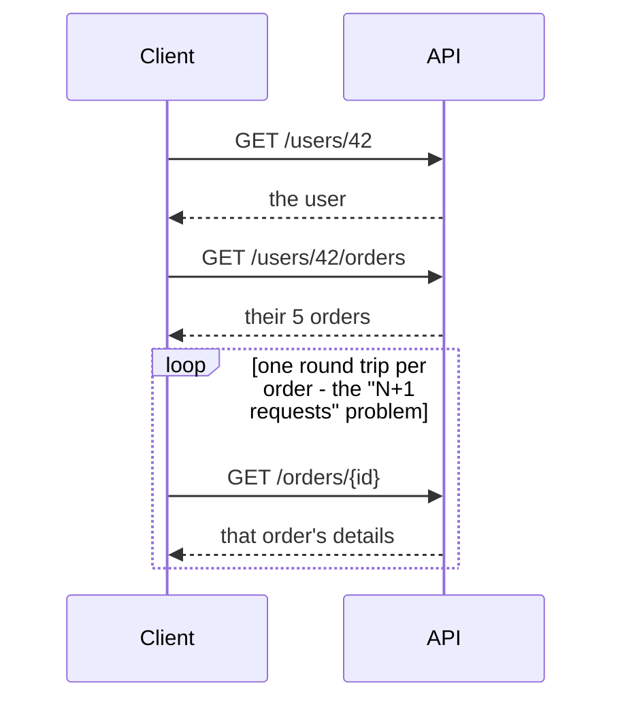

# REST in the Real World - Where It Bends and Where It Breaks

If you've read the first two phases, you might now be worried that some API you use daily isn't "really
REST" - it has a `/search` endpoint, or a `POST /orders/42/cancel` that's clearly a verb. Relax. That
instinct is healthy, and the answer is freeing: almost no production API is textbook-pure REST, and that's
fine. This phase is the clear-eyed conversation about what REST is in practice, and the genuine pain points
that make teams reach for other tools.

## REST is a style, not a law

REST was described in 2000 by Roy Fielding as an *architectural style* - a set of constraints, not a
specification you can fail a compliance test against. (source:
https://ics.uci.edu/~fielding/pubs/dissertation/rest_arch_style.htm) There's no committee that certifies
an API "RESTful." So in everyday speech, "REST API" has come to mean something looser and more practical:
*an HTTP API organized around resources and methods, returning JSON, using status codes sensibly.* That's
the API you'll build and consume 95% of the time.

Newcomers sometimes treat the conventions from Phase 2 as sacred rules and feel guilty breaking them. But
real apps have needs that don't map cleanly onto five verbs and a noun. Two common, *accepted* pragmatic
deviations:

- **Actions that aren't CRUD.** "Cancel this order," "publish this draft," "send this email" are verbs,
  not nouns. The pragmatic move is a sub-resource that reads as an action:
  `POST /orders/42/cancellation` or, very commonly, `POST /orders/42/cancel`. Purists wince; teams ship
  it; the world keeps turning.
- **Search.** Complex search rarely fits filter params, so a dedicated `GET /search?q=...` (or even a
  `POST /search` with a query body) is standard and nobody objects.

💡 **Key point.** The conventions exist to make APIs *predictable*, not to win an argument. Follow them by
default because predictability is valuable; break them deliberately when a real need doesn't fit, and your
API will still be perfectly good. "Pragmatic REST" is the norm, not a compromise to apologize for.

⚠️ **Gotcha - but don't tunnel actions through `GET`.** There's one line you should *not* cross casually.
A `GET` is supposed to be *safe* - read-only, retryable, cacheable (see Phase 1). The moment you make a
`GET` change data - `GET /orders/42/delete`, or a `GET` that charges a card - you've broken a promise the
entire web relies on. Browsers prefetch links, proxies cache `GET`s, crawlers follow them, and a
"retry on timeout" will happily fire it twice. People have wiped their own data because an admin tool put
a destructive action behind a `GET` link that something prefetched. Anything that changes state goes
behind `POST`/`PUT`/`PATCH`/`DELETE`. Bend the noun rules freely; never bend this one.

## Pain point 1: over-fetching and under-fetching

This is the most-felt limitation of resource-shaped APIs, and it has two faces.

**Over-fetching** - you ask for a resource and get *more* than you need. Your mobile screen only shows a
user's name and avatar, but the resource hands you the whole record:

```http
GET /users/42 HTTP/1.1
```
```http
HTTP/1.1 200 OK
Content-Type: application/json

{
  "id": 42,
  "name": "Dana Okoro",
  "avatar_url": "https://cdn.example.com/a/42.png",
  "email": "dana@example.com",
  "bio": "...a few paragraphs...",
  "preferences": { "...": "..." },
  "billing_address": { "...": "..." },
  "created": "2023-02-11T00:00:00Z"
}
```
You needed two fields and the server sent ten. Each endpoint returns a *fixed* representation, so it
ships the full record to everyone - wasting bandwidth, which stings most on slow mobile connections.

**Under-fetching** - the opposite: one resource isn't enough, so you make several calls. To render
"a user and the titles of their last 5 orders," the user resource doesn't include orders, so:



One screen became seven sequential requests, each paying its own network round trip. On a fast connection
it's invisible; on a phone in a tunnel, those round trips stack up into a visibly slow screen. This is the
**"chatty API" / N+1 requests** problem.

There's tension here, too: you can fight over-fetching by making resources skinnier, but that makes
under-fetching worse (more calls to assemble a page), and you can fight under-fetching by fattening
resources, which worsens over-fetching. Resource-shaped APIs make you pick a point on that spectrum for
*everyone*.

> This exact pain - the client wanting to ask for precisely the fields and relationships it needs, in one
> request - is the problem [GraphQL, Explained](/guides/graphql-explained) was built to solve. It's worth
> understanding REST's limitation first, because it's *why* GraphQL exists.

## Pain point 2: versioning

APIs are contracts, and contracts change. The day you rename a field, split an endpoint, or make an
optional param required, every existing client that relied on the old shape can break - and you often
can't update those clients (they're mobile apps in the wild, third-party integrations, scripts you've
never heard of). You need to evolve without pulling the rug out.

The common, blunt tool is to put a version in the URL and run the old and new shapes side by side:

```http
GET /v1/users/42 HTTP/1.1
```
```http
GET /v2/users/42 HTTP/1.1
```
`/v1` keeps serving the old shape to old clients while `/v2` ships the new one. Nobody breaks; you
migrate callers over time, then retire `/v1` once it's quiet. (Some teams version via a header instead of
the URL - same idea, different placement.) It works, but every live version is code you maintain, test,
and can't delete, so versions are expensive and you want as few as possible.

The deeper craft here - how to change an API *without* needing a new version most of the time (additive
changes, deprecation policies, tolerant readers) - is a whole discipline of its own.

> That discipline is exactly the subject of
> [Designing APIs That Last](/guides/designing-apis-that-last) - how to evolve a contract for years
> without breaking the people who depend on it.

## So when is REST the right call?

In short? Most of the time. REST's pain points are real, but so are its strengths, and for the common case
it's hard to beat:

```text
   REST shines when…                        REST strains when…
   ─────────────────────────────────        ─────────────────────────────────
   resources map cleanly to nouns           clients need wildly different
   (users, orders, posts)                   slices of the data per screen

   you want HTTP caching, proxies,          one screen needs data from many
   and tooling to "just work"               resources (chatty / N+1)

   many independent clients, each            mobile bandwidth is precious and
   doing simple CRUD                         over-fetching is costly

   you value predictability and a           the data is a deeply connected
   low learning curve                       graph you query many ways
```

REST is the dependable default - well-understood, tooled to death, and predictable. Reach for something
else when your pain points line up with the right-hand column, not because REST is "old." A boring,
consistent REST API that your whole team can read is worth more than a clever one nobody can predict.

## Recap

1. **REST is a style, not a law** - real APIs are *pragmatic*, with `/search` endpoints and action
   sub-resources, and that's normal.
2. **The one hard rule: never change state through `GET`** - safe methods get prefetched, cached, and
   retried.
3. **Over-fetching** (too much data per call) and **under-fetching** (too many calls per screen) are
   REST's core tension - and the reason [GraphQL](/guides/graphql-explained) exists.
4. **Versioning** (`/v1`, `/v2`) lets you evolve without breaking old clients, but every version is code
   you must maintain - [Designing APIs That Last](/guides/designing-apis-that-last) covers doing it well.
5. **REST is the right default for most APIs** - choose something else when your needs match the
   strain column, not out of fashion.

That's REST, plain and simple. You can now read an unfamiliar API on sight, design one others can navigate, and
recognize the moment its style stops serving you - which is exactly when the related guides pick up.

Watch it animated: [REST vs. GraphQL](/explainers/RESTvsGraphQL.dc.html)

---

[← Phase 2: Designing Endpoints](02-designing-endpoints.md) · [Guide overview](_guide.md)
