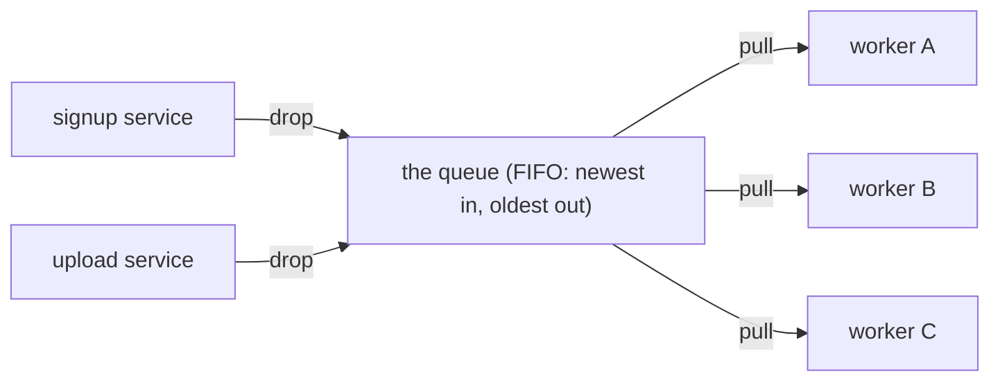

# Message Queues

A user signs up on your site. Behind that one click, you want to: save the account, send a welcome
email, generate a thumbnail for their avatar, and notify your analytics. If you do all of that *before*
showing them "Welcome!", they're staring at a spinner while four things happen in a row — and if the
email service is having a bad day, the whole signup *fails* over a welcome email that nobody needed
immediately.

The fix is to stop doing everything in line. Save the account, then drop little notes that say "send
this person a welcome email" and "make a thumbnail" onto a list, and tell the user "Welcome!" right
away. Something else picks up those notes and does the work in its own time. That list is a **message
queue**, and once you have the mental model, a huge category of architecture problems gets simple.

## The mental model: a to-do list between services

A message queue is a buffer that sits *between* two pieces of your system. One side writes short
messages into it; the other side reads them out and acts on them. Think of the shared ticket spike in a
diner kitchen: the server clips an order onto the rail and walks away; the cook pulls tickets off and
cooks them at the cook's pace. The server never waits for the food, and the cook never deals with the
customer.

📝 **Terminology.** The thing that *writes* messages is the **producer** (or publisher). The thing that
*reads and acts on* them is the **consumer** (or worker / subscriber). The **message** is a small,
self-contained description of work to do or something that happened — usually a little JSON blob, not the
actual heavy lifting. The software that runs the queue (RabbitMQ, Amazon SQS, and others) is the
**broker**.

**The picture.**

*Reading the diagram:* producers drop messages in on the left and immediately move on. Messages wait in
line. Consumers pull them off the front when they have capacity. Nobody on the left waits for anybody on
the right.

The common wrong picture is "a queue is just a fancy way to call another service." It isn't. A direct
call couples the two services in time: the caller waits, and if the callee is down, the call fails *now*.
A queue deliberately *breaks* that coupling — the producer's job is done the moment the message is safely
in the queue, no matter what the consumer is doing. That decoupling is the entire point, and it buys you
three specific things.

## What it buys you #1: decoupling

The producer and consumer don't have to know about each other, don't have to be written in the same
language, and don't have to be running at the same time. The producer only knows "the queue." You can
rewrite, redeploy, or scale the consumer without touching the producer at all.

The producer's side:
```console
$ # The signup service just saved the account. Now it drops a job and returns.
$ enqueue --queue emails '{"task":"welcome_email","user_id":4821}'
enqueued message id=msg_5f3 to "emails" (queue depth: 1)
```
The signup service handed off "send a welcome email" in a fraction of a second and is now free to return
"Welcome!" to the user. It did not open SMTP connections, did not wait for the mail provider, and does
not care whether the email worker is even running right now. Its responsibility ended at "message is in
the queue."

When the email service breaks, signups keep working — the messages quietly wait. When you want to move
email sending to a different team's service, the signup code doesn't change. The queue is a stable
contract in the middle, and stable contracts are what let big systems evolve without everything breaking
at once.

## What it buys you #2: load-leveling (absorbing spikes)

Traffic is bursty. You might get ten thousand uploads in one minute during a launch and almost nothing an
hour later. If each upload directly triggered heavy processing, that spike would overwhelm your workers
(or your database) all at once. A queue acts as a shock absorber: the spike fills the queue quickly, and
the consumers drain it at a steady, survivable rate.

📝 **Terminology.** *Queue depth* (or backlog) is how many messages are waiting. It rising during a
spike is normal and healthy — it means the queue is doing its job, holding work so your workers aren't
crushed. It rising *and never coming back down* is the warning sign (more on that in
[Phase 3](03-when-to-use-which.md)).

**The picture.**
```text
   bursty arrivals                steady processing

   ▇▇▇▇▇▇▇▇▇▇  ──►  [ queue absorbs the burst ]  ──►  ▇ ▇ ▇ ▇ ▇ ▇
   10k in a minute       depth rises, then falls       workers chew through
                                                        at a safe, even pace
```

"We went viral and the site fell over" is often really "a spike hit a component that could only handle a
trickle." Putting a queue in front of the slow component turns a crash into a temporary backlog that
clears itself. You trade a little latency under load (work gets done a bit later) for not falling over
(work gets done *at all*). For most background work, that's a trade you'll happily take.

## What it buys you #3: resilience

Because messages sit in the queue until a consumer successfully handles them, work survives a consumer
being down. Deploy a new version of the worker, let the old one crash, scale to zero overnight — when a
consumer comes back, the waiting messages are still there, and it picks up where things left off.

The consumer side, including a crash:
```console
$ worker start --queue emails
[worker] received msg_5f3 (welcome_email, user 4821)
[worker] sending email... DONE
[worker] acknowledged msg_5f3  ← removed from queue only after success

$ worker start --queue emails
[worker] received msg_5f3 (welcome_email, user 4821)
[worker] sending email...
[worker] CRASHED (no acknowledgment sent)
$ # msg_5f3 was NOT acknowledged, so the broker puts it back for another worker.
```
In the first run the worker finished and **acknowledged** the message, so the broker dropped it from the
queue. In the second run the worker died mid-task and never acknowledged. Because the broker only removes
a message once it's been acknowledged, it considers the work unfinished and makes the message available
again. The job isn't lost — another worker (or the same one after restart) will get it.

📝 **Terminology.** *Acknowledging* (often "ack") a message is the consumer telling the broker "I
finished this, you can delete it." Until that ack, the broker assumes the work might not have happened
and keeps the message safe. This is the mechanism that makes "work survives a crash" actually true.

Without a queue, a worker crashing mid-job usually means that job is gone and someone files a "I never got
my email" ticket. With a queue, a crash is a non-event — the message quietly comes back and gets done.
Your deploys get less scary, because in-flight work isn't tied to the process you're about to restart.

⚠️ **The flip side of "comes back again."** That same redelivery — "if it wasn't acknowledged, do it
again" — means a message can be delivered *more than once*: a worker might finish the real work and then
crash *right before* sending the ack. The broker, seeing no ack, hands the message out again, and now
the work runs twice. This is the single most important gotcha with queues, and it's exactly where the
next phase begins.

## Recap

1. **A message queue is a to-do list between services** — a producer drops a message and moves on; a
   consumer pulls it off and does the work when it's ready.
2. **Decoupling:** the producer's job ends when the message is in the queue. The two sides don't share a
   language, a runtime, or even uptime.
3. **Load-leveling:** the queue absorbs bursts so a steady stream of workers can drain them without
   being crushed — a backlog instead of a crash.
4. **Resilience:** messages stay until **acknowledged**, so an unfinished job comes back rather than
   vanishing when a consumer dies.
5. That redelivery is a gift *and* a trap: the same message can arrive more than once. Hold that thought.

Watch it animated: [message queues](/explainers/MessageQueues.dc.html)

---

[← Phase 1: Push vs Pull: Webhooks](01-push-vs-pull-webhooks.md) · [Guide overview](_guide.md) · [Phase 3: When to Use Which →](03-when-to-use-which.md)
