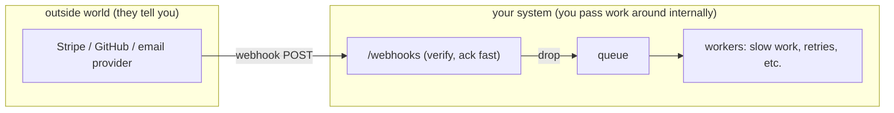
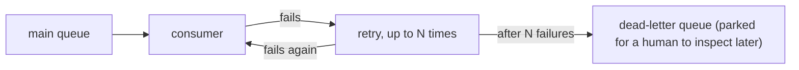

# When to Use Which (and the Gotchas)

You now have both tools. The danger is using them interchangeably, because they overlap enough to be
confusing and differ enough to bite you. This phase draws the line, then walks through the four traps
that catch everyone — duplicates, retries, ordering, and the message that just won't process. If you're
here mid-incident, start with the cheat-card.

## Cheat-card: symptom → calm fix

| Symptom | What's likely happening | Calm fix |
|---|---|---|
| "We charged/emailed the customer twice" | The same event was delivered more than once (at-least-once) | Make the handler **idempotent** — see below |
| "The webhook sender keeps re-sending the same event" | Your endpoint isn't returning `2xx` fast enough, or at all | Return `2xx` immediately; do slow work in a queue |
| "Messages process out of order" | Queues don't guarantee strict global order by default | Don't rely on order; use a key/version in the message |
| "One bad message is stuck and blocks the rest" | A poison message keeps failing and retrying | Route it to a **dead-letter queue** after N tries |
| "The backlog keeps growing and never drains" | Consumers are too slow or too few for the arrival rate | Add consumers, or speed up the work; check for a crash loop |

Now the explanations underneath.

## Which one? Webhooks vs queues

**The one-line rule.** Use a **webhook** when *another system* needs to tell *yours* that something
happened. Use a **queue** when *your own* services need to hand work to each other.

A webhook crosses an organizational boundary — it's how Stripe, GitHub, or your email provider reaches
into your system from the outside. A queue lives *inside* your system — it's how your signup service
hands work to your email worker. They even pair up: a very common, very healthy pattern is to *receive a
webhook and immediately drop its payload onto an internal queue*, so your endpoint returns `2xx` in
milliseconds and your own workers do the real processing on their own schedule.



**An honest comparison.** Neither is "better"; they answer different questions.

| | Webhook | Message queue |
|---|---|---|
| Direction | An outside system → you | Your service → your service |
| You control both ends? | No (they own the sender) | Yes (you own producer and consumer) |
| Main job | Notify you of an external event | Decouple, absorb spikes, survive outages |
| If the receiver is down | Sender retries on *its* schedule (or gives up) | Messages wait safely until a consumer returns |
| Delivery guarantee | Typically at-least-once | Typically at-least-once |

That last row is the same for both, and it's the source of the biggest gotcha — so let's take it head on.

## Gotcha 1: at-least-once means duplicates

**What it actually is.** Both webhooks and queues almost always promise **at-least-once delivery**: they
guarantee a message will arrive *at least* one time, and accept that it might arrive *more* than once.
They choose this on purpose. The alternative — *at-most-once* — risks losing messages entirely, which is
usually worse. So the systems lean toward "send it again if we're not sure it got through," and the
price is the occasional duplicate.

📝 **Terminology.** *At-least-once* = never lost, possibly repeated. *At-most-once* = never repeated,
possibly lost. *Exactly-once* = the holy grail (never lost, never repeated) and genuinely hard to achieve
end-to-end — which is why most real systems give you at-least-once and ask you to handle duplicates
yourself.

**Why it happens.** You saw the mechanism in Phase 2: a worker finishes the real work, then crashes
*before* sending its acknowledgment. The broker, having heard no ack, hands the message out again.
Webhooks have the twin of this: your endpoint does the work but is slow to reply, the sender times out
and assumes failure, and re-delivers. In both cases the work was actually done — the *confirmation* was
what got lost.

⚠️ **This is not rare.** It's tempting to treat duplicates as a freak event you can ignore. Don't. Over
enough volume, duplicate deliveries *will* happen, and "we billed them twice" or "we sent three welcome
emails" is a real, embarrassing bug. Design for it from the start.

## The fix: idempotency

**What it actually is.** An operation is **idempotent** if doing it twice has the same effect as doing it
once. "Set the order's status to `paid`" is idempotent — run it five times, the status is still `paid`.
"Add $42 to the balance" is *not* — run it five times and you've added $210. The whole game is making
your handlers idempotent so a duplicate delivery is harmless.

📝 **Terminology.** *Idempotent* comes from math: applying the operation again doesn't change the result
beyond the first application. In practice it means "safe to retry."

**How you actually do it.** The standard move: every message/event carries a unique ID (the
`evt_9aB` you saw in the Phase 1 webhook body, or a message ID from the queue). Before doing the work,
record that ID; if you've already seen it, skip the work.

**A real example.**
```javascript
async function handleEvent(event) {
  // Try to record this event's id. The DB column has a UNIQUE constraint.
  const firstTime = await db.tryInsertProcessedId(event.id);

  if (!firstTime) {
    // We've handled this exact event before — a duplicate delivery. Do nothing.
    return ack();
  }

  await doTheRealWork(event);   // ship the order, send the email, etc.
  return ack();
}
```
*What just happened:* The first time `evt_9aB` arrives, the insert succeeds, you do the work, and you
ack. When the duplicate of `evt_9aB` arrives, the insert fails the uniqueness check, so you recognize
it as already-handled, skip the work, and ack anyway. The customer is charged once no matter how many
times the event is delivered. That's idempotency doing its quiet job.

💡 **Key point.** You cannot prevent duplicates at the delivery layer; you neutralize them at the
*handling* layer. "Make the consumer idempotent" is the single most valuable habit in async systems.

## Gotcha 2: retries (the helpful thing that can hurt)

**What it actually is.** When a delivery fails — your endpoint returned a `500`, or a worker didn't ack
— the sender retries. This is what makes at-least-once work, and it's genuinely good: a brief blip
doesn't lose the message.

**The sharp edge.** Retries are usually **exponential backoff**: try again after a few seconds, then
longer, then longer still, often with some randomness so a thousand retries don't all land at the same
instant. Two things to internalize:

- Retries *amplify* the duplicate problem — every retry is another chance for the work to run twice. Your
  idempotency from above is what makes retries safe.
- A handler that fails *permanently* (bad data it will never be able to process) will be retried over and
  over, wasting effort and potentially clogging the queue, until you stop it. Which leads to the last
  two gotchas.

## Gotcha 3: ordering is not guaranteed

**What it actually is.** By default, you should *not* assume messages are processed in the order they
were sent. With multiple consumers working in parallel, message #2 can finish before message #1. Even a
single consumer can re-process a redelivered message "late." Strict global ordering is expensive, so
most queues don't promise it out of the box.

**Why people get this wrong.** They write a consumer that assumes "the `created` event always arrives
before the `updated` event." Then one day it doesn't, and `updated` fails because the record doesn't
exist yet — or worse, an old `updated` overwrites a newer one.

**The calm way to think about it.** Don't depend on arrival order. Instead, make each message carry
enough context to stand alone, and use a version or timestamp to ignore stale updates. "Apply this
update only if its version is newer than what I have" is order-independent and survives duplicates and
reordering both. If you *truly* need ordering, queues offer features for it (like ordered/FIFO modes or
partitioning by a key) — but reach for those deliberately, knowing they cost throughput, rather than
assuming order for free.

## Gotcha 4: the poison message → dead-letter queues

**What it actually is.** Sometimes a message cannot be processed at all — it's malformed, references a
deleted record, or trips a bug. It fails, gets retried, fails again, retried again, forever. Worse, while
it sits at the front being retried, it can hold up everything behind it. That's a **poison message**.

**The fix — a dead-letter queue.** A **dead-letter queue (DLQ)** is a separate queue where messages go
after they've failed too many times (you set the limit, e.g. 5 attempts). Instead of retrying a hopeless
message forever, the broker moves it aside into the DLQ, and the main queue keeps flowing.



📝 **Terminology.** *Dead-letter queue* (DLQ) — the holding pen for messages that have repeatedly failed.
Nothing reads from it automatically; it's where you go to investigate "what's broken?" without those
messages poisoning live processing.

**Why this saves you later.** A DLQ turns "one bad message silently stalled our entire pipeline at 3am"
into "the pipeline kept running, and there are four messages in the DLQ to look at on Monday." You get
to debug the failures on your own time instead of having them take down the healthy traffic with them.

## Recap

1. **Webhook** = an *outside* system tells *yours* something happened. **Queue** = your *own* services
   pass work to each other. They pair beautifully: receive the webhook, ack fast, enqueue the work.
2. Both are **at-least-once**: never lost, possibly duplicated. Plan for duplicates from day one.
3. **Idempotency** is the cure — record each event's unique ID and skip work you've already done, so a
   second delivery is harmless.
4. **Retries** make at-least-once work but amplify duplicates; idempotency is what makes them safe.
5. **Ordering** isn't guaranteed by default — don't depend on it; carry versions/timestamps and ignore
   stale updates.
6. A **dead-letter queue** parks messages that fail too many times, so one poison message can't stall
   everything behind it.

You came in knowing request/response. You leave knowing how systems handle "later" — both when the news
comes from outside (webhooks) and when the work flows inside (queues) — and the handful of traps that
turn a nice async design into a 2am page. That's the whole shape of event-driven integration, named.

---

[← Phase 2: Message Queues](02-message-queues.md) · [Guide overview](_guide.md)

Related guides: [REST APIs, Explained](/guides/rest-apis-explained) · [Designing APIs That Last](/guides/designing-apis-that-last)
