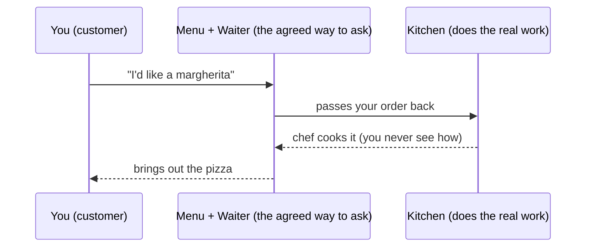

# A Contract Between Programs

Before any acronym, let's build the one idea everything else rests on. Forget code, forget the internet, forget the word "API" for a minute. We're going to a restaurant.

## The menu, the waiter, and the kitchen

You sit down. Someone hands you a **menu**. The menu lists what you can ask for and what you'll get: "Margherita pizza — tomato, mozzarella, basil." You don't walk into the kitchen. You don't need to know whether the chef uses a wood oven or a gas one, where they buy the cheese, or how many cooks are back there. You read the menu, you place an order with the waiter, and a while later the pizza arrives.

That whole arrangement is the idea behind an API.



- **You** are one program that needs something done.
- **The kitchen** is another program that knows how to do it.
- **The menu and the waiter** are the API: the agreed-upon way you ask, and the agreed-upon thing you get back.

The kitchen could be tiny or enormous. It could change chefs tomorrow. As long as the menu still says "margherita pizza" and a margherita pizza still arrives when you order one, *you don't care what changed back there.* That not-caring is the whole point.

## What an API actually is

**What it actually is.** An **API** — Application Programming Interface — is a **defined way for one program to ask another program for something.** It spells out two things: what requests you're allowed to make, and what you'll get back for each one. It is, at heart, a **promise**: "ask me *this*, in *this* way, and I'll give you *that*."

📝 **Terminology.** *API* stands for **Application Programming Interface**. Don't let the words intimidate you — "interface" here means the same thing it means on a TV remote: the agreed set of buttons you're allowed to press. The remote is the interface to the television; you press a button, something happens inside, and you never open the case. An API is the set of "buttons" one program exposes for other programs to press.

**Why people get this wrong.** The most common wrong picture is thinking an API is *the other program itself* — "the payments API" must be the whole payment system, right? It isn't. The API is the **menu**, not the kitchen. It's the thin, public, agreed-upon front of a much bigger thing you never see. The payment system might be a million lines of code across hundreds of machines; the API is the short list of things you're allowed to ask it to do.

**What it does in real life.** When developers say "the weather app uses a weather API," here's the literal sequence: the app sends a request that follows the menu ("give me today's forecast for London"), some other system does the real work (reads sensors, runs models, looks up data), and sends back a tidy answer the app knew to expect. The app never runs the weather models. It orders from the menu.

## The two halves of the promise

Every API is really two agreements, and it helps to see them separately:

```text
   ┌─────────────────────────────┐
   │  WHAT YOU CAN ASK           │   "You may request today's forecast
   │  (the requests allowed)     │    for any city, by name."
   ├─────────────────────────────┤
   │  WHAT YOU GET BACK          │   "You'll get a temperature, a
   │  (the response promised)    │    condition, and a chance of rain."
   └─────────────────────────────┘
            together = the contract
```

This is why people call an API a **contract**. A contract is a promise both sides can rely on. The program offering the API promises: "if you ask in this exact way, I'll respond in this exact way." The program using it promises: "I'll only ask in the agreed way, and I'll expect the agreed answer." Neither side has to know how the *other* side is built internally — they only have to honor the contract between them.

💡 **Key point.** An API is a **contract**: a defined set of requests you can make and responses you'll get back. The work behind it is hidden on purpose. You program *against the menu*, not against the kitchen.

## Hiding the internals is the feature, not a limitation

It's tempting to feel like the hidden kitchen is something being kept *from* you. Flip that around — the hiding is doing you an enormous favor.

Because the internals are hidden, the team running the kitchen can rip out the old oven, hire new cooks, or rewrite the whole thing in a different language, and **your order still works** — as long as they keep honoring the menu. You wrote your program to depend on the *promise*, not on the *plumbing*. That's what lets two pieces of software, built by different people who never met, work together reliably for years.

📝 **Terminology.** This deliberate hiding has a name: **abstraction.** To "abstract away" the kitchen means to give you a simple way to use it (the menu) without exposing the complicated reality behind it. APIs are one of the main ways software hides complexity so humans can build big things without holding all the details in their heads at once.

**Why this saves you later.** Once you see an API as a contract that hides a kitchen, a lot of developer sentences decode themselves. "Don't break the API" means *don't change the menu out from under the people who ordered from it.* "That's not exposed in the API" means *the kitchen can do it, but the menu doesn't offer it to you.* "We're versioning the API" means *we're publishing a new menu without yanking the old one away from existing customers.* You'll meet all of these, and now they'll land.

## Recap

1. An API is a **defined way for one program to ask another for something** — the menu and waiter, not the kitchen.
2. It's a **contract** with two halves: what you can ask, and what you'll get back.
3. The internals are **hidden on purpose** (abstraction) — that's what lets the other side change without breaking you.
4. You program **against the promise**, not against the inner workings, which is exactly why independently-built software can work together.

Next, we'll ask the obvious question: if an API is a contract that hides a kitchen, *why* is software built this way at all? What problem does the whole arrangement solve?

---

[← Guide overview](_guide.md) · [Phase 2: Why APIs Exist →](02-why-apis-exist.md)
