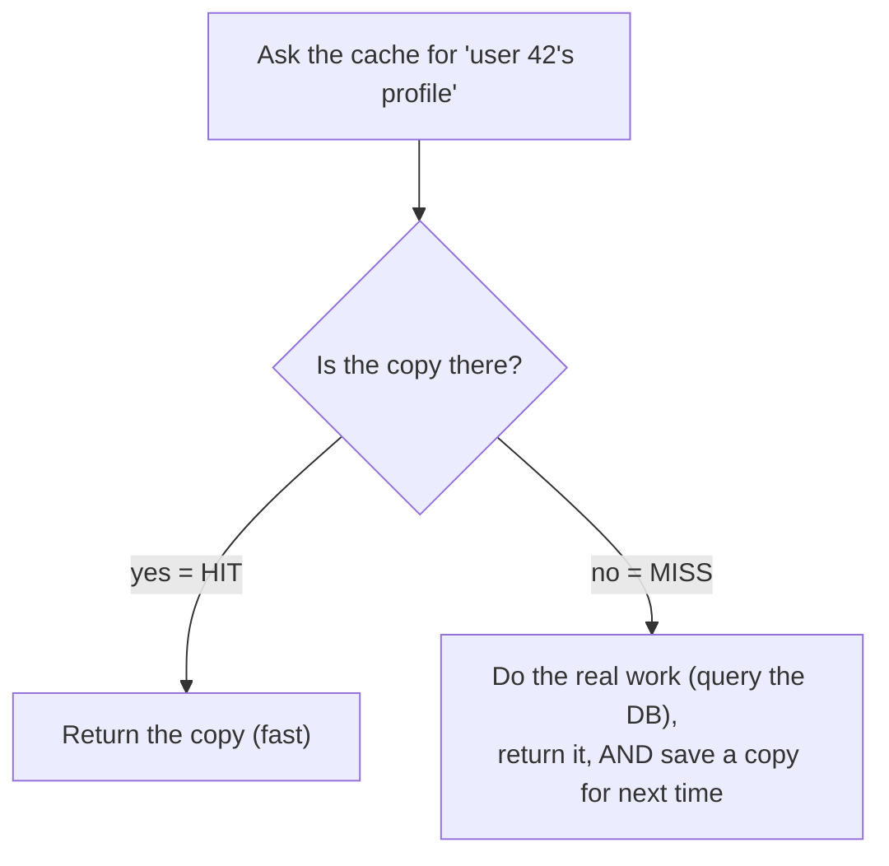

# What a Cache Actually Is

The word "cache" gets used like it's a special database, or a setting you flip on, or some kind of speed boost the framework gives you for free. That fuzziness is why it feels mysterious. The thing itself is almost embarrassingly simple, and seeing it plainly is what lets you reason about every cache you'll ever touch.

Here's the whole idea: **a cache keeps a copy of an answer that was expensive to produce, somewhere fast to reach, so the next time you need that answer you grab the copy instead of doing the expensive work again.** That's it. Not a kind of database. Not magic. A copy, kept handy, to skip repeated work.

## The mental model: a notepad of answers you already worked out

**What it actually is.** Picture yourself doing a long column of arithmetic by hand. Halfway through you need `347 × 89` again — the same product you carefully computed two lines ago. You don't redo the multiplication; you glance at where you wrote `30883` and copy it down. That scrap of paper is a cache. The multiplication was the expensive work; the written-down answer is the cached copy; glancing at it instead of recomputing is the entire benefit.

```text
   First time you need 347 × 89:
       do the work  ──►  get 30883  ──►  jot it on the notepad
                                              │
   Next time you need 347 × 89:               ▼
       glance at the notepad  ──►  30883   (no multiplication this time)
```

Every cache in computing is this notepad. The "expensive work" might be a database query that scans a million rows, a call to a slow third-party API, rendering an image, or fetching a file from a server on another continent. The cache is wherever you stash the result so you don't pay that cost twice.

**Why people get this wrong.** The common wrong picture is that a cache is a place you *put data on purpose*, like a special fast database you write to. The core idea is the opposite: a cache holds *derived* copies of answers whose real home — the database, the API, the original file — is somewhere else. Holding that distinction, **truth lives elsewhere, the cache holds a copy**, is what makes Phase 3 make sense later.

## Hit and miss: the two things that can happen

**What it actually is.** Every time you ask a cache for something, exactly one of two things happens.

- 📝 **Cache hit** — the copy is there. You take it and skip the expensive work. Fast.
- 📝 **Cache miss** — the copy isn't there. You do the real work, return the answer, and (usually) store a copy so next time is a hit.



**What it does in real life.** The first request for something is almost always a miss — nobody's computed it yet, so the cache is empty for that item (a *cold* cache). You pay full price once; every later request for the same thing can be a hit, paying almost nothing. Caching doesn't make any single answer cheaper to *produce* — it makes *repeated* requests for the same answer nearly free.

**A real example.** Here's the pattern in plain code — ask the cache first, fall back to the real work on a miss, then save the result:

```text
   answer = cache.get("user:42:profile")

   if answer is present:          # HIT
       return answer

   answer = database.query(...)   # MISS — do the expensive work
   cache.set("user:42:profile", answer)
   return answer
```
*What just happened:* The first call for `user:42:profile` finds nothing (miss), runs the real database query, and stores the result under that key. The second call finds the stored copy (hit) and returns it without touching the database at all. The key — `user:42:profile` — is just a label so you can find the right copy again, exactly like writing `347×89=` next to your jotted answer.

**The gotcha.** A cache only helps when the *same* answer is asked for more than once. If every request is for something unique — a one-time report, a per-request random value, a query nobody repeats — there's nothing to reuse, every request is a miss, and the cache adds work (check, fail, do the job anyway) without ever paying off. Caching wins on *repetition*, and when someone suggests caching data that's different on every request, that's your cue to push back.

## Why caching is everywhere

**What it actually is.** Once you see "keep a copy of the expensive answer somewhere fast," you start seeing it at every layer of every system — the gap between *fast* and *slow* is enormous and shows up everywhere.

Producing an answer can be slow for very different reasons:

- **Distance.** The data lives on a server far away; light and network hops take real time.
- **Computation.** The answer takes real work to build — a heavy query, a rendered image, an aggregation over lots of rows.
- **A slow dependency.** You're calling something out of your control — a third-party API, a rate-limited service.

In all three cases the fix is the same shape: do the expensive thing once, keep the result somewhere closer or cheaper, and serve the copy. That's why caching appears in your browser, at the network edge, inside your application, and inside the database itself — which is exactly the tour Phase 2 takes you on.

**Why this saves you later.** Performance work is often just "find the expensive thing that's being redone, and stop redoing it." Seeing caching as *one idea applied at many layers*, rather than a pile of unrelated technologies, makes the whole landscape readable. (When the expensive thing is a database query specifically, [Why Is My Query Slow?](/guides/why-is-my-query-slow) is the companion to this guide.)

## Recap

1. **A cache is a copy of an expensive-to-produce answer, kept somewhere fast, so you skip redoing the work.** It's a notepad, not a special database.
2. **The truth lives elsewhere; the cache holds a copy.** Hold this — it's the root of every staleness problem in Phase 3.
3. **A hit means the copy is there (fast); a miss means you do the real work and save a copy for next time.**
4. **Caching only pays off when the same answer is asked for repeatedly.** No repetition, no benefit.
5. **It's everywhere because the slow/fast gap is everywhere** — distance, computation, and slow dependencies all get the same treatment.

You know what a cache is and why it helps. The next question is *where* you'd actually put one — and it turns out a single web request passes through several caches stacked one behind the other.

See why a small cache still helps — repeated keys are instant hits, and the least-recently-used entry gets evicted when it fills:

```playground-lru
```

Watch it animated: [caching](/explainers/Caching.dc.html)

---

[← Guide overview](_guide.md) · [Phase 2: Where Caches Live →](02-where-caches-live.md)
