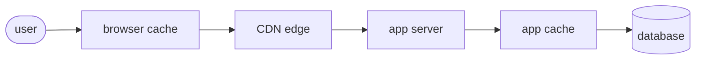
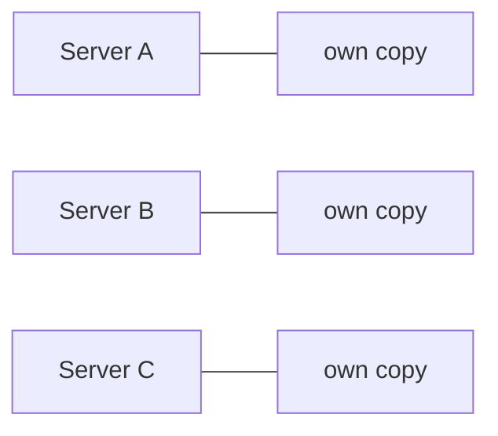
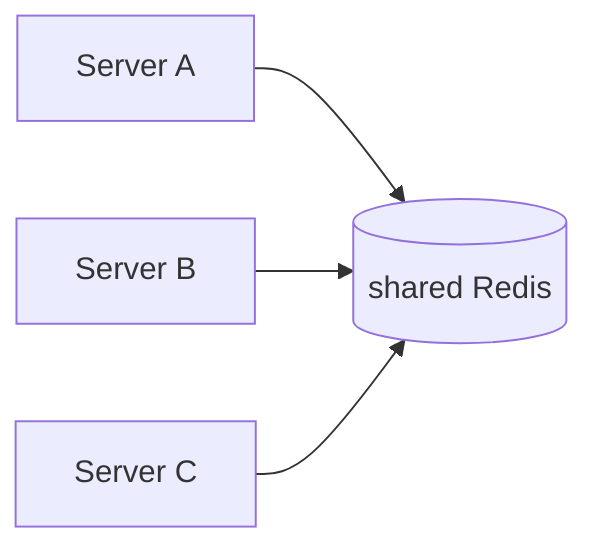

# Where Caches Live

Knowing what a cache *is* leads straight to a practical question: where do you put one? The surprising answer is that you rarely put just one. A single web request typically passes through several caches stacked in a line, each closer to the user and faster than the next one behind it. A hit at any layer turns the request around right there — the layers behind it never even hear about the request. Understanding that line is what lets you ask the right question when something is slow, or when something is *stale*.

## The line a request travels

Here's the whole journey, from the user's screen to the source of truth, with the caches it can hit on the way:

Each box is a place a copy of an answer can live. Let's walk them from the user outward.

## 1. The browser cache: a copy on the user's own device

**What it actually is.** Your browser keeps copies of things it has already downloaded — images, CSS files, JavaScript bundles, sometimes whole pages — right on the user's disk. The next time a page needs that same logo or stylesheet, it uses the local copy instead of asking the network at all. This is why a site feels instant on your second visit but slower on the first. The server controls how long a copy lives by sending response headers (like `Cache-Control`) that say "keep this for an hour" or "never reuse this, always re-ask."

**What it's good at.** Static assets that rarely change and belong to *one* user's view — logos, fonts, compiled CSS/JS. It's the fastest cache there is, because the answer never leaves the device.

⚠️ **Gotcha.** Because the copy lives on the *user's* machine, you can't reach in and delete it. If you ship a bug in a cached file, browsers may keep serving the old one until it expires. This is why production builds put a content hash in filenames (`app.9f2a1c.js`) — a new build changes the name, so the browser sees a new thing and fetches it fresh, sidestepping the stale copy entirely. (That trick is a preview of Phase 3's whole theme.)

## 2. The CDN: a copy at the edge, near the user

**What it actually is.** A *CDN* (Content Delivery Network) is a fleet of servers spread across the world, each keeping copies of your content close to the people near it. A user in Tokyo gets your images from a server in Tokyo instead of one in Virginia.

📝 **Terminology.** "The edge" just means *the CDN servers near the user*, as opposed to "the origin" — your actual server where the content really comes from.

**What it does in real life.** The first user in a region to request something causes a miss: the CDN fetches it from your origin, hands it over, and keeps a copy. Every later user in that region gets a hit from the nearby edge server — fast, and your origin never sees those requests. This is mainly a fix for the *distance* cost from Phase 1.

**What it's good at.** Content that's the same for many users and is read far more than it changes: images, videos, static files, and increasingly whole cached HTML pages. The more users share the same answer, the more a CDN earns its keep.

## 3. The application cache: a copy your server keeps between requests

**What it actually is.** This is the cache *you* write in your own code — the `cache.get` / `cache.set` pattern from Phase 1. Your application stores the results of expensive work so it doesn't redo them on the next request. It comes in two common flavors:

- **In-memory cache** — a copy held in your application process's own RAM. Fastest possible for your code to reach (no network hop), but it lives and dies with that one process, and each server has its own separate copy.
- **A shared cache server like Redis** — a separate service, held in RAM, that all your application servers talk to over the network. Slightly slower because of the network hop, but *shared*: every server sees the same cached answers, and the cache survives a single app restart.

📝 **Terminology.** *Redis* is a fast, in-memory data store frequently used as a shared application cache. "Put it in Redis" usually means "keep this answer in our shared, fast, in-memory cache."

*In-memory — each server keeps its own copy, so they can disagree:*

*Shared (Redis) — one network hop, but every server sees the same copy:*

**What it's good at.** Expensive, repeated, *computed* answers — a rendered dashboard, an aggregation, a slow third-party API response — especially things specific to your application's logic that a CDN couldn't know how to build.

⚠️ **Gotcha.** With per-process in-memory caches, each server has its *own* copy, so they can disagree. Server A may have updated its copy while Server B still serves the old one, and a user bouncing between them sees the answer flicker. Wanting everyone to agree is a big reason teams reach for a shared cache like Redis.

## 4. The database's own caches: the source of truth is faster than you think

**What it actually is.** Even your database — the source of truth — caches internally. It keeps recently-read pages of data in RAM (its *buffer cache* / *buffer pool*) so a second read of the same rows doesn't touch the disk. Many databases also cache query plans (the worked-out strategy for running a query) so they don't re-plan an identical query from scratch.

**What it does in real life.** This happens automatically — you don't write code for it — but it's why "run the same slow query twice and the second run is faster" is so common. The first run warmed the database's own cache. It makes the source of truth itself less expensive to query, without you adding any caching layer — the safety net under everything else.

💡 **Key point.** These layers stack. A request hits the browser cache first; on a miss it goes to the CDN; on a miss there, to your app and its cache; and only a miss *there* reaches the database (which then leans on its own internal caches). When something is slow, the useful question becomes "which layer is missing?" — and when something is *stale*, "which layer is holding an old copy?"

## Recap

1. **A request passes through several caches in a line**, each closer to the user and faster than the one behind it; a hit anywhere turns the request around there.
2. **Browser cache** — copies on the user's device; best for static assets; you can't clear it remotely (hence hashed filenames).
3. **CDN / edge** — copies near the user around the world; best for shared content read far more than it changes; fixes the *distance* cost.
4. **Application cache (in-memory or Redis)** — copies your code keeps between requests; best for expensive computed answers; in-memory is fastest but per-server, Redis is shared.
5. **The database's own caches** — automatic internal caching of data pages and query plans; makes the source of truth itself cheaper to read.

Every one of these layers holds a *copy* of an answer whose truth lives further down the line — which means every one can end up holding a copy that's *out of date*. That gap between the copy and the truth is the genuinely hard part of caching, and it's next.

Watch it animated: [CDN caching](/explainers/CDNCaching.dc.html)

---

[← Phase 1: What a Cache Actually Is](01-what-a-cache-actually-is.md) · [Guide overview](_guide.md) · [Phase 3: The Hard Part — Invalidation & Staleness →](03-invalidation-and-staleness.md)
