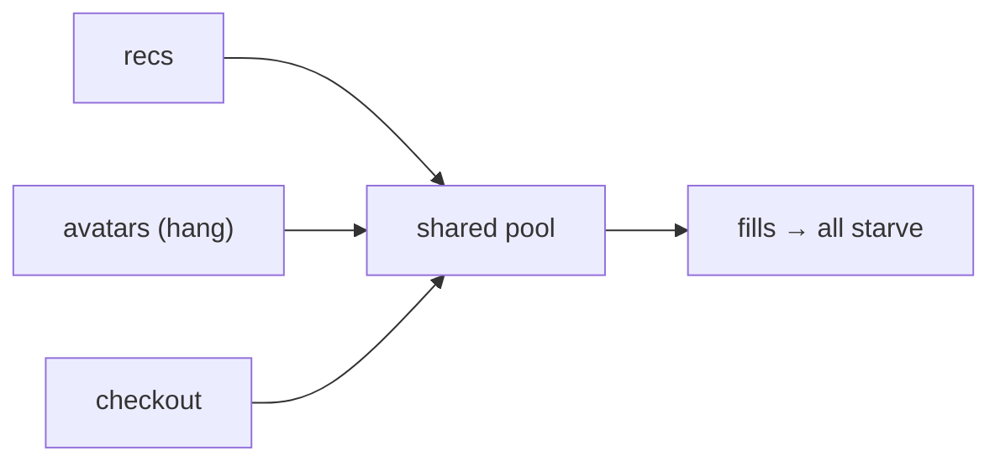
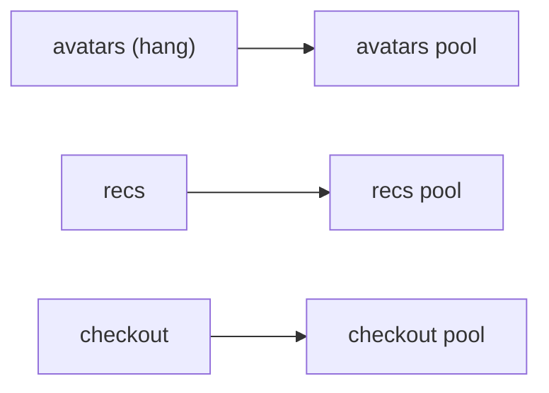
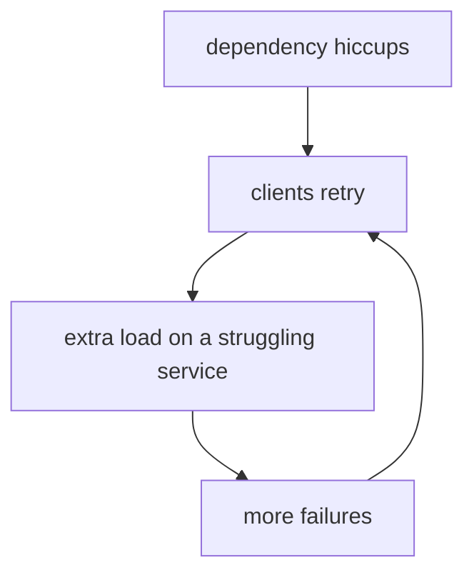

# Failing Soft: Degradation & Redundancy

The patterns in [Phase 2](02-the-core-patterns.md) decide *how you call* a dependency safely. This phase
is about what you do when, despite all of that, the dependency is gone: the timeout fired, retries ran
out, the breaker is open - and now you have to return *something* to the user.

Here's the mindset that separates resilient systems from fragile ones: **a failure should cost you a
feature, not the product.** When the recommendations service is down, the store should still take orders.
When the avatar service hangs, the page should still load - just without avatars. Failing *soft* means the
user notices less, or nothing; failing *hard* means a 500 error page and a lost customer. Same underlying
outage, wildly different outcome - and more than anything, this is how you avoid the 2am page from
[When Prod Is Down](/guides/when-prod-is-down).

## Graceful degradation - serve something useful

**What it actually is.** *Graceful degradation* means that when a dependency fails, you return a
**reduced but still useful** result instead of an error. Not the best answer - a *good-enough* answer.
The feature quietly steps down a level rather than falling off a cliff.

**What it does in real life.** You decide, ahead of time, what "less" looks like for each feature when
its dependency is unavailable:

```text
   Feature                  Full result            Degraded (dependency down)
   ──────────────────────   ────────────────────   ──────────────────────────────
   Personalized recs        tailored picks         generic "popular items" list
   User avatar              their photo            a default silhouette
   Live inventory count     "3 left in stock"      hide the count, still sell
   Search ranking service   smart ranking          plain newest-first ordering
   Currency conversion      live FX rate           last cached rate (with a note)
```

**A real example.** A page-render path that degrades instead of erroring:
```console
[req 8c2f] rendering /product/42
[req 8c2f] recommendations: circuit OPEN → using fallback: top-sellers
[req 8c2f] avatar service: timeout → using fallback: default silhouette
[req 8c2f] response 200 OK (degraded: recs, avatar)
```
*What just happened:* two dependencies were unavailable - the recommendations breaker was open and the
avatar call timed out. Instead of returning a `500`, the request fell back to top-sellers and a default
avatar and returned a perfectly usable `200`. The user got a slightly less personalized page and almost
certainly didn't notice. Logging *which* parts degraded means you can still see the problem and fix it - 
soft failure shouldn't mean *silent*.

💡 **Key point.** Degradation is a *product* decision as much as an engineering one. For every dependency,
ask: "if this is down, what's the least-bad thing we can still show?" The answer is rarely "an error
page." Decide it before the outage, not during.

## Fallbacks - the answer you keep in your pocket

A *fallback* is the specific source of that degraded answer - the pre-arranged Plan B you reach for when
Plan A fails. The common ones:

- **Cached / stale data.** Serve the last good value you saw. A slightly old exchange rate or product
  list beats no page at all. (Be upfront where it matters - "prices may be delayed.")
- **A default or static value.** The silhouette avatar, the generic "popular items," an empty-but-valid
  result.
- **A secondary source.** A second provider, a read replica, a different region.

⚠️ **Gotcha - your fallback must not depend on the thing that's failing.** A cache that lives inside the
same down service isn't a fallback. A "backup" provider you call through the same exhausted connection
pool isn't isolated. Test that your Plan B actually works *while Plan A is broken* - that's the only
condition under which you'll ever need it, and it's exactly the condition people forget to test.

## Bulkheads - isolate the flooding

Back in [Phase 1](01-everything-fails.md), one slow feature (avatars) drowned an unrelated one (checkout)
because they shared a single resource pool. The bulkhead pattern is the direct cure.

**What it actually is.** The name comes from ships: a hull is divided into sealed **bulkhead**
compartments, so a breach in one floods only that compartment instead of sinking the whole vessel. In
software, a *bulkhead* means giving each dependency its **own isolated pool** of resources - connections,
threads, whatever's finite - so one dependency saturating its pool can't starve the others.

*One shared pool - a hang anywhere starves everything:*

*Bulkheads - each gets its own pool, so a hang is contained:*


**What it does in real life.** Give the avatar calls, say, their own small connection pool. When avatars
hang, *those* connections fill up and avatar requests start failing (which your timeout and fallback
already handle) - but checkout and recommendations are drawing from entirely different pools, untouched.
The breach is sealed in one compartment.

💡 **Key point.** Bulkheads turn "one dependency is sick" into "one *feature* is sick" instead of "the
whole service is down." They're the structural backstop behind everything else in this guide: even if a
timeout is misconfigured or a breaker is slow to trip, isolation limits the blast radius.

## Redundancy - more than one of the thing

**What it actually is.** *Redundancy* is having more than one of something critical so that losing one
doesn't lose the capability: multiple instances of a service behind a load balancer, a database with
replicas, deployments across more than one availability zone or region. If a single thing failing can
take you down, that thing is a **single point of failure**, and redundancy is how you remove it.

📝 **Terminology.** A *single point of failure* (SPOF) is any one component whose failure takes the whole
system down. Hunting down SPOFs - "what's the one box / one service / one zone that, if it died right
now, would end us?" - is a core resilience exercise.

⚠️ **Gotcha - redundancy you've never failed over to is a guess, not a guarantee.** A standby replica
that's never been promoted, a second region that's never taken live traffic - you don't actually know it
works until you try, and discovering it's misconfigured *during* a real outage is the worst possible time.
Deliberately failing over (the gentle end of *chaos engineering*) turns "we have a backup" into "we know
the backup works."

## The retry storm - when your own defenses attack you

One last warning: this is how well-intentioned resilience turns into a self-inflicted outage.

We added retries in [Phase 2](02-the-core-patterns.md) to ride out transient failures. But picture a
dependency that briefly hiccups under load. Every client retries - and those retries *are extra load*, so
the dependency, already struggling, now gets the normal traffic *plus* a flood of retries on top. That
pushes it further down, which causes more failures, which triggers *more* retries. The system attacks
itself.



*What just happened:* This is a **retry storm** (a flavor of the **thundering herd** from Phase 2):
retries meant to *recover* from an overload instead *amplify* it into a full outage. The cure is the
whole toolkit working together:

- **Backoff and jitter** (Phase 2) so retries are spread out in time and across clients, not synchronized.
- **A retry budget / cap** - limit retries per request *and* limit the overall fraction of traffic that
  may be retries, so retries can never become the majority of your load.
- **Circuit breakers** (Phase 2) so that once a dependency is clearly down, you stop retrying entirely
  and fail fast instead of feeding the storm.

⚠️ **Gotcha - resilience features can amplify failures.** Retries, especially, are double-edged: the same
mechanism that hides a blip can multiply an outage. Always pair retries with backoff, jitter, a cap, and
a breaker. Resilience added carelessly is just a new failure mode with good intentions.

## Why this is how you avoid the 2am page

A system built this way doesn't experience the Phase 1 nightmare. The slow dependency hits a timeout. A
couple of capped, jittered retries either succeed or give up cleanly. The breaker trips and stops the
pile-on. The feature degrades to a cached or default result. The bulkhead keeps the rest of the product
healthy. From the user's side: a slightly plainer page for a few minutes. From your side: a graph that
dips and recovers - not a phone that rings at 2am. On the rare day something *does* get through all of
this, you'll want the human procedure in [When Prod Is Down](/guides/when-prod-is-down) - but you'll be
walking into that calm, because you designed the system to bend.

## Your turn: recommendations is failing and taking checkout with it

Reading the patterns is the easy part. Choosing between them while checkout is actually breaking is the
job. There's no single right answer below and nothing is scored right or wrong - but the clock is real,
and every minute belongs to a customer who can't check out. Isolate it, then read the debrief.

```scenario
{
  "title": "Recommendations is failing and dragging checkout down with it",
  "brief": "You're on call, twelve minutes before your highest-traffic hour. The recommendations service starts timing out. It shares a connection pool with checkout, and checkout requests are now queuing behind the hung recommendations calls too. Nobody ever built a bulkhead. There's a feature flag that can turn recommendations off and fall back to a generic list.",
  "prompt": "What do you do first?",
  "clock": { "unit": "min", "running": "checkout stuck behind recs", "resolved": "checkout free of recs" },
  "resolvedHeading": "Checkout is taking orders again. Here's how it went.",
  "actions": [
    {
      "id": "check-pool",
      "label": "Check the connection pool metrics",
      "cost": 2,
      "reveals": "$ pool-stats checkout-api\nconnections: 200/200 in use\n  held by recommendations calls: 188\n  held by checkout calls: 12 (queued)\navg wait: 4.8s",
      "note": "Confirms it: checkout isn't broken, it's queued behind recommendations in the same pool. Two minutes well spent, and it tells you exactly what to isolate."
    },
    {
      "id": "restart-recs",
      "label": "Restart the recommendations service",
      "cost": 3,
      "reveals": "$ kubectl rollout restart deployment/recommendations\ndeployment.apps/recommendations restarted\n[90s later]\nrecommendations: p99 latency 6200ms (climbing again)",
      "note": "Healthy for ninety seconds, then slow again. You changed something on a system whose root cause you hadn't found, and checkout stayed queued behind the pool the whole time regardless."
    },
    {
      "id": "more-retries",
      "label": "Turn up retries and the timeout on the recs call so requests get through",
      "cost": 4,
      "reveals": "config: recs.max_retries 1 -> 5, recs.timeout 500ms -> 3000ms\n...\nrecommendations error rate: 41% -> 68%\ncheckout p99 latency: 5.1s -> 9.4s",
      "note": "You fed a struggling dependency more load. Its error rate got worse, and checkout - which was never waiting on recommendations to succeed, only waiting on the pool - got worse too."
    },
    {
      "id": "scale-recs",
      "label": "Scale up the recommendations service",
      "cost": 6,
      "reveals": "$ kubectl scale deployment/recommendations --replicas=12\ndeployment.apps/recommendations scaled\n[4 min later]\nrecommendations: p99 still 6100ms\nrecommendations-db: cpu 97%, slow queries: 340",
      "note": "More pods didn't help - the bottleneck is the database behind recommendations, not its replica count. Checkout doesn't care how many recommendations pods exist; it only cares that it shares their pool."
    },
    {
      "id": "page-recs-team",
      "label": "Ping the team that owns recommendations and wait for their fix",
      "cost": 8,
      "reveals": "you: recommendations is timing out and it's taking checkout down with it - can someone look?\nrecs-oncall: just paged, digging into the db now, give me ~15\nyou: checkout is failing right now, need something sooner than that",
      "note": "Asking for help isn't the mistake. Waiting on their fix before doing anything yourself is - that fix runs on their clock, and checkout is bleeding on yours."
    },
    {
      "id": "deploy-bulkhead",
      "label": "Write and deploy a dedicated connection pool for checkout",
      "cost": 10,
      "reveals": "$ git commit -m \"give checkout its own connection pool\"\n$ deploy checkout-api\nrunning tests... 3m40s\ndeploying... 4m10s\n[10 min later] checkout-api: dedicated pool live, 0/50 in use",
      "note": "This is the real fix, and it's real work: tests, a deploy, a rollout. Exactly right for next week's design review. Not a first move in an incident that's costing you checkout traffic right now."
    },
    {
      "id": "flip-flag",
      "label": "Flip the flag to disable recommendations and serve the fallback",
      "cost": 1,
      "resolves": true,
      "reveals": "$ feature-flag set recommendations.enabled false\nflag updated\n[req 91a2] recommendations: disabled by flag -> fallback: top-sellers\n[req 91a2] checkout: 200 OK\ncheckout-api pool: 12/200 in use, 0 queued",
      "note": "Recommendations is still broken. Checkout doesn't care anymore - it was never actually about recommendations."
    }
  ],
  "debrief": {
    "ideal": 3,
    "text": "The move that frees checkout has nothing to do with fixing recommendations - isolate it, serve the fallback, and let recommendations be someone else's Tuesday. A failure should cost you a feature, not the product, and the flag is just how fast you can make that true when it wasn't designed in ahead of time.",
    "notes": [
      { "when": "if-taken", "action": "more-retries", "text": "Turning the retries up is this guide's retry storm in miniature: you fed a struggling dependency more load, its error rate got worse, and checkout - stuck on the pool, not on whether recommendations succeeded - stayed broken for every one of those minutes." },
      { "when": "if-taken", "action": "restart-recs", "text": "The restart bought ninety seconds of healthy metrics and nothing for checkout, which was never actually waiting on recommendations to be healthy - just waiting on the shared pool." },
      { "when": "if-taken", "action": "scale-recs", "text": "More capacity for a service that isn't capacity-constrained buys you nothing. The bottleneck was the database behind recommendations, and checkout was stuck on the pool the entire four minutes it took to learn that." },
      { "when": "if-taken", "action": "page-recs-team", "text": "The team's fix runs on their clock, not yours. Whatever they find, checkout doesn't get any faster by waiting on it - only by no longer depending on it." },
      { "when": "if-taken", "action": "deploy-bulkhead", "text": "The dedicated pool is the correct permanent fix, and it's also the slowest action on this list. That's the argument for building it in a design review before the outage, not live during one." },
      { "when": "if-not-taken", "action": "check-pool", "text": "You never confirmed checkout was queued behind recommendations in the shared pool - you flipped the flag on a strong guess, and it happened to be right. The bulkhead you build afterward is what turns that guess into something you never have to make twice." }
    ]
  }
}
```

## Recap

1. **Fail soft, not hard:** a failure should cost a *feature*, not the product. Decide the least-bad
   degraded result for each dependency *before* the outage.
2. **Graceful degradation** returns a reduced-but-useful result; **fallbacks** are where that result
   comes from (cache, default, secondary source) - and a fallback must not depend on the failing thing.
3. **Bulkheads** give each dependency its own isolated resource pool, so one saturated pool can't starve
   the rest - turning "the service is down" into "one feature is down."
4. **Redundancy** removes single points of failure - but untested failover is a guess; verify it works
   *before* you need it.
5. Beware the **retry storm**: retries can amplify an outage into a bigger one. Always pair them with
   backoff, jitter, a retry cap, and a circuit breaker.

---

[← Guide overview](_guide.md) · [Phase 2: The Core Patterns](02-the-core-patterns.md)
