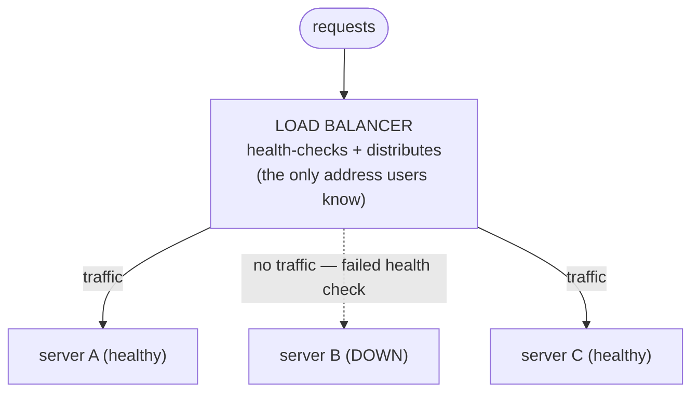

# Load Balancing

You've got a pool of identical, stateless servers from Phase 1. Now there's an obvious question: when a request arrives, *who decides* which server handles it? Your users only know one address — `api.example.com` — they don't know or care that there are five machines behind it. Something has to stand at the front door and direct traffic. That something is a load balancer, the piece that turns "a bunch of servers" into "a service" — and it also offers one feature that can quietly drag you back into the stateful world you worked so hard to leave.

## What a load balancer actually is

📝 **Terminology.** A *load balancer* (often shortened to *LB*) is a server whose entire job is to receive incoming requests and forward each one to one of several backend servers. *Backend* here means your actual application servers — the pool. The load balancer is the public-facing front; the backends do the real work.

**What it actually is.** A load balancer is a traffic director that sits between your users and your server pool. Every request hits the load balancer first; it picks one healthy backend and forwards the request there, then passes the response back to the user. The user never sees the backend's address — as far as they're concerned, the load balancer *is* the service.

Here's the whole arrangement in one picture:



**Why people get this wrong.** Newcomers picture a load balancer as something exotic and heavyweight. It isn't. Conceptually it's a smart receptionist: it knows which desks are staffed, and it hands each visitor to a free, working one — two jobs, done relentlessly: *distribution* (spreading the requests) and *health checking* (knowing which backends are actually up). Get those two ideas and you understand a load balancer.

## Job one: distribution

The load balancer has to decide which backend gets each request. The common strategies are simpler than their names suggest:

- **Round robin** — hand requests out in rotation: A, B, C, A, B, C… Dead simple, and surprisingly effective when your servers are equal and your requests are roughly equal in cost. This is the default in many setups.
- **Least connections** — send the next request to whichever backend currently has the fewest in-flight requests. Better when some requests take much longer than others, so a slow request doesn't pile more onto an already-busy server.
- **Weighted** — give some backends a bigger share, useful when machines aren't identical (a beefier box can take more).

💡 **Key point.** Notice *why* round robin is even allowed to be this dumb: it works precisely because your servers are stateless and interchangeable (Phase 1). If it didn't matter which server handled a request, then a blind rotation is perfectly safe. The simplicity of the load balancer is a *reward* for the statelessness you built. Break statelessness and even the cleverest distribution strategy can send a user to a server that doesn't have their data.

## Job two: health checks

📝 **Terminology.** A *health check* is a small request the load balancer sends to each backend on a schedule — often a hit to a dedicated endpoint like `/health` — to ask "are you alive and able to serve?" A backend that responds correctly is *healthy* and stays in rotation; one that fails (errors, times out, or returns the wrong thing) is marked *unhealthy* and pulled out.

**What it does in real life.** This is the feature that makes a pool resilient instead of just big. The load balancer is constantly, quietly polling every backend. The instant one stops answering — it crashed, it's overloaded, someone's deploying to it — the load balancer notices and *stops sending it traffic*. Users never see the dead server, because their requests are routed only to the ones that passed the most recent check.

**A real example — watching the load balancer pull a sick backend.** Here's what a health-check log looks like when a backend goes bad and comes back:

```console
$ tail -f /var/log/lb/health.log
10:42:01  check server-A /health -> 200 OK (12ms)   [healthy]
10:42:01  check server-B /health -> 200 OK (15ms)   [healthy]
10:42:01  check server-C /health -> 200 OK (11ms)   [healthy]
10:42:06  check server-B /health -> timeout (5000ms) [UNHEALTHY] removed from pool
10:42:11  check server-B /health -> timeout (5000ms) [UNHEALTHY]
10:42:16  check server-B /health -> 200 OK (18ms)   [healthy] returned to pool
```

*What just happened:* at `10:42:06` server B stopped answering its health check in time, so the load balancer marked it unhealthy and **removed it from the pool** — from that moment, no requests were sent to B. The two healthy servers absorbed its share. Ten seconds later B recovered, passed a check, and was put back into rotation automatically. No human touched anything, and no user got an error from the broken box.

⚠️ **Gotcha — your health endpoint should mean what it says.** A naive `/health` that just returns `200 OK` proves the web process is running, not that the server can do real work — it might be unable to reach the database, and happily pass health checks while failing every real request. Make the check verify what actually matters, but don't over-couple it either: if `/health` checks the database and the database blips, *every* backend fails at once and the load balancer pulls the *entire* pool, turning a small wobble into a total outage.

## The sticky-session trap

Now the part this phase exists to warn you about. Most load balancers offer a feature called **sticky sessions** (also *session affinity*), and it is a tempting, plausible-sounding mistake.

📝 **Terminology.** *Sticky sessions* mean the load balancer remembers which backend it first sent a given user to, and then keeps routing that same user to that same backend for the rest of their session — usually by tagging them with a cookie.

**Why it's tempting.** Picture the Phase 1 bug: you stored a user's session in server A's local memory, so it only works if they keep coming back to A. Sticky sessions make that bug *go away* — the load balancer faithfully sends each user back to "their" server, so the in-memory session is always there. It looks like a fix. It's actually a way to *hide* the statefulness instead of removing it.

**What it does in real life, and why it bites.** You've now pinned each user to one specific server, which quietly undoes much of why you scaled out in the first place:

- **A dead backend takes its users down with it.** When server A fails its health check and gets pulled, every user stuck to A loses their session — logged out, cart emptied — even though the pool is otherwise fine. The whole point of a pool was that one death is survivable; stickiness makes it personal.
- **Load gets lumpy.** New users spread evenly, but long-lived sessions accumulate on whichever servers have been up longest. Add a fresh server and it sits nearly idle, because no existing sessions are stuck to it — exactly when you need it to help.
- **Deploys hurt.** Restart a backend to ship code and you've just kicked every user stuck to it.

```text
   STICKY SESSIONS                        STATELESS + SHARED STORE
   ─────────────────────────────         ─────────────────────────────
   user pinned to "their" server   │     user can go to any server
   that server dies -> session lost│     a server dies -> no one notices
   load piles up unevenly          │     load spreads evenly
   new server starts out idle      │     new server is useful immediately
   a workaround for local state    │     a real fix: no local state at all
```

💡 **Key point — externalizing state is the cleaner fix.** Sticky sessions treat the symptom (state is on one server, so keep going back to it). The real cure treats the cause: *don't keep the state on a server at all.* Move it to a shared store every backend can read, and any server can serve any user again — no stickiness, no pinning, no lost sessions when a box dies. The load balancer goes back to being a simple, dumb, beautiful round-robin director. That move — pulling state out to a place all servers share — is exactly what Phase 3 is about.

🪖 **War story.** A team turned on sticky sessions to fix their random-logout bug (the Phase 1 one) and declared victory — until their busiest day, when one backend got overwhelmed by the long-running sessions piled onto it, fell over, and took a chunk of active users down with it while the other servers sat half-idle, unable to help, because those users were *stuck* to the dead box. The "fix" had converted a graceful, survivable architecture back into a fragile one. They ripped it out and moved sessions to a shared store the next week.

## Recap

1. A **load balancer** sits in front of your server pool and is the only address users know; it forwards each request to one backend.
2. It does two jobs: **distribution** (round robin, least connections, weighted) and **health checks** (pulling unhealthy backends out of rotation automatically, so users never hit a dead box).
3. Distribution can be dumb-simple *because* your servers are stateless — simplicity at the front is the reward for statelessness at the back.
4. **Sticky sessions are a trap.** They hide local state instead of removing it, and they cost you resilience (a dead box loses its users), even load, and painless deploys.
5. The clean fix is to **externalize state** so any server can serve any user — which is Phase 3.

Next, the parts of your system you *can't* clone freely — sessions, the database, the cache — and how to handle each one.

---

[← Phase 1: Scale Up vs Scale Out](01-scale-up-vs-scale-out.md) · [Phase 3: Scaling the Stateful Bits →](03-scaling-the-stateful-bits.md)
