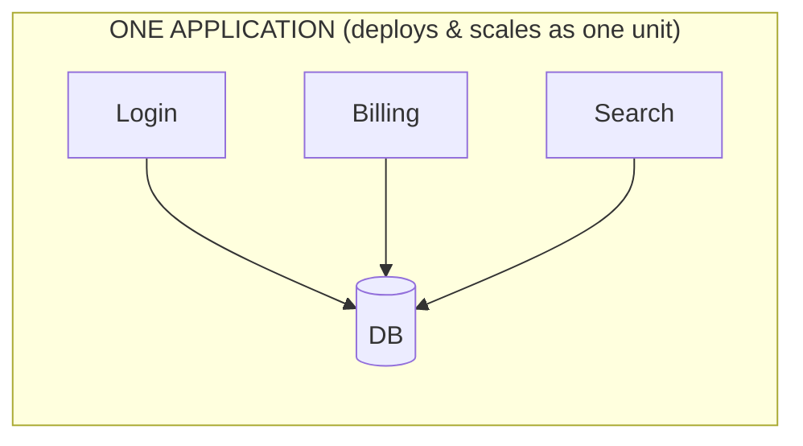
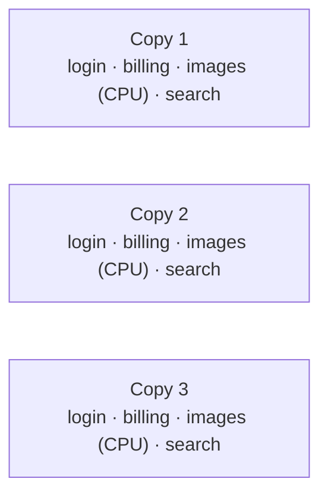

# The Monolith

"Monolith" gets said with a little sneer, like a confession - *we're still on a monolith*. That feeling does you a disservice. Most successful software you've ever used started as a monolith, and a great deal of it still is one. Before you can fairly weigh anything against it, you need to see what it really is, on its own terms.

## What a monolith actually is

**What it actually is.** A monolith is **one application that you build, deploy, and run as a single unit**. All your features - login, billing, search, the admin panel - live in one codebase and ship together as one artifact (one server process, one container image, one deployable). They call each other by calling functions, in the same process, sharing the same memory and usually the same database.

**Why people get this wrong.** The common wrong picture is "monolith = messy, tangled, big ball of mud." That's a description of *bad code*, not of a monolith. A monolith can be beautifully organized into modules with clean boundaries - it's still a monolith, because it deploys as one thing. The defining trait is the deployment unit, not the tidiness.

Here's the whole shape in one picture:



## Where the monolith genuinely shines

This is the part the sneer hides. A monolith has real, durable advantages - not "good enough for now" ones.

**It's simple to build, deploy, and run.** One repo to clone, one command to start, one thing to deploy. A new hire is running the whole system locally on their first morning - no service-discovery layer, no inter-service auth, no "which of the seventeen services owns this?" When you deploy, you deploy *the app*: one artifact, one version.

**Debugging is one stack trace.** When something breaks, the entire request lives in one process. You set a breakpoint, you step through it, you read one log stream from top to bottom.

**A real example.** A request fails, and the trace shows you the whole path, end to end:
```console
$ tail -n 8 app.log
ERROR  POST /checkout  500
  at chargeCard (billing/charge.js:42)
  at placeOrder (orders/place.js:88)
  at handler (routes/checkout.js:15)
NullError: card.token is undefined
```
*What just happened:* billing and orders run in the same process, so the failure is one continuous stack trace from the HTTP handler down to the exact line - `placeOrder` called `chargeCard` with a card that had no token. No correlation IDs, no jumping between dashboards; the whole story is in one place.

**Transactions are easy.** This one is underrated. When billing and orders share a database, "charge the card *and* save the order, or do neither" is a single database transaction. The database guarantees it for you.
```console
$ psql -c "BEGIN; INSERT INTO orders ...; UPDATE accounts SET balance ...; COMMIT;"
COMMIT
```
*What just happened:* both writes happened inside one transaction. If either failed, the database rolls back both - you can never end up with a charged card and no order. This atomic-across-features guarantee is nearly free in a monolith and something you have to fight hard for once features live in separate services (see [Phase 2](02-microservices.md)).

**Refactoring across features is safe.** Renaming a function that billing and orders both use? Your compiler or test suite catches every caller, because they're all in one codebase. Change a shared model and everything that depends on it updates together.

## Where the monolith starts to strain

A monolith isn't free of limits - it's just that the limits show up later and for more specific reasons than the hype suggests. There are two that genuinely bite.

**One big team on one codebase.** A handful of developers in one repo is a pleasure. Fifty developers in one repo, all merging into the same `main`, all needing to deploy on their own schedule, is friction. Every deploy ships *everyone's* changes, so one team's risky feature can block another team's urgent fix. Coordination cost grows with the number of people sharing the deployment unit.

**Scaling the whole thing to scale one part.** A monolith scales by running more copies of the *entire* application behind a load balancer. That works fine - until one slice has wildly different needs from the rest.

Your image-processing endpoint is CPU-hungry. Everything else is light. To give image-processing more CPU, you must run more copies of the WHOLE app:



*The strain:* you can't give the image-processing code more resources without also duplicating login, billing, and search alongside it. Often that's perfectly acceptable - copies of a stateless app are cheap. It becomes a real problem only when one part's resource appetite is so different from the rest that duplicating everything to feed it is genuinely wasteful.

**The gotcha - don't mistake messy code for "monolith problems."** When a monolith feels painful, the cause is usually tangled internal boundaries, not the fact that it's a monolith. A monolith with clean module boundaries (sometimes called a *modular monolith*) keeps almost all the simplicity while staying easy to reason about. Splitting a tangled monolith into services doesn't untangle it - it spreads the tangle across a network, which is worse. (More on that trap in [Phase 3](03-how-to-actually-choose.md).)

> 📝 **Modular monolith** - a monolith deliberately organized into well-separated internal modules with clear interfaces, so it stays one deployable but doesn't become a big ball of mud. It's the strong default this guide keeps coming back to.

⚠️ **"Monolith" is not a slur.** It's an architecture with a specific, often excellent, set of trade-offs. Plenty of large, busy products run happily on a well-built monolith for years. The real question is never "are we still a monolith?" - it's "are we feeling a *specific* pain that a different shape would actually fix?"

## Recap

1. A **monolith** is one application built, deployed, and run as a single unit; features call each other as in-process function calls.
2. "Monolith" describes the **deployment unit**, not the code quality - a clean modular monolith is still a monolith.
3. Its real strengths: **simple to build/deploy/run, one stack trace to debug, easy database transactions, safe cross-feature refactoring.**
4. It strains when **one big team shares one deploy** and when **one part needs to scale very differently from the rest.**
5. Most "monolith pain" is **tangled code, not the monolith itself** - and splitting tangled code into services makes it worse.

With the monolith seen fairly, you're ready to look at the architecture built specifically to relieve those two strains - and to pay for that relief in new ways.

---

[← Guide overview](_guide.md) · [Phase 2: Microservices →](02-microservices.md)
