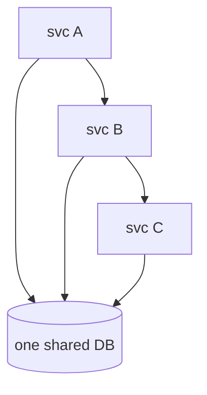

# How to Actually Choose

Everything so far has been fact: what each architecture *is* and what it *costs*. This phase is different — it's **judgment**, flagged as judgment so you can weigh it against your own situation rather than treat it as law. Reasonable, experienced engineers disagree at the edges here. What follows is the position most battle-scarred practitioners land on, and the reasoning behind it, so you can decide for yourself.

## The decision cheat-card

> **In a meeting and need a position right now? Start here, then read the reasoning below.**

| Your situation | The honest default |
|---|---|
| New product, small team, still finding fit | **Start with a (well-structured) monolith** (§1) |
| Monolith works fine, no specific pain | **Stay** — "we're a monolith" is not a problem (§1) |
| One specific part needs very different scaling | **Split out that one service** — not everything (§2) |
| One team is blocked by everyone else's deploys | **Split along that team's boundary** (§2) |
| "We should do microservices because that's what real companies do" | ⚠️ **Stop** — that's not a reason (§3) |
| Tangled monolith you want to fix by splitting | ⚠️ **Untangle first** — splitting spreads the mess (§3) |

## 1. The default: start with a well-structured monolith

**The judgment.** *For most teams, most of the time, the right starting point is a well-structured monolith — ideally a modular one.* This is opinion, but it's opinion grounded in the costs you read in Phase 2.

Here's the reasoning. Early on, the things that kill a product are not scaling limits — they're shipping slowly, building the wrong thing, and running out of runway. A monolith optimizes for exactly the things you need then: fast iteration, easy debugging, cheap refactoring, one thing to deploy. The microservices bill from Phase 2 — network failure handling, distributed debugging, cross-service consistency, an ops platform — is a tax you'd be paying *before* you have the problems it buys relief from.

And critically: a monolith is not a one-way door. If you build it with clean internal module boundaries, those boundaries are the natural seams you'll cut along *later*, when and if a real reason appears.

💡 **Key point.** The strong default isn't "monolith forever." It's "monolith *first*, with clean internal seams, so that splitting later is cheap when a specific reason shows up." You buy the option to split without paying for it up front.

## 2. Split out a service when you feel a *specific* pain

**The judgment.** *Don't migrate to microservices as a project. Split out one service when a named, concrete pain makes the cost worth it — and split only that part.* "Microservices" is rarely the right goal; "relieve this specific pain" is.

What does a real reason look like? It's specific enough to point at:

- **"The image-processing endpoint needs ten times the CPU of everything else, and duplicating the whole app to feed it is genuinely wasteful."** That's a scaling reason — split out the image service, leave the rest alone.
- **"The payments team can't ship a fix without coordinating a release with four other teams, and it's costing us real velocity."** That's a team-autonomy reason — split along that team's boundary so they own their own deploy.
- **"The reporting jobs are heavy and occasionally take the whole app down with them."** That's a fault-isolation reason — move reporting to its own service so its problems stay contained.

Notice the shape: each one names a *part*, names the *pain*, and the fix is to extract *that part* — not to rewrite the system. You can run a mostly-monolith with two or three services peeled off where it actually helps. That hybrid is not a failure to commit; it's often the wisest end state.

**A real example of the disciplined move:**
```console
$ git log --oneline --grep="extract" -3
a1b2c3d  Extract image-processing into its own service (CPU isolation)
9f8e7d6  Add correlation IDs across app + image service
4c5b6a7  Define image-service API contract, keep monolith as caller
```
*What just happened:* The team didn't "go microservices." They extracted exactly one service for one stated reason (CPU isolation), and — crucially — they added correlation IDs and a clear API contract *as part of the same work*, because those are the mandatory costs from Phase 2. One pain, one split, costs paid honestly.

## 3. The two traps that catch everyone

These are where good teams get hurt. Both come from choosing for the wrong reason.

### Trap 1 — The distributed monolith

⚠️ **The distributed monolith: all the coupling of a monolith, none of the benefits of microservices.** This is the worst of both worlds, and it's distressingly common. It happens when you split a system into services *but the services are still tightly coupled* — they have to be deployed together, they share a database, or every change to one forces changes to the others.

It looks like microservices, but acts like a monolith — you can't deploy one service without the others, they share one database, and one change ripples through all three:



You're paying the full microservices bill — network calls, distributed debugging, ops overhead — and getting none of the rewards, because the services can't actually move independently. **The tell:** if deploying one service routinely requires deploying others in lockstep, or they all read and write the same tables, you have a distributed monolith. The cure is real boundaries: each service owns its own data and can deploy on its own. If you can't give a candidate service those things, it shouldn't be a separate service yet.

### Trap 2 — Premature splitting

⚠️ **Premature splitting: drawing service boundaries before you understand the domain.** Early on, you don't yet know where the natural seams in your system are — which parts truly change together and which are independent. Carve the system into services too early and you'll almost certainly draw the lines in the wrong places. Moving a boundary *after* it's a network boundary is brutally expensive: changing API contracts, migrating data between databases, coordinating across teams — instead of the simple cross-module refactor it would have been inside a monolith (Phase 1).

The deeper irony: splitting a *tangled* monolith into services to "clean it up" doesn't untangle it. It takes the tangle and stretches it across a network, turning every messy function call into a messy network call. **Untangle the code first, inside the monolith, where refactoring is cheap and safe. Find the real seams. Then — if a specific pain still calls for it — split along seams you've actually verified.**

## Recap (all judgment, flagged as such)

1. **Default to a well-structured (modular) monolith** for most teams — it optimizes for the things that matter early, and keeps clean seams for later.
2. **Don't migrate to microservices as a goal.** Split out a service when a **specific, named pain** (scaling, team autonomy, fault isolation) makes the Phase 2 costs worth paying — and split only that part.
3. **A hybrid** — a monolith with a few services peeled off where they help — is often the wisest end state, not a half-measure.
4. **Avoid the distributed monolith** (coupled services = all the costs, none of the benefits) and **premature splitting** (wrong boundaries, drawn before you understand the domain).
5. The recurring honest question is never "are we modern enough?" — it's **"are we feeling a specific pain that a different shape would actually fix?"**

That's the whole decision, told fairly: two real architectures, each with genuine strengths and an honest bill, and a way to choose based on your team's actual pain instead of the loudest voice in the meeting.

> To go deeper on the pieces this guide touched: [What "Architecture" Means](/guides/what-architecture-means) for the foundations, [Designing for Scale](/guides/designing-for-scale) for scaling any service well, and [Webhooks and Message Queues](/guides/webhooks-and-message-queues) for the communication glue between services.

Watch it animated: [monolith vs. microservices](/explainers/MonolithMicroservices.dc.html)

---

[← Phase 2: Microservices](02-microservices.md) · [Guide overview](_guide.md)
