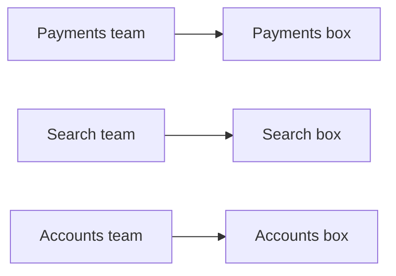

# Thinking in Trade-offs

By now you can see a system as boxes and arrows, and you know architecture is the set of expensive-to-change decisions driven by needs like scale and reliability. So here's the question every beginner eventually asks: *which architecture is the best one?* This phase gives you the honest answer — there isn't one — and then hands you the single most useful habit in the whole field, plus the rule that keeps beginners out of trouble.

## There is no "best," only "fitting"

**What it actually is.** Architecture has no universal winner. There is no shape that's correct for every system, the way there's no single "best" vehicle. A motorcycle, a minivan, and a cargo truck are all *right* — for different jobs. Ask "which is best?" and the only honest answer is "best *for what?*"

Architecture works exactly the same way. The right shape for a weekend side project is the wrong shape for a bank, and vice versa. A senior engineer doesn't ask "what's the best architecture?" — they ask "what's the architecture that *fits this problem, this team, and these constraints?*"

**Why people get this wrong.** It's comforting to believe there's a "correct" answer you can memorize — a list of "the right way to build software." So beginners (and a lot of blog posts) declare one shape universally superior: "always use microservices," "monoliths are dead," "you must use this pattern." It's reassuring and it's wrong. Any time someone tells you an architecture is *always* the answer regardless of the problem, you've found someone selling a hammer and calling everything a nail.

## Every choice trades something away

Here's *why* there's no best: every architectural choice is a **trade-off**. You don't get a free upgrade — you buy one quality by spending another. Seeing the trade behind every option is the core skill.

```text
   YOU WANT MORE...        ...YOU USUALLY PAY IN...
   ────────────────        ────────────────────────
   flexibility       ──►   simplicity (more moving parts to understand)
   speed             ──►   cost (faster often means more machines, more money)
   reliability       ──►   complexity (backups, failovers, extra boxes)
   independence      ──►   coordination (more pieces that must agree to work)

   every arrow is a "you gain this, you give up that" — never a pure win
```

*What just happened:* Look at the first row. Splitting one program into many smaller, independent pieces buys you flexibility — teams can work and ship separately. But you *pay* for it in simplicity: now there are many boxes to run, many arrows that can fail, and a whole new class of "which box broke?" problems. Neither the one-big-program shape nor the many-small-pieces shape is "better." Each trades a real thing for another real thing. The skill isn't picking the option with no downside — there isn't one — it's picking the option whose downside you can live with for *this* problem.

💡 **Key point.** Stop hunting for the architecture with no downsides; it doesn't exist. Instead, for every option ask: **"What does this buy me, and what does it cost me?"** The best engineers aren't the ones who avoid trade-offs — they're the ones who make them *on purpose, with eyes open*.

> If you want to see one of these trade-offs explored in full, [monolith vs microservices](/guides/monolith-vs-microservices) is exactly the "one big program vs many small pieces" choice from the table above, taken apart honestly.

## Conway's Law: your system mirrors your org

There's one trade-off-shaping force so reliable it has a name, and it surprises everyone the first time they hear it.

📝 **Terminology.** **Conway's Law** (named after Melvin Conway, who wrote it down in 1968) says, in plain terms: **a system's shape ends up mirroring the shape of the organization that built it.** The boxes tend to line up with the teams.

Picture it:


*Three teams that don't talk much tend to produce three components that don't share much.*

**What it does in real life.** If three separate teams build a system, you'll almost always end up with (at least) three major components, roughly one per team — because the way people are organized to communicate quietly shapes how their software is organized to communicate. This isn't a rule someone *chose*; it's a pull that happens whether you plan for it or not.

**Why this saves you later.** Two reasons. First, it explains messy systems you'll inherit: "why is this split into these weird pieces?" is often answered by "because of who built which part." Second, and more powerfully, you can *use* it — if you want a system shaped a certain way, organize the teams to match. When you hear a senior engineer say "we should reorganize the teams before we rebuild this," Conway's Law is what they're invoking. The org chart and the architecture are the same diagram in disguise.

## The golden rule for beginners: start simple

All of this could leave you anxious — *so many trade-offs, how do I ever choose?* Here's the rule that cuts through it, and it's the one piece of advice to carry out of this entire guide:

> **Start with the simplest architecture that solves your actual problem. Add complexity only when a real, specific problem forces you to.**

**Why this is the rule.** Remember the cost-of-change curve and the "more boxes isn't better" gotcha from earlier. Every box and arrow you add buys some future flexibility but costs you simplicity *right now* — more to build, more to run, more that can break. Beginners (and nervous teams) tend to add that complexity *up front*, designing for a million users and a fifty-person team they don't have yet. They pay the full cost of complexity immediately and collect the benefit maybe never.

The discipline is to resist. Build the three-box `web → API → database` shape. Run it. When — and *only* when — a real problem appears (it's genuinely too slow, this one team keeps colliding with that one, this part truly must never go down), you add exactly the complexity that solves *that* problem. You let the real world tell you what shape you need, instead of guessing.

⚠️ **Gotcha.** The opposite mistake — building a sprawling, "scalable," many-boxed architecture before you have a single real user — has a nickname among engineers: over-engineering. It *feels* responsible and forward-thinking. It usually just means you spent weeks paying for flexibility you never needed, on top of a system now too complicated to change quickly when the *real* requirements finally show up. Simple-and-working beats clever-and-theoretical almost every time at the start.

🪖 **War story.** Plenty of teams have launched on a single, boring, one-program-plus-one-database setup and happily served real customers on it for years — adding bigger machinery only once specific parts actually strained. Meanwhile other teams built elaborate distributed architectures before launch "to be ready to scale," and spent their energy maintaining complexity for traffic that took years to arrive, if it ever did. Starting simple isn't the timid choice. It's usually the experienced one.

## Recap

1. There is **no "best" architecture, only fitting ones** — the right shape depends on the problem, the team, and the constraints. "Best for *what?*"
2. **Every choice is a trade-off.** You buy one quality (flexibility, speed, reliability) by spending another (simplicity, cost, complexity). Make the trade on purpose.
3. **Conway's Law:** a system tends to mirror the org that built it. The boxes line up with the teams — which both explains messy systems and lets you shape new ones.
4. **The golden rule: start simple, add complexity only when a real problem demands it.** Over-engineering up front pays the full cost of complexity for benefits you may never collect.

That's the whole foundation. You can now see a system's shape (Phase 1), judge which of its decisions are the expensive ones (Phase 2), and reason about the trade-offs behind any choice (Phase 3). Everything else in the **architecture** category — specific shapes, scaling techniques, patterns with intimidating names — is built on exactly these ideas. When you meet a fancy pattern next, ask the three questions you now own: *What are the boxes and arrows? Which decisions are expensive? What does it trade away?* That's thinking like an architect.

> Ready for a concrete example? [Monolith vs microservices](/guides/monolith-vs-microservices) applies all three habits to one real decision. When you start worrying about real traffic, [designing for scale](/guides/designing-for-scale) is where the "scale" driver from Phase 2 gets its own guide.

---

[← Phase 2: Why It Matters](02-why-it-matters.md) · [Guide overview →](_guide.md)
