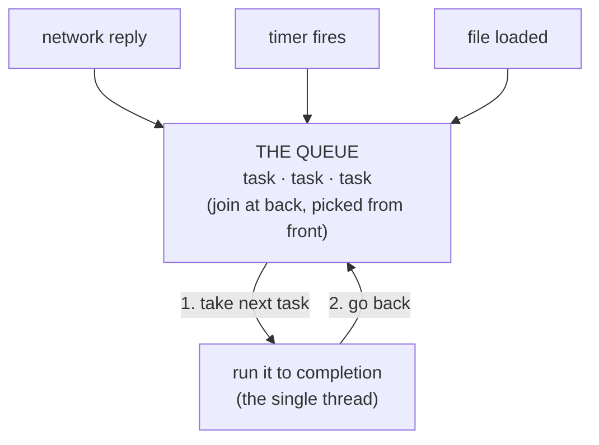

# The Event Loop

In Phase 1 we left a question hanging: how does *one* worker juggle many overlapping waits without dropping any of them? Who rings the bell when "table 4 is ready," and how does the waiter know to go pick it up?

The answer is a beautifully simple machine called the **event loop**. It's the engine underneath every `await` you've ever written, and once you can picture it turning, async stops being mysterious. The whole thing is two parts: a single worker that runs your code, and a line of jobs waiting their turn. Let's build it.

## What the event loop actually is

**What it actually is.** The event loop is a single thread — one worker — paired with a **queue** of tasks that are ready to run. The loop does one boring thing forever: take the next ready task off the queue, run it *all the way to completion*, then come back and take the next one. Run a task, finish it, grab the next. Run, finish, grab. Forever.

📝 **Terminology.** A *thread* is a single sequence of execution — one worker doing one thing at a time, in order. A *queue* here is just a waiting line: jobs join at the back and get picked up from the front. The event loop has one thread and (at least) one queue.

The "events" are the bells from Phase 1: a network response arrived, a timer fired, a file finished loading. When one of those happens, the work that should run *next* (the code waiting on that result) gets placed in the queue. The loop will get to it.



*What's happening:* Your code runs on the single thread. When it starts a wait — a network request, say — it hands that request off (to the operating system, the browser, the runtime) and *returns immediately*, freeing the thread to do other things. Later, when the reply lands, the runtime drops the "continue here" work into the queue. The loop, going around and around, eventually picks it up and runs it. The waiter dropped the order and walked away; the bell put the finished dish back in his path.

## Single-threaded but concurrent — not a contradiction

This is the line that trips everyone, so let's defuse it directly: JavaScript runs your code on **one thread**, yet it handles **many things at once**. How can both be true?

The trick is distinguishing two words people use loosely:

📝 **Terminology.** *Concurrency* is dealing with many tasks over the same period by interleaving them — making progress on several by switching between them. *Parallelism* is doing many tasks *at the same instant*, which requires multiple workers (multiple CPU cores). They are not the same thing.

The waiter is **concurrent, not parallel.** There is one waiter. He never carries two dishes through the door in the same instant. But over the course of an evening he keeps *many* tables progressing, because each table spends most of its time *waiting* (for food, for the bill), and he fills those gaps by tending other tables. One worker, many tasks in flight, none of them frozen.

That's exactly the event loop. The single thread is the one waiter. It only ever runs one piece of code at a time — truly one. But because each task hands off its waiting and steps aside, the thread is free to advance other tasks during those gaps. The result *looks* like many things happening together, and for waiting-heavy work, it's nearly as good — without the cost and complexity of multiple threads.

💡 **Key point.** One thread can keep hundreds of waiting tasks moving, because waiting doesn't occupy the thread. The thread is only ever busy during the brief moments of actual *computing* between the waits.

## The catch: the thread can only do one thing at a time

Here's the flip side, and it's the most important practical fact in this whole guide. The loop runs each task **to completion** before it touches the next one. It can't pause your code in the middle of a long calculation to go answer a network reply — it has no way to interrupt a running task. It has to wait for your task to *finish and return* before it can pick up anything else.

So if one of your tasks doesn't return for a long time — a giant loop, a synchronous file parse, a heavy calculation — the loop is *stuck inside it*. The queue piles up. Timers don't fire. Clicks don't register. Network replies sit unhandled. The single waiter is trapped in the kitchen doing arithmetic, and the whole dining room waits.

This is the meaning of the warning you've heard:

⚠️ **Gotcha: don't block the event loop.** A long-running *synchronous* task freezes everything, because the single thread can't do anything else until that task returns. In a browser, the page goes unresponsive — no scrolling, no clicks, the dreaded spinning cursor. On a server, *every* incoming request stalls until the one slow task finishes. The fix is to break the long task into chunks that return control to the loop, or hand the heavy computing to a separate worker (a Web Worker in the browser, a worker thread or separate process on a server).

## Seeing the block

Let's watch the loop get stuck. This code sets a timer to fire after 100 ms, then immediately runs a long synchronous loop. You'd hope the timer fires on time:

```console
$ node blockdemo.js
[t=0ms]   timer set for 100ms
[t=0ms]   starting a 2-second synchronous calculation...
[t=2013ms] calculation done
[t=2013ms] timer callback finally ran
```
*What just happened:* The timer was *due* at 100 ms — its "continue here" work was sitting in the queue, ready, on time. But the loop couldn't pick it up, because the single thread was trapped inside the 2-second synchronous calculation, running it to completion. Only when that calculation returned and freed the thread could the loop finally pull the timer's work off the queue. The timer didn't fire late because the timer was slow; it fired late because *we* blocked the one worker who answers the bell.

**Why this saves you later.** This single picture explains a startling number of real-world bugs. "My web server handles requests fine until one endpoint does heavy work, then *all* requests hang" — blocked loop. "My UI freezes for two seconds when I click Export" — blocked loop. "I added a `console.log` inside a tight million-iteration loop and the whole tab died" — blocked loop. Once you know the loop runs each task to completion on one thread, you stop being surprised by these, and you know the fix: get the heavy work off the one thread that's answering everyone.

## Recap

1. **The event loop** is one thread plus a queue: take the next ready task, run it to completion, go back for the next — forever.
2. **Events fill the queue.** When a wait finishes (network reply, timer, file load), the work that should continue is dropped into the queue for the loop to pick up.
3. **Single-threaded but concurrent** isn't a contradiction: one worker keeps many *waiting* tasks progressing by filling the gaps. That's concurrency (interleaving), not parallelism (simultaneous workers).
4. **The loop runs each task to completion** and can't interrupt it — so a long *synchronous* task **blocks the event loop**, freezing everything until it returns.

We now have the engine. But writing code that hands off waits and picks them back up — using the queue directly — would be a nightmare of nested callbacks. The last piece is the syntax that lets you *write* async code as if it were ordinary top-to-bottom code, while it quietly cooperates with the loop: promises, and `async`/`await`.

---

[← Phase 1: Why Async Exists](01-why-async-exists.md) · [Guide overview](_guide.md) · [Phase 3: Promises & async/await →](03-promises-and-async-await.md)
