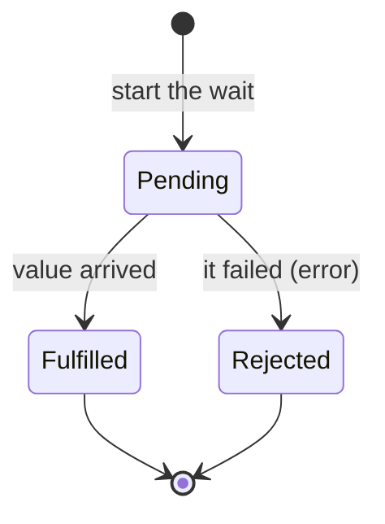

# Promises & async/await

You've got the model now: waiting is wasteful (Phase 1), and a single-threaded event loop fills the waits by juggling tasks (Phase 2). What's left is the part you actually *type* — the words `async` and `await` and the thing called a *promise*. The good news is that they don't introduce any new ideas. They're a readable skin stretched over the exact machine you already understand. Let's connect the syntax to the model, one piece at a time.

## A promise is "a value that isn't here yet"

**What it actually is.** A **promise** (called a *future* in some languages) is an object that stands in for a value you don't have *yet* but will have *later* — the result of a wait. The moment you start an async operation, you don't get the result; you get a promise, a receipt that says "the real value is coming; hold onto this and I'll fill it in."

A promise is always in one of three states:



*What's happening:* A promise starts **pending** — the food is still cooking. It then settles exactly once, into one of two final states: **fulfilled** with the value (the dish is ready), or **rejected** with an error (the kitchen dropped it). Once settled, it never changes again. This is why you sometimes see `Promise { <pending> }` printed: you logged the *receipt* before the value arrived.

📝 **Terminology.** A *promise* is an object representing the eventual result of an asynchronous operation. *Pending* = not done yet; *fulfilled* (or "resolved") = succeeded with a value; *rejected* = failed with an error. "Settled" means it reached fulfilled or rejected.

## await means "pause THIS function until it's ready"

**What it actually is.** `await` is the word that unwraps a promise. You put it in front of a promise, and it means: *pause this function right here until the promise settles, then give me the value* (or throw the error, if it rejected).

The crucial part — the part that makes this work with everything from Phase 2 — is what `await` pauses and what it *doesn't*:

💡 **Key point.** `await` pauses **only the function it's written in.** It does **not** block the event loop. The single thread is freed to go run other queued tasks while this function sits paused. When the awaited promise settles, the runtime drops "continue this function" into the queue, and the loop picks it back up.

Read that twice, because it's the whole trick. `await` *looks* like blocking — the code below it doesn't run until the value arrives, just like a blocking call. But underneath, it's pure non-blocking: your function steps aside and hands the thread back to the loop during the wait. It's the polite waiter who drops the order and walks away, written so it *reads* like the waiter who stands and waits. You get blocking-style readability with non-blocking behavior.

📝 **Terminology.** The `async` keyword in front of a function does two small things: it lets you use `await` inside that function, and it makes the function automatically return a promise. So `async function` = "this function does async work and hands back a promise."

## The before and after: callbacks → async/await

Before promises and `await`, you handled "do this when the value arrives" by passing a function to call later — a **callback**. It works, but stack a few in a row and it nests into a sideways pyramid that's miserable to read and harder to get error handling right. Here's the same job — fetch a user, then their orders, then the first order's details — written both ways.

The callback version:

```javascript
getUser(userId, (err, user) => {
  if (err) return handle(err);                 // error handling, attempt 1
  getOrders(user.id, (err, orders) => {
    if (err) return handle(err);               // error handling, attempt 2
    getDetails(orders[0].id, (err, details) => {
      if (err) return handle(err);             // error handling, attempt 3
      console.log(details);                    // finally, the actual point
    });
  });
});
```
*What just happened:* Each step nests inside the previous step's callback, because each one can only start once the one before it has delivered its result. The real work — `console.log(details)` — is buried three levels deep, and the error handling is copy-pasted at every level. This rightward drift is the famous "callback pyramid," and it gets worse with every step you add.

The same logic with `async`/`await`:

```javascript
async function showDetails(userId) {
  try {
    const user = await getUser(userId);        // pause until user arrives
    const orders = await getOrders(user.id);   // then pause until orders arrive
    const details = await getDetails(orders[0].id);  // then the details
    console.log(details);                      // the point, right where it belongs
  } catch (err) {
    handle(err);                               // one place handles any failure
  }
}
```
*What just happened:* The same three sequential waits now read top-to-bottom like ordinary code. Each `await` pauses the function until its value is ready — and during each pause, the event loop is free to do other work, exactly as in the callback version. The nesting is gone, the value flows down in plain variables, and a single `try/catch` handles a failure at *any* step (a rejected promise makes `await` throw, so your normal error handling catches it). Same model, same behavior, a fraction of the cognitive load.

⚠️ **Note on sequencing.** Those three `await`s run *one after another* because each genuinely needs the previous result. If steps are *independent*, awaiting them in a row makes them wait in sequence for no reason — that's the blocking-style timeline from Phase 1, reintroduced by accident. To overlap independent waits, start them all first, then await together: `const [a, b] = await Promise.all([fetchA(), fetchB()])`. Reach for that when the tasks don't depend on each other.

## The gotcha: forgetting await

Because an `async` function returns a promise, *calling it gives you a promise, not the value.* If you forget `await`, you're holding the receipt and treating it like the meal.

```console
$ node forgot-await.js
Promise { <pending> }
TypeError: Cannot read properties of undefined (reading 'name')
```
*What just happened:* The code called `getUser(id)` without `await`, so the variable held a pending *promise*, not a user object. Logging it showed `Promise { <pending> }` — the receipt, printed before the value arrived. Then the code tried to read `.name` off the promise, which doesn't have one, so it blew up. This is the single most common async mistake: the missing `await` doesn't error on its own line; it quietly hands you a promise, and the crash happens later when you use the "value" that was never unwrapped.

⚠️ **Gotcha.** If a value is `Promise { <pending> }`, or a property is mysteriously `undefined` right after an async call, your first suspect is a missing `await`. The code often *looks* right because it runs without an immediate error — the promise just flows downstream as the wrong type until something tries to use it.

## The other gotcha: unhandled rejections

A promise can reject — the wait failed. If nothing is there to catch that rejection, the error doesn't vanish; it surfaces as an **unhandled promise rejection**, a separate failure mode that's easy to miss because it's not a normal thrown exception in the line of code you're looking at.

```console
$ node no-catch.js
node:internal/process/promises:391
    triggerUncaughtException(err, true /* fromPromise */);
    ^
Error: network request failed
    at fetchUser (/app/no-catch.js:4:9)
[...]
Node.js v20.x
```
*What just happened:* An `async` function's promise rejected — the network request failed — and no `await` inside a `try/catch`, and no `.catch(...)` on the promise, ever handled it. The rejection bubbled all the way up as an *unhandled rejection*. In modern Node.js this crashes the process by default; in a browser it logs an "Uncaught (in promise)" error to the console. Either way, the failure happened far from where you'd look, because it escaped your normal error handling.

⚠️ **Gotcha.** Every promise that can fail needs a place to catch the failure: either `await` it inside a `try/catch`, or attach a `.catch()` to it. A "fire-and-forget" async call with no error handling is a rejection waiting to surprise you — often in production, often at 2am.

**Why this saves you later.** These two gotchas — the missing `await` and the unhandled rejection — account for a huge share of real async bugs, and both are quiet: neither errors on the line where you made the mistake. Knowing their *symptoms* (`Promise { <pending> }`, a surprise `undefined`, an "Uncaught (in promise)" from nowhere) turns a baffling debugging session into a five-second diagnosis. You'll see the symptom and know exactly which mistake to look for.

## Recap

1. **A promise is a value that isn't here yet** — a receipt for the eventual result of a wait. It's *pending*, then settles once into *fulfilled* (got the value) or *rejected* (got an error).
2. **`await` pauses only its own function** until the promise settles, without blocking the event loop — the thread is freed to run other queued work during the wait. `async` lets a function use `await` and makes it return a promise.
3. **async/await is readable syntax over the Phase 2 model** — it turns the sideways callback pyramid into top-to-bottom code with one `try/catch`, while behaving identically underneath.
4. **The two gotchas bite everyone:** forgetting `await` hands you a `Promise { <pending> }` instead of the value, and an uncaught rejection surfaces far from where it happened. Both are quiet — learn their symptoms.

That's the whole arc: async exists because waiting is wasteful; the event loop is a single thread plus a queue that fills the waits; and promises with `async`/`await` are the readable syntax that lets you write non-blocking code as if it ran straight down the page. The next time `await` does something surprising, you won't be staring at a spell — you'll be reasoning about a machine you can see.

> Want to go deeper? Cancellation, running work across multiple cores, async streams, and backpressure build on this foundation — those are a follow-up guide. With the model in this guide, you have what you need to read and reason about the async code in front of you today.

Related reading: [What Happens When Code Runs](/guides/what-happens-when-code-runs) · [Processes, Memory & the CPU](/guides/processes-memory-and-cpu)

---

[← Phase 2: The Event Loop](02-the-event-loop.md) · [Guide overview](_guide.md)
