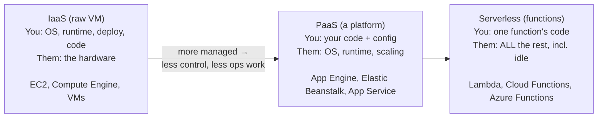

# IaaS vs PaaS vs Serverless, and Staying Sane

There's one more dimension to the buildings blocks, and it's the one that quietly shapes every cloud
decision: *how much of the work do you want to do yourself?* The same outcome — "run my code" — can be
bought at several levels of done-for-you, from "here's a bare machine, you handle everything" to "here's
a place to paste a function, we handle the rest."

This phase gives you that spectrum so you can place any service on it and know what you're trading. Then
it names the three things that turn an otherwise fine cloud setup into a bad week — and how to defuse
each before it bites.

## The spectrum: IaaS → PaaS → Serverless

It's one dial, not three separate worlds. As you slide toward "more managed," you do *less operations
work* — and you also get *less control* and bind yourself a little tighter to the provider. Nothing here
is "better"; they're trades.



### IaaS — Infrastructure as a Service (the raw VM)

**What it is.** The provider gives you the machine; everything *on* it is yours. You pick the OS, install
the runtime, configure the web server, set up deploys, and keep it patched. This is EC2 / Compute Engine
/ Azure VMs from Phase 2.

**The trade.** Maximum control and flexibility — it's just a computer, you can do anything — in exchange
for maximum operational work. You are the sysadmin.

### PaaS — Platform as a Service (a place to run your app)

**What it is.** You hand the platform your *application code* and a little configuration; it provides the
operating system, the language runtime, the scaling, and the deploy mechanics. You stop thinking about
the machine and think only about your app.

📝 **PaaS.** A managed platform that runs your application for you. You provide code; the provider
provides and operates everything underneath it (OS, runtime, scaling). Examples: AWS Elastic Beanstalk,
GCP App Engine, Azure App Service.

**The trade.** Far less ops work than IaaS, at the cost of having to fit the platform's expectations
(its supported runtimes, its way of deploying, its limits). You give up some control to stop being a
sysadmin.

### Serverless — functions that run on demand (FaaS)

**What it is.** You upload a single function. The provider runs it *only when something triggers it* — an
HTTP request, a file landing in a bucket, a scheduled timer — and you pay only for the time it actually
runs. There's no machine for you to manage, and when nothing's calling it, there's nothing running.
"Serverless" doesn't mean no servers; it means *you* never see, size, or manage the servers.

📝 **Serverless / FaaS (Functions as a Service).** You deploy a function, not a machine. The provider
runs it on demand, scales it from zero to many automatically, and bills per execution. Examples: AWS
Lambda, GCP Cloud Functions, Azure Functions.

**The trade.** The least ops work of all and you pay nothing while idle — wonderful for spiky or
occasional workloads. In exchange you accept the platform's constraints (functions have time limits, a
"cold start" delay after idle, and limited execution environments) and the *deepest* coupling to that
provider's specific way of doing things.

💡 **Key point.** Read the dial as: *more managed = less control + less ops + tighter coupling.* There's
no universally right spot. A team that wants to tune everything leans IaaS; a team that wants to ship and
not babysit leans PaaS or serverless. Most real systems mix all three.

---

## Staying sane: the three gotchas that actually hurt

The platforms work. What ruins people's weeks isn't the technology failing — it's three predictable
traps. Here they are, named before they bite, with the calm move for each.

### Gotcha 1 — Surprise bills (the meter you forgot)

⚠️ **This is the one that ends up in horror stories.** Because pricing is metered (Phase 1), anything
left running bills you silently. The classic ways it goes wrong: a beefy machine spun up "just to test"
and never shut down; a managed database sized for launch-day traffic that nobody scaled back; a
misconfigured job that loops and re-runs; or large amounts of data egressing to the internet (outbound
network transfer is often charged, and it surprises people). No alarm sounds — the invoice just arrives.

**The calm move: set a budget with alerts before you do anything else.** Every provider lets you define a
spending threshold and get emailed (or paged) when you approach it. This is the single highest-value ten
minutes in any new cloud account.

```console
$ aws budgets create-budget --account-id 123456789012 \
    --budget '{"BudgetName":"monthly-cap","BudgetLimit":{"Amount":"50","Unit":"USD"},"TimeUnit":"MONTHLY","BudgetType":"COST"}' \
    --notifications-with-subscribers '[{"Notification":{"NotificationType":"ACTUAL","ComparisonOperator":"GREATER_THAN","Threshold":80},"Subscribers":[{"SubscriptionType":"EMAIL","Address":"you@example.com"}]}]'
```
*What just happened:* You created a monthly budget called `monthly-cap` and told AWS to email you the
moment your *actual* spend crosses 80% of it. You haven't capped anything — the cloud won't auto-stop
your resources — but you've turned a silent meter into one that taps you on the shoulder early, while a
mistake is still cheap to fix. (GCP and Azure have the same feature: GCP "Budgets & alerts," Azure "Cost
Management budgets.")

📝 **A budget alerts you; it does not stop spending.** Setting a $50 budget does not switch off your
resources at $50 — it emails you. Stopping the spend is still your action. Treat the alert as a smoke
detector, not a circuit breaker.

### Gotcha 2 — IAM complexity (permissions that grow into a swamp)

**Why it bites.** IAM (Phase 2) starts simple and compounds. Each new service needs permission to talk to
the others, and the path of least resistance — when something is denied — is to grant broad, sweeping
access "to make it work." Do that a few dozen times and you have a system where half the identities can
do almost anything, nobody remembers why, and a single leaked credential is a catastrophe instead of a
contained incident.

**The calm move: least privilege, on purpose.** Grant each identity the *specific* permissions its job
needs and no more. When you hit an "access denied," resist the urge to widen the door — read what was
actually denied and grant exactly that. It's slower in the moment and dramatically safer over the life
of the system.

📝 **Least privilege.** The principle of giving each identity (person or code) only the permissions it
genuinely needs. The opposite — "just give it admin" — is the most common and most dangerous IAM
shortcut.

🪖 **War story shape.** The breaches you read about are rarely "the hacker defeated the cloud." They're
far more often "a key with far too many permissions leaked, and because it could touch everything, so
could whoever found it." Over-permissioning is what turns a small leak into a big one. That's why this
gotcha is worth the friction.

### Gotcha 3 — Lock-in (the exit you didn't plan)

**What it is.** The more managed and provider-specific the services you build on, the harder it is to
ever leave that provider. Build everything on plain VMs and a standard PostgreSQL database, and you could
move to another cloud (or your own servers) with effort but no rewrite. Build deeply on one provider's
proprietary serverless triggers, managed queues, and specialized databases, and your application is
woven into *that* provider — moving means rewriting.

**The honest framing — lock-in is a trade, not a sin.** Those deeply-managed, provider-specific services
are often genuinely the most productive way to ship. The mistake isn't using them; it's using them
*without knowing you're making the trade.* Decide deliberately: how much portability is this particular
system worth?

**The calm move: keep the expensive-to-move parts portable, and manage it all as code.** Your data and
your core application logic are the painful things to migrate, so favor standard, portable choices there
(a normal SQL database over a proprietary one, your own code over platform-specific glue) where it
matters. And describe your whole setup in **infrastructure as code** so it's reproducible and reviewable
rather than a pile of hand-clicked console settings nobody can recreate.

> ⏭️ That last point deserves its own skill. Defining your cloud resources in version-controlled files —
> so the whole environment can be rebuilt, reviewed, and (partly) re-pointed at another provider — is
> exactly what [Infrastructure as Code with Terraform](/guides/infrastructure-as-code-terraform)
> teaches. It's the antidote to both "what did we even click to set this up?" and the worst of lock-in.

## Recap

1. **IaaS → PaaS → Serverless is one dial:** more managed means less ops work, less control, and tighter
   coupling. Pick a spot per workload; most systems mix all three.
2. **Surprise bills:** the meter runs on anything left on. Set a **budget with alerts** first — but know
   it warns, it doesn't stop.
3. **IAM complexity:** grant **least privilege** on purpose; resist widening permissions "to make it
   work," because over-permissioning is how small leaks become big breaches.
4. **Lock-in:** it's a deliberate trade, not a sin — keep your data and core logic portable where it
   matters, and define everything as code.

You now have the whole mental model: what the cloud sells, the blocks it's made of, and how to choose
among them without getting burned. The natural next step is to stop clicking the console and start
describing your infrastructure as code — so it's reproducible, reviewable, and yours.

---

[← Phase 2: The Building Blocks](02-the-building-blocks.md) · [Guide overview](_guide.md) · [Next guide: Infrastructure as Code with Terraform →](/guides/infrastructure-as-code-terraform)
