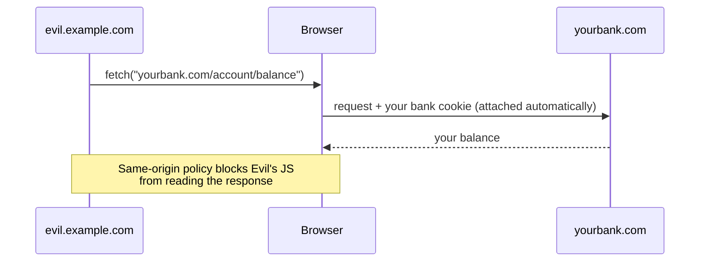
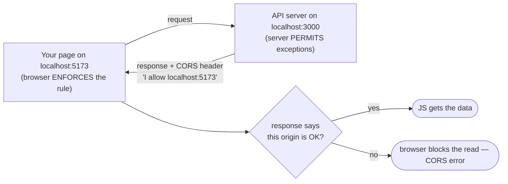

# Why the Browser Blocks You

Before you touch a single header, you need one idea in your head — because every confusing thing about
CORS comes from *not* having it. The idea is this: **the browser is enforcing a rule to protect the person
sitting in front of it, and CORS is how the server tells the browser to relax that rule for specific
friends.** That's the whole game. Let's build up to it.

## What an "origin" actually is

📝 **Origin.** An origin is the combination of three things: the **scheme** (`http` or `https`), the
**host** (`example.com`, `localhost`), and the **port** (`443`, `3000`, `5173`). All three must match for
two URLs to share an origin.

This trips people up constantly, so here is the picture:

```text
   https :// api.example.com : 443 / users
   ─────    ───────────────   ───
   scheme       host          port      ← change ANY of these three…
                                          …and it's a DIFFERENT origin.
```

So these are all *different* origins from `http://localhost:5173`:

```text
   http://localhost:3000      ← different PORT      (the classic dev setup)
   https://localhost:5173     ← different SCHEME    (http vs https)
   http://127.0.0.1:5173      ← different HOST      (127.0.0.1 is not "localhost")
```

⚠️ **The one that bites everyone in dev:** `localhost` and `127.0.0.1` are *not* the same origin, even
though they point at the same machine. If your frontend uses one and your API uses the other, the browser
treats them as strangers and CORS kicks in. Pick one and use it on both sides.

## The same-origin policy — the rule underneath everything

**What it actually is.** The **same-origin policy** is a rule baked into every browser: JavaScript running
on one origin **cannot read the response** from a request to a *different* origin — unless that other
origin explicitly allows it.

**Why people get this wrong.** People assume the request was *blocked*. Usually it wasn't. The browser
often sends the request, the server answers, and then — at the last moment — the browser refuses to hand
the response body to your JavaScript. The data came back; your code just isn't allowed to see it. That's
why the Network tab can show a `200 OK` while your `fetch` throws.

**Why this rule exists at all.** Imagine you're logged into your bank in one tab. Your browser holds a
cookie that proves it's you. Now you open a sketchy tab with this on the page:



The same-origin policy is what stops that. The evil page can *send* the request, but the browser will not
let the evil page's JavaScript *read* the answer. Your money stays private. This is the entire reason the
policy exists — it protects a logged-in user from having their data siphoned by whatever random site they
happen to be visiting.

💡 **Hold onto this:** the same-origin policy protects the *user*, by refusing to let one site read
another site's responses. It is the default. CORS is the exception mechanism layered on top.

## CORS — the server saying "these origins are okay"

**What it actually is.** CORS stands for **Cross-Origin Resource Sharing**. It is a set of HTTP headers
the *server* sends to tell the browser: *"I'm fine with this particular other origin reading my
responses."*

That's the key reversal most people miss. CORS doesn't *block* anything — the same-origin policy already
does the blocking, by default. CORS is how a server **opts specific origins back in**. When your API
answers with `Access-Control-Allow-Origin: http://localhost:5173`, it's telling the browser: *"a page on
`localhost:5173` is allowed to read this — let it through."* The browser sees that permission slip and
hands your JavaScript the response.



💡 **The whole mental model in one line:** the **browser enforces**, the **server permits**. A CORS error
means the server didn't send the permission the browser was looking for.

## The gotcha that changes how you debug

⚠️ **CORS is not a server-side firewall. It does not protect your API.** This is the single most important
thing to understand, and it's the opposite of what the error *feels* like.

CORS is enforced *by the browser*, for *browser users*. Anything that is not a browser — `curl`, a Python
script, Postman, another server, an attacker with a terminal — completely ignores CORS headers. They will
happily read your API's response no matter what `Access-Control-Allow-Origin` says.

```console
$ curl https://api.example.com/users
[{"id":1,"name":"Ada"},{"id":2,"name":"Grace"}]
```
*What just happened:* `curl` asked your API for `/users` and got the data — no CORS header in sight, no
"blocked" anything. CORS only ever happens inside a browser. So if your `/users` endpoint should not be
public, **CORS won't save you** — you need real authentication and authorization on the server. CORS
decides which *web pages* may read your responses; it says nothing about who is *allowed to call your API*.

**Why this saves you later.** When something is "blocked by CORS," you now know two things instantly: the
problem is a *missing or wrong response header on the server*, not your fetch code — and it only shows up
in the browser, which is why `curl` "works" while the page doesn't. That single insight cuts most CORS
debugging in half.

## Recap

1. An **origin** is scheme + host + port. Change any one and it's a different origin (`localhost` ≠
   `127.0.0.1`; different ports differ too).
2. The **same-origin policy** stops one origin's JavaScript from reading another origin's responses — to
   protect the logged-in user. It's the default.
3. **CORS** is the *server's* way to opt specific origins back in, via response headers.
4. **The browser enforces; the server permits.** A CORS error = the server didn't send the permission.
5. CORS protects *users in browsers*, **not your API**. `curl` and scripts ignore it entirely — so guard
   your API with real auth, not CORS.

---

[← Guide overview](_guide.md) · [Phase 2: Reading the Error & the Headers →](02-reading-the-error-and-the-headers.md)
