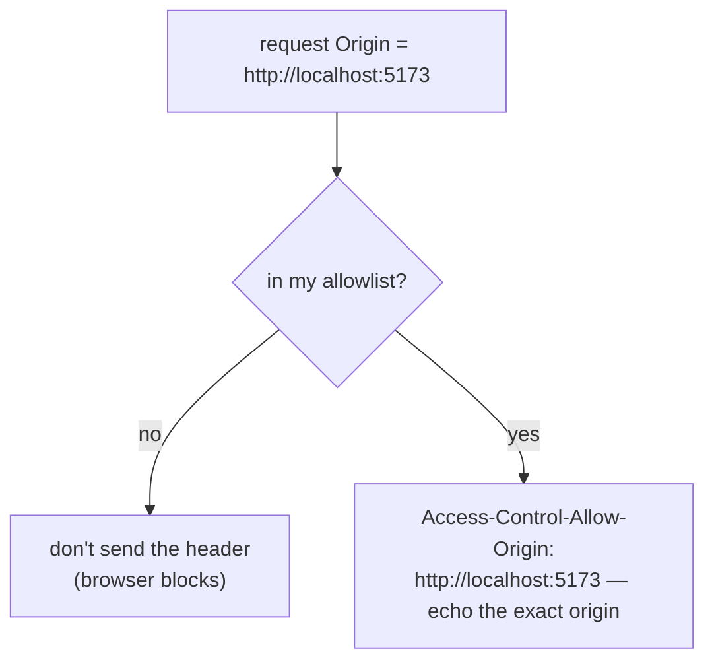
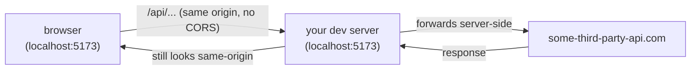

# Fixing It Properly

Here's the good news you earned in Phases 1 and 2: the fix is almost always a few response headers on the
*server*. Not the frontend. The browser is waiting for the server to send a permission slip — so we send
it. This phase gives you a scannable cheat-card for when you're blocked *right now*, then the proper fixes
underneath, the credentials trap that catches everyone, and a dev-only proxy for when you can't change the
server.

## The cheat-card

> **Match the symptom to the row, then read the section under it. The fix is always on the server unless
> noted.**

| What you're seeing | The calm fix |
|---|---|
| `No 'Access-Control-Allow-Origin' header is present` | Server sends no CORS at all — add `Access-Control-Allow-Origin` for your origin (§1) |
| Header present but `...not equal to the supplied origin` | Server allows a *different* origin — set it to *your* origin, or reflect it (§1) |
| `Response to preflight request doesn't pass access control check` | Add `Access-Control-Allow-Methods` and `Access-Control-Allow-Headers` and answer `OPTIONS` (§2) |
| Cookies/auth not sent, or "credentials" error with `*` | You can't combine credentials with `*` — name the exact origin (§3) |
| Can't touch the server (third-party API, no access) | Use a dev proxy so the browser sees one origin (§4) |
| Works in `curl` / Postman but not the browser | That's expected — CORS is browser-only. Your headers are the fix (Phase 1) |

---

## 1. Allow your origin (the everyday fix)

Most CORS errors are just a server that never sends `Access-Control-Allow-Origin`. You add it to the
response. The cleanest value is the *exact* origin you want to allow:

```http
HTTP/1.1 200 OK
Content-Type: application/json
Access-Control-Allow-Origin: http://localhost:5173
```
*What just happened:* the server now names `http://localhost:5173` as an allowed reader. The browser
compares it to the `Origin` it sent, sees a match, and releases the response to your JavaScript. The error
is gone.

If you need to allow several origins (say dev *and* staging), the server should keep a small **allowlist**
and reflect the request's `Origin` back only when it's on that list:



This is the honest way to support multiple origins. Resist the urge to reach for `*` — the next sections
explain why.

## 2. Make the preflight pass

If your error mentions *preflight*, the server is rejecting the `OPTIONS` "may I?" request (Phase 2). The
server has to answer `OPTIONS` with the methods and headers your real request needs:

```http
HTTP/1.1 204 No Content
Access-Control-Allow-Origin: http://localhost:5173
Access-Control-Allow-Methods: GET, POST, PUT, DELETE
Access-Control-Allow-Headers: Content-Type, Authorization
```
*What just happened:* the server told the browser, ahead of time, that this origin may use those methods
and send those headers. The browser approves the preflight and *then* fires your real request. Two common
trip-ups: the server must actually *handle* the `OPTIONS` route (many frameworks need this enabled), and
`Access-Control-Allow-Headers` must include every custom header you send — `Authorization` and a non-form
`Content-Type` are the usual missing ones.

💡 **Most web frameworks ship a CORS middleware** (a setting or a small package) that sets all of these
for you from one config block. Reach for that rather than writing headers by hand — but you now know
exactly what it's doing under the covers, which is what makes it debuggable.

## 3. The credentials trap (read this before you ship)

📝 **Credentials.** In CORS, "credentials" means cookies, HTTP authentication, or a request sent with
`fetch(url, { credentials: "include" })`. These are how a browser proves *who the user is*.

Here's the rule that catches everyone:

⚠️ **You cannot combine `Access-Control-Allow-Origin: *` with credentials.** If the request sends
credentials, the server **must** name a single, specific origin — the wildcard is rejected by the browser.
This is deliberate: `*` means "any site may read this," and "any site may read this *with the user's
cookies attached*" would re-open the exact bank-account hole the same-origin policy exists to close.

```http
HTTP/1.1 200 OK
Access-Control-Allow-Origin: http://localhost:5173    ← MUST be a specific origin, never *
Access-Control-Allow-Credentials: true                ← required to let cookies/auth through
```
*What just happened:* the server allowed one named origin *and* set `Access-Control-Allow-Credentials:
true`, so the browser will both send the user's cookies and let your JavaScript read the response. If the
server had answered `Access-Control-Allow-Origin: *` here, the browser would block it with a credentials
error no matter what else was set.

This is why the multi-origin allowlist from §1 matters: with credentials, *reflecting the exact origin* is
not just tidy — it's the only thing that works.

## The big gotcha: don't `*` your way out of it

⚠️ **`Access-Control-Allow-Origin: *` is not a fix — it's a decision to let every website on the internet
read that response.** It's the first thing people paste in to make the red text go away, and for a truly
public, non-credentialed, read-only endpoint (a public weather feed, say) it can be fine. But on anything
that returns user data, sits behind auth, or lives on a private/internal network, `*` is a real security
mistake:

- It can't be used with credentials anyway (§3), so it often doesn't even solve your actual problem.
- It tells *every* origin — including malicious ones — that their JavaScript may read your responses. For
  an internal or authenticated API, that's the door you were trying to keep shut.

The safe default is: **name the specific origin(s) you actually trust.** Use `*` only when you genuinely
mean "this is public to the entire web, with no user-specific data."

## 4. The dev workaround: a proxy

Sometimes you *can't* change the server — it's a third-party API, or someone else owns it. In development,
you can sidestep CORS entirely with a **proxy**: your own dev server forwards the request, so the browser
only ever talks to *one* origin (yours).



*What's happening:* the browser thinks it's talking to its own origin (`localhost:5173`), so the
same-origin policy is satisfied and no CORS headers are needed. The actual cross-origin call happens
*server-to-server*, where CORS doesn't apply at all (remember Phase 1: CORS is browser-only). Most
frontend dev servers have a built-in proxy setting for exactly this.

⚠️ **A proxy is a dev convenience, not a production CORS fix.** In production, the proper answer is still
correct headers on the server you control. Don't ship a hack that papers over a header you could just set.

## Recap

1. The fix is **server-side headers**, not frontend code.
2. Send `Access-Control-Allow-Origin` with your **exact origin**; for several origins, keep an allowlist
   and reflect the matching one.
3. For preflights, also send `Access-Control-Allow-Methods` and `Access-Control-Allow-Headers`, and
   actually handle the `OPTIONS` request.
4. **Credentials + `*` is forbidden** — name a specific origin and add `Access-Control-Allow-Credentials:
   true`.
5. Don't reach for `Access-Control-Allow-Origin: *` on a credentialed or private API — it opens it to the
   whole web. A **dev proxy** is the right *temporary* workaround when you can't change the server.

---

You came here blocked and a little annoyed, and now you can read the error, point at the exact missing
header, and fix it without quietly opening a hole. That's the whole skill. The deeper material — caching
preflights with `Access-Control-Max-Age`, per-route policies, and CORS in front of CDNs and API
gateways — is a follow-up guide for when you need it. For now, you're unblocked, safely.

---

[← Phase 2: Reading the Error & the Headers](02-reading-the-error-and-the-headers.md) · [Guide overview](_guide.md)
