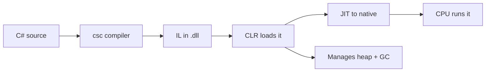
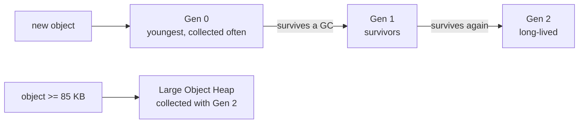

# The .NET Runtime: Memory, GC & JIT — What Runs Your IL

For fourteen phases you've written C# and it ran. You never called `malloc`, never called `free`, never thought about where an `int` or a `Customer` actually lives in memory. That wasn't an accident you got away with — it's the whole point of a *managed* language. Underneath your code sits the **CLR**, the .NET runtime, and it has quietly been doing three big jobs for you: deciding where your data lives, cleaning up the data you stop using, and turning your code into native machine instructions on the fly.

You can ship C# for years without opening this hood. But the day a service's memory climbs and never comes back down, or a request stalls for 50 ms with no code running, or you wonder why your value type benchmark is 10x faster than the reference-type one — you're asking runtime questions. This phase gives you the mental model so those questions have answers instead of shrugs. The big idea: **.NET trades a little control you don't want for a lot of bookkeeping you don't have to do** — and it pays off everywhere except the few spots where you need to know the deal you signed.

## The CLR, recapped and deepened

Back in [Phase 1](01-install-and-first-program.md) you learned that C# compiles to **IL** (Intermediate Language), not to machine code, and that something called the CLR runs it. Time to deepen that.

📝 **CLR (Common Language Runtime)** — the .NET runtime: the program that loads your assemblies, manages their memory, JIT-compiles their IL to native instructions, and supervises them while they run. "Managed code" means code whose memory and execution the CLR oversees. When people say C# is "managed," *this* is the manager.

Here's the shape to hold in your head. Your `.cs` files compile to IL stored in a `.dll`. That IL is portable and not directly runnable by any CPU — it's instructions for an imaginary stack machine. When you run the program, the CLR loads that IL and does the real work: it allocates memory for your objects, tracks which objects are still in use, runs the **garbage collector** to reclaim the rest, and **JIT-compiles** each method to native code the first time it's called.



*One idea:* the compiler's job ends at IL. Everything between "IL on disk" and "instructions executing on your CPU" is the CLR's job — and memory management and JIT are the two biggest parts of it. The rest of this phase is those two parts, up close.

## Stack vs heap, and value vs reference types

Way back in [Phase 2](02-syntax-values-and-types.md) you met the split between **value types** (`int`, `bool`, `double`, `struct`, `enum`) and **reference types** (`class`, `string`, arrays, `object`). At the time the difference was about *copying behavior*. Now you get the deeper reason it exists: value types and reference types live in different *places*, and those places behave very differently.

📝 **Stack** — a small, fast, per-thread region of memory that grows and shrinks with method calls. When a method is called, its locals get a slice of the stack ("stack frame"); when it returns, that slice vanishes instantly and for free. Allocation is a pointer bump; cleanup is automatic and costs nothing. **Managed heap** — a larger shared pool where reference-type objects live. The heap is *not* freed when a method returns — reclaiming it is the garbage collector's job.

The rough rule: **value types live where they're declared; reference types live on the heap with a reference pointing to them.** A local `int` sits right in the method's stack frame. A local `Customer c = new Customer()` puts the `Customer` *object* on the heap and keeps a *reference* (a pointer) to it on the stack. When `int` is a field inside a class, it rides along on the heap inside that object; when it's a local, it's on the stack. ("Often on the stack" is the honest phrasing — the CLR can put value types on the heap when they're captured by a lambda or boxed, which is the next gotcha.)

```csharp
struct Point { public int X, Y; }          // value type
class Box    { public int Value; }          // reference type

void Demo()
{
    int n = 42;                 // value: lives in this stack frame
    Point p = new Point();      // value: also lives in this stack frame, inline
    Box b = new Box();          // reference: the Box object is on the heap;
                                //   `b` (the reference to it) is on the stack
}                               // frame vanishes: n and p are gone instantly.
                                //   the Box on the heap waits for the GC.
```

*What just happened:* `n` and `p` are value types, so they sit directly in `Demo`'s stack frame — when `Demo` returns, they're swept away with the frame at zero cost. `b` is a *reference*: the `Box` object itself was allocated on the managed heap, and `b` just holds its address. When `Demo` returns, the reference `b` disappears with the frame, but the `Box` object on the heap lingers until the GC notices nothing points to it anymore.

This split is exactly why value vs reference type matters for performance. Stack allocation is nearly free and self-cleaning. Heap allocation costs more *and* it creates future work for the GC. A method that spins value types in a tight loop touches the heap zero times; the same loop with `new`-ed objects feeds the garbage collector.

There's one trap that quietly drags a value type onto the heap: **boxing**.

📝 **Boxing** — wrapping a value type in a heap object so it can be treated as a reference type (typically `object` or an interface). **Unboxing** is the reverse: copying the value back out. Each box is a fresh heap allocation plus a copy.

```csharp
int n = 7;
object boxed = n;        // BOXING: a heap object is allocated to hold a copy of 7
int back = (int)boxed;   // UNBOXING: copies the value back out of the heap object
```

*What just happened:* assigning an `int` to an `object` can't just store the number — `object` is a reference type, so the CLR allocates a little box on the heap, copies `7` into it, and points `boxed` at it. That's a heap allocation you didn't ask for. The cast back copies the value out again. One box is cheap; a million boxes in a loop (easy to do accidentally with old non-generic collections like `ArrayList`, or by formatting value types into `object[]`) is a measurable GC stampede.

⚠️ **Gotcha — boxing hides in plain sight.** It's why generics (`List<int>`) exist and `ArrayList` is discouraged: `List<int>` stores `int`s without boxing, while `ArrayList` boxes every one. If a hot path is allocating and you can't see `new` anywhere, suspect a hidden box — a value type slipping into an `object`, an interface, or a non-generic API.

## Garbage collection

You allocate heap objects constantly — every `new` on a class, every `string` concatenation, every list that grows. You never free any of them. So what stops the heap from filling up forever? The garbage collector.

📝 **Garbage collector (GC)** — the CLR component that automatically finds heap objects your program can no longer reach and reclaims their memory, so you never call `free` yourself. .NET's GC is a **generational, tracing, mark-and-sweep** collector.

The core idea is **reachability**. The GC starts from a set of **roots** — static fields, and the local variables and method arguments live on every thread's stack right now — and traces every reference it can follow. Every object it reaches is *live* and kept. Every object it *can't* reach is unreachable — garbage — and its memory goes back into the pool. You don't track object lifetimes; reachability *is* the lifetime. The moment nothing points to an object, it's eligible to be collected (not necessarily *immediately*, but eventually).

The "generational" part is the clever optimization, and it rests on one observation that holds for almost every program: **most objects die young.** The temporary string you built to log a line, the small list inside a method — they become garbage almost as soon as they're born. A few objects (your cache, your config, your long-lived service) live for the whole program. So the GC sorts the heap by age:



📝 **Generations.** New objects start in **Gen 0**, which is small and collected very frequently and very fast. Anything that survives a Gen 0 collection is promoted to **Gen 1**; survivors of Gen 1 move to **Gen 2**, the long-lived region, collected rarely. Because most objects die in Gen 0, the GC does the *cheap, frequent* work on a tiny slice of the heap and only occasionally pays for a full **Gen 2** sweep of everything. Separately, objects 85 KB or larger (big arrays, large buffers) go on the **Large Object Heap (LOH)**, which is collected together with Gen 2 — moving big objects around is expensive, so the GC avoids it.

Two more dials worth knowing by name. **Workstation vs server GC**: workstation GC (the default for desktop/client apps) is tuned for low latency on one or two cores; **server GC** (typical for ASP.NET and high-throughput services) runs parallel collection threads across many cores for higher throughput. And every collection involves a brief **stop-the-world (STW)** pause — the GC must freeze your threads for at least part of the work so the object graph doesn't change mid-trace. Modern .NET keeps these pauses small (often sub-millisecond for Gen 0), but they are never *zero*.

Step through a mark-and-sweep collection yourself — roots, what's reachable, and what gets swept:

```playground-gc
```

💡 **The insight.** GC is automatic, but it isn't free. Every object you allocate is future work for the collector, and heavy **allocation pressure** (churning through short-lived objects in a hot path) means more frequent Gen 0 collections and more STW pauses. You rarely tune the GC directly — instead you *allocate less*: reuse buffers, prefer value types and `Span<T>`, avoid hidden boxing. That's the bridge to [Phase 17](17-performance-and-ecosystem.md), where you'll measure exactly this.

## `IDisposable`, finalizers, and the limit of GC

Here's the trap that catches people who learn "the GC cleans up for me" and stop there: **the GC manages memory, and only memory.** It knows nothing about the file handle, network socket, database connection, or OS lock your object is holding. Those are *unmanaged resources*, and the GC won't release them for you — at least not when you need it to.

⚠️ **The GC frees memory; it does not free everything else.** An object holding an open file can become unreachable and the GC will happily reclaim its *memory* — but the file might stay locked until some indeterminate later moment (or until the process exits). For anything scarce or externally visible — files, sockets, DB connections, handles — you must release it *deterministically*, and that's what `IDisposable` is for.

You met `using` back in [Phase 7](07-errors-and-io.md). Now you can see *why* it exists: it's the deterministic counterpart to the non-deterministic GC.

```csharp
// `using` calls Dispose() the instant the block ends — deterministic cleanup,
// not "whenever the GC gets around to it."
using (var file = new StreamReader("data.txt"))
{
    string first = file.ReadLine();
    Console.WriteLine(first);
}   // file.Dispose() runs HERE, releasing the OS file handle right now

// modern "using declaration" form — disposes at the end of the enclosing scope
using var conn = new SqlConnection(connectionString);
conn.Open();
// ... conn.Dispose() runs when the method's scope ends
```

*What just happened:* `using` guarantees `Dispose()` is called the moment control leaves the block — even if an exception is thrown — so the file handle is released *right then*, deterministically. Without it, the `StreamReader` would eventually become unreachable and the GC would reclaim its memory, but the underlying OS handle could stay open far longer than you'd want, and a handful of leaked handles can exhaust an OS limit while you still have gigabytes of free memory.

So what about **finalizers** (the `~ClassName()` method)? They're the GC's last-resort backstop: if an object holding an unmanaged resource is collected *without* anyone calling `Dispose()`, its finalizer runs during GC and can release the resource. But finalizers are bad news as a primary strategy.

⚠️ **Avoid relying on finalizers.** A finalizable object survives an *extra* GC cycle (it's promoted so the finalizer can run, then collected later), runs your cleanup on a separate finalizer thread at an unpredictable time, and delays reclaiming that memory. They exist as a safety net for the rare case where you wrap a raw unmanaged handle and someone forgets to `Dispose`. The right pattern is the standard `Dispose` pattern with `GC.SuppressFinalize(this)`, which says "I cleaned up properly, skip the finalizer." In day-to-day C#, you write `using` and let `IDisposable` types handle their own internals.

💡 **The one-line rule.** The GC frees *memory*; you free *everything else* — with `using`. Memory is the runtime's job; file handles, sockets, and connections are yours.

## JIT compilation and memory errors

The last piece of CLR magic is how your IL becomes machine code. It doesn't happen all at once at startup — it happens **just in time**.

📝 **JIT (Just-In-Time) compiler** — the part of the CLR that translates a method's IL into native machine code the *first time that method is called*, then caches the result so later calls run the already-native version. Methods you never call are never JIT-compiled.

This is why .NET apps "warm up." The very first request to a freshly started service is often noticeably slower: every method on that code path is being JIT-compiled as it's hit, for the only time. Subsequent requests run the cached native code at full speed. Modern .NET sharpens this with **tiered compilation**: the JIT first produces code *quickly* with few optimizations (Tier 0) so the app starts fast, then, for methods that turn out to be hot (called many times), recompiles them in the background with full optimizations (Tier 1). You get fast startup *and* fast steady-state.

If you can't afford warm-up at all — a CLI tool that must be instant, or a serverless function billed per millisecond — there are ahead-of-time options: **ReadyToRun** (R2R) bakes pre-JITted native code into the assembly so startup skips most JIT work, and **Native AOT** compiles the whole app to a standalone native binary with no JIT (and no runtime JIT machinery) at all. The trade-off is larger or less flexible binaries and some feature restrictions; most apps stick with the JIT.

Finally, two memory errors you'll eventually meet. The CLR throws `OutOfMemoryException` when it genuinely can't satisfy an allocation. But far more common in practice is the **managed memory leak** — and here's the sting:

⚠️ **GC'd does not mean leak-proof.** The GC only frees what's *unreachable*. If your program keeps a reference alive by accident, the object stays in memory forever — and it looks exactly like a leak, because it is one. The classic culprits:

```csharp
// 1. A static collection that only ever grows.
static readonly List<byte[]> _cache = new();
void Remember(byte[] data) => _cache.Add(data);   // never removed → grows without bound

// 2. An event subscription you never unsubscribe.
publisher.DataChanged += subscriber.OnDataChanged;
// The publisher now holds a reference to `subscriber`. Even when you're "done"
// with `subscriber`, the publisher keeps it reachable — and alive — forever,
// until you do:  publisher.DataChanged -= subscriber.OnDataChanged;
```

*What just happened:* in both cases the GC is working *perfectly* — the memory genuinely is still reachable, so it's genuinely still alive. The static `_cache` keeps every array reachable for the life of the process. The event subscription is sneakier: a publisher's event holds a reference to every subscriber, so a long-lived publisher silently pins short-lived subscribers in memory until you unsubscribe. The fix is never a GC setting — it's bounding your collections (eviction policies, `WeakReference`) and matching every `+=` with a `-=`. Managed languages move the leak from "forgot to `free`" to "forgot to drop the reference," but the leak is just as real.

## Recap

1. The **CLR** runs your IL: it manages the heap, runs the GC, and JIT-compiles methods to native code. "Managed code" means the CLR is doing this bookkeeping for you.
2. **Value types** (structs, primitives) typically live inline on the **stack** (cheap, auto-freed on return); **reference types** live on the **managed heap** with a reference on the stack. **Boxing** drags a value type onto the heap — a hidden cost worth hunting for.
3. The **GC** reclaims **unreachable** heap objects automatically (you never `free`). It's **generational** — Gen 0 is small and collected often because most objects die young; Gen 2 and the LOH are collected rarely. Every collection has a brief **stop-the-world** pause, and allocation pressure causes more of them.
4. ⚠️ The GC frees **memory, not other resources**. Files, sockets, and connections need deterministic cleanup via **`IDisposable`/`using`**; **finalizers** are a last-resort backstop, not a strategy.
5. The **JIT** compiles IL to native on first call (with **tiered compilation** for fast startup *and* fast hot paths), which is why .NET "warms up"; **ReadyToRun**/**Native AOT** skip JIT when warm-up is unacceptable.
6. ⚠️ GC'd ≠ leak-proof: an accidental lingering reference (static collections, un-unsubscribed events) keeps memory alive forever. The fix is dropping the reference, not tuning the GC.

You now know what happens beneath `new`, `using`, and every method call: where your data lives, who cleans it up, and how your IL becomes instructions. Next we make all of this measurable — testing, building, and profiling, where you'll watch allocations and timings with real tools instead of reasoning about them in the abstract.

## Quick check

Test yourself on the three ideas that matter most — where values live, what the GC does and doesn't free, and what JIT means:

```quiz
[
  {
    "q": "What is boxing in C#, and why does it cost something?",
    "choices": [
      "Wrapping a value type in a heap-allocated object so it can be used as a reference type — it costs a heap allocation plus a copy",
      "Putting a class instance on the stack to make it faster, which costs nothing",
      "Compiling IL to native code on first use, which costs startup time",
      "Marking an object unreachable so the GC can collect it"
    ],
    "answer": 0,
    "explain": "Boxing wraps a value type (like an int) in a fresh heap object so it can be treated as `object` or an interface. That's a heap allocation and a copy you didn't ask for — harmless once, but a GC stampede in a hot loop. It's the reason `List<int>` is preferred over the boxing `ArrayList`."
  },
  {
    "q": "Your object holds an open file handle and becomes unreachable. What does the garbage collector guarantee?",
    "choices": [
      "It will reclaim the object's memory eventually, but it does NOT promptly release the file handle — that needs IDisposable/using",
      "It immediately closes the file and frees the memory at the same instant",
      "Nothing — the GC never touches objects that hold unmanaged resources",
      "It throws OutOfMemoryException because file handles can't be collected"
    ],
    "answer": 0,
    "explain": "The GC manages memory and only memory. It'll reclaim the object's bytes once nothing references it, but it knows nothing about the OS file handle and won't release it deterministically. That's exactly what `IDisposable` and `using` are for — and why finalizers are only a last-resort backstop."
  },
  {
    "q": "Why is the very first request to a freshly started .NET service often slower than later ones?",
    "choices": [
      "The JIT compiles each method's IL to native code the first time it runs; later calls reuse the cached native code",
      "The garbage collector always runs a full Gen 2 collection at startup",
      "The CLR re-downloads the assemblies on the first request",
      "Value types are boxed on the first call and unboxed afterward"
    ],
    "answer": 0,
    "explain": "Methods are JIT-compiled to native code on first call, then cached. The first request pays that one-time compilation cost across its whole code path, so it 'warms up.' Tiered compilation softens this (fast Tier 0 first, optimized Tier 1 later), and ReadyToRun/Native AOT can skip it entirely."
  }
]
```

---

[← Phase 14: async/await & Tasks](14-async-await-and-tasks.md) · [Guide overview](_guide.md) · [Phase 16: Testing, Build & Profiling →](16-testing-and-profiling.md)
