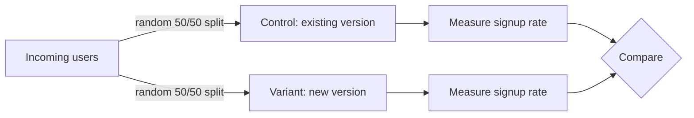

# Why you'd randomize at all

Here's the trap almost everyone falls into before they learn better: you ship a change, watch the metric for a week, see it go up, and conclude the change worked. That's "before vs. after," and it feels like evidence. It is not.

## The problem with before vs. after

The week after you shipped isn't a clean copy of the week before it with one variable changed. It's a different week, full of things that have nothing to do with your button color:

- **Seasonality.** Traffic on a Monday doesn't behave like traffic on a Saturday. A holiday week doesn't behave like a normal one. If your "before" period and "after" period land on different points in that cycle, the difference you're seeing might just be the calendar.
- **Other changes happening at the same time.** Marketing sent an email. A competitor had an outage. Your app store rating ticked up. Another team shipped a different feature the same week. Any of these can move your metric, and "before vs. after" has no way to separate their effect from yours.
- **Confounds.** A confound is anything that changes alongside your treatment and could explain the result instead of it. If you rolled the new button out only to mobile users first, and mobile users already convert differently than desktop users, you're not measuring the button - you're measuring mobile vs. desktop.

The real problem is that "after" always differs from "before" in dozens of ways you didn't control, and your change is just one of them. You have no way to isolate its effect from all the rest.

> A metric moving after you shipped something is not evidence the thing you shipped caused it. Time moves things on its own.

## What randomizing actually buys you

The fix is to stop comparing across time and start comparing across groups that exist in the *same* time. Take your incoming users and randomly assign each one to see version A (the **control** - what already exists) or version B (the **variant** - the new thing). Both groups experience the same day, the same marketing email, the same outage, the same everything - except the one thing you're testing.

Randomization is what makes this work. If you let users pick which version they see, or assign based on any trait (signup date, browser, region), you've reintroduced a confound - now the groups differ by more than just the variant. Random assignment means, on average, the two groups are identical in every way *except* which version they saw. Any difference in outcomes has one remaining explanation: the variant.

*What just happened:* both groups are drawn from the exact same population, at the exact same time, experiencing the exact same external world. The random split is what lets you attribute any difference in the two "measure" boxes to the one thing that differs between them - which version they saw.

## Why "at the same time" is the whole point

A proper A/B test never compares control-in-March to variant-in-April. Both groups run **concurrently** - same week, same days, same external conditions. That's the piece "before vs. after" is missing entirely, and it's what makes A/B testing worth the extra setup. You're not asking "did the metric change over time." You're asking "of two groups living through the identical moment, which one did better" - and that question has a clean answer.

This doesn't mean before/after comparisons are worthless everywhere. They're a reasonable first signal when you have no way to run a real test. But if you're deciding something that matters - a pricing change, a checkout redesign, anything you'd want to defend later - a random split is what turns "I think it worked" into "I can show it worked."

Phase 2 covers how to actually structure that split: what to hold fixed, what to measure, and how big the groups need to be before the comparison means anything.

[← Overview](_guide.md) | [Phase 2: How a real test is structured →](02-structuring-a-test.md)
