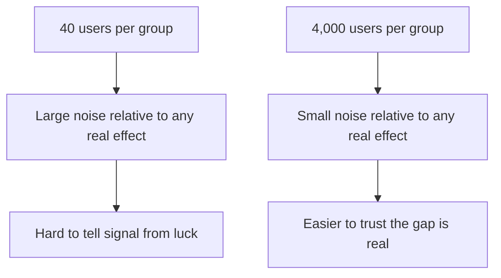

# How a real test is structured

Randomizing the split (Phase 1) is the foundation. On top of it, a real test needs three more things nailed down before you start: what you're calling "control," what single number counts as winning, and how many people you need before the answer is trustworthy.

## Control vs. variant

The **control** group sees the thing that already exists — your current button, your current pricing page, your current onboarding flow. It's the baseline. The **variant** (sometimes called the "treatment") sees the new thing you're proposing. You can run more than one variant at once (A vs. B vs. C), but the core comparison is always "new thing vs. what we already know works."

The control isn't a formality — it's the only thing that tells you whether the variant actually *beat* something, rather than just landed on a number that sounds fine in isolation. "12% of the variant group converted" means nothing on its own. "12% of the variant group converted, vs. 9% of the control group, in the same week" means something.

## Pick ONE metric before you start

This is the step people skip and regret. Before you launch the test, decide the single metric that determines whether the variant wins: signup rate, checkout completion, seven-day retention — one number, chosen in advance.

Why one, and why in advance? If you watch ten metrics at once, at least one will move by chance even if your change does nothing — and it's tempting to declare *that* one "the real result" after the fact. Phase 3 covers this trap in detail; the prevention starts here: write down the metric before you see any data, and judge the test by that number alone.

That doesn't mean you can't *look* at other metrics — you should, for context and to catch a variant that wins on signups but tanks retention. It means only one of them was the pre-registered judge of "did this work."

## Why small tests are noisy

Say you run a test for one day, 40 people per group: control converts at 10%, the variant at 15%. That's roughly 4 conversions vs. 6 — a single person switching groups would change the whole story. Small samples swing wildly for the same reason a coin flipped 4 times can land heads 3 times without being unfair: there isn't enough data yet for randomness to average itself out.

This is **noise**: the natural bounce in a metric even when nothing real is happening underneath. The larger your sample, the smaller that bounce gets relative to a real effect — and the more you can trust that a gap you're seeing is real, not a lucky coin flip.



*What just happened:* the sample size doesn't change how big the real effect is — it changes how confidently you can tell that effect apart from ordinary randomness. That's why serious tests are planned to run until they hit a target sample size, not just "run for a while and see."

## What "statistically significant" actually means

You'll hear this phrase constantly, and most people who say it can't explain it. Here's the plain version, no formulas: a result is called **statistically significant** when the gap between control and variant is large enough, given how much data you collected, that it's unlikely to have happened from ordinary random noise alone.

It is *not* a claim that the result is important, large, or permanent — it's a narrower one: "if there were truly no difference between these two versions, we probably wouldn't have seen a gap this big by chance." That's it.

A tiny, meaningless improvement can be "statistically significant" with enough users. A genuinely large improvement can fail to reach significance if tested on too few. Significance is about confidence that a gap is real — not whether it's worth caring about; ask both questions separately.

> "Statistically significant" means "probably not noise." It does not mean "big," "important," or "definitely permanent." Ask those separately.

The practical takeaway: before running a test, decide roughly how many users you need — most experimentation tools or a sample-size calculator do this math for you, given your baseline conversion rate and the smallest improvement worth detecting — then run until you hit that number and only then check significance. Checking before that point is where Phase 3 begins.

Watch it animated: [A/B testing](/explainers/ABTesting.dc.html)

```quiz
[
  {
    "q": "Why does a real A/B test run the control and variant groups at the same time, rather than control last month and variant this month?",
    "choices": [
      "It's faster to set up that way",
      "Running them concurrently controls for everything else that changes over time, like seasonality or other launches",
      "It uses less server capacity",
      "Users prefer seeing both versions in the same month"
    ],
    "answer": 1,
    "explain": "Concurrent groups experience identical external conditions, so any outcome difference can be attributed to the variant instead of the calendar."
  },
  {
    "q": "Why should you pick one metric before the test starts, instead of after?",
    "choices": [
      "Analytics tools only support tracking one metric at a time",
      "Choosing after the fact lets you cherry-pick whichever metric happened to move, even by chance",
      "One metric is required by law for regulated industries",
      "It makes the dashboard load faster"
    ],
    "answer": 1,
    "explain": "Pre-registering the judging metric prevents picking a winner after seeing which number happened to move."
  },
  {
    "q": "A test with 40 users per group shows the variant winning. What should you be most cautious about?",
    "choices": [
      "The variant is definitely worse in reality",
      "The sample is too small for the gap to reliably reflect a real difference rather than noise",
      "40 users is always enough for any test",
      "The control group probably had a bug"
    ],
    "answer": 1,
    "explain": "Small samples bounce around a lot by chance alone, so an early-looking win may just be noise rather than a real effect."
  }
]
```

[← Phase 1: Why you'd randomize at all](01-why-randomize.md) | [Overview](_guide.md) | [Phase 3: How teams fool themselves →](03-how-teams-fool-themselves.md)
