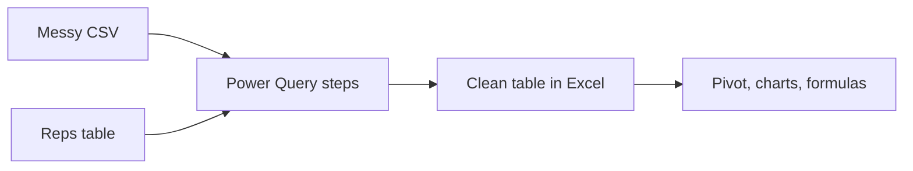

# Power Query: Repeatable Cleanup

Every month the export arrives looking slightly different from what your formulas expect: junk rows on top, a stray space in "East ", months spread across columns instead of rows. You fix it by hand, it takes an hour, and next month you do it again from memory. Power Query turns that hour into a recorded recipe you replay with one click. After this phase you can import a messy file, reshape it, join it to a lookup table, and refresh the whole thing the day the next export lands.

Version note: Power Query appears as Get & Transform on the Data tab in Excel for Microsoft 365, Excel 2024, and Excel 2021 on Windows. Microsoft says Excel for Microsoft 365 for Mac offers some support, so menus and connectors can differ there.

## The mental model: a recorded recipe, not an edited sheet

Do not think of Power Query as editing a spreadsheet. Think of it as writing a recipe that Excel follows each time. You click through a sample of the data and Excel records each transformation as a **step**. The data source stays untouched: Power Query reads it, applies the steps, and delivers a clean table. Microsoft's own description is that it defines a repeatable process you can refresh later, and records transformations as query steps rather than modifying the source.



Two pieces to know:

- The **Power Query Editor** is the window where you click transformations and see a preview. Its **Query Settings** pane on the right lists the **Applied Steps**. Click any step to see the data as it looked at that moment. If the pane is closed, open it from the View tab, then Query Settings.
- Behind every click, Power Query writes code in a language called **M**. You rarely need to touch it, but reading it makes the recipe concrete, as you will see below.

## The messy export

Your system exports `sales_export.csv`. This is what it contains, as plain text:

```text
Quarterly order export - generated 2026-09-30,,,,
,,,,
Region,Rep,Jan,Feb,Mar
East ,Ana,400,380,
east,Ben,150,,210
West,Cy,120,90,60
West,Dee ,95,310,175
Total,,765,780,445
```

Count the problems: two junk rows above the real header, a total row at the bottom that is not an order, inconsistent text ("East " with a trailing space, "east" in lowercase, "Dee " with a trailing space), blank cells where there were no sales, and months laid out across columns, which pivot tables and formulas dislike.

## Step 1: import it

On the Data tab, choose **Get Data**, then **From File**, then **From Text/CSV**, and pick the file. A preview window opens. Choose **Transform Data** (rather than Load) to open the Power Query Editor.

Power Query may add steps on its own for text and CSV files, typically promoting the first row to headers and guessing column types from the first 200 rows. Here that guess is wrong, because the first row is a title. In the Applied Steps list, delete any auto-added "Promoted Headers" and "Changed Type" steps by selecting the step and clicking the X beside it. You will do them properly.

## Step 2: clean it, one recorded step at a time

| # | Command (Power Query Editor) | What it does | Rows left |
|---|---|---|---|
| 1 | Home, Remove Rows, Remove Top Rows, enter 2 | Drops the title row and the empty comma row | 6 (header + 4 orders + Total) |
| 2 | Home, Use First Row as Headers | The row with Region, Rep, Jan, Feb, Mar becomes the header | 5 |
| 3 | Home, Remove Rows, Remove Bottom Rows, enter 1 | Drops the Total row | 4 |
| 4 | Select Region and Rep, then Transform, Format, Trim | Removes leading and trailing spaces ("East " becomes "East", "Dee " becomes "Dee") | 4 |
| 5 | Select Region, then Transform, Format, Capitalize Each Word | "east" becomes "East" | 4 |
| 6 | Select Jan, Feb, Mar, then Home, Data Type, Whole Number | Columns become numbers. Empty cells show as `null`. | 4 |
| 7 | Select Jan, Feb, Mar, then Transform, Replace Values, find `null`, replace with `0` | A blank sale becomes an explicit zero | 4 |

Check your work as you go by clicking each step in the Applied Steps list and looking at the preview. After step 7 the table is:

| Region | Rep | Jan | Feb | Mar |
|---|---|---|---|---|
| East | Ana | 400 | 380 | 0 |
| East | Ben | 150 | 0 | 210 |
| West | Cy | 120 | 90 | 60 |
| West | Dee | 95 | 310 | 175 |

> 🪖 **War story**
> The Total row is a trap for pivot tables: leave it in and every figure is double-counted, with no error to warn you. Always remove totals and notes from data before analysing it. Later, you will check that the cleaned numbers add up to the same totals the export claimed.

If a CSV from another region has dates like 22/09/2026 and Power Query reads them with US month-first rules, the conversion errors. Microsoft's fix is to right-click the column, choose Change Type, then **Using Locale**, and pick the locale the file was written in.

## Step 3: unpivot

The table is **wide**: one column per month. Analysis wants it **long**: one row per rep, month, and amount, so adding April means adding rows, not a new column.

Select the Region and Rep columns, then choose Transform, **Unpivot Columns** dropdown, **Unpivot Other Columns**. Power Query turns the headers into values under a column named **Attribute** and the cell values into a column named **Value**. Rename them to Month and Amount by double-clicking the headers.

Microsoft lists three variants:

| Command | Unpivots | Picks up a new column added later? |
|---|---|---|
| Unpivot Columns | The columns you selected | Do not count on it. Use Unpivot Other Columns when columns will be added |
| Unpivot Other Columns | Every column except the ones you selected | Yes, which is why you choose it when months will be added |
| Unpivot Only Selected Columns | Only the columns you selected | No, new columns stay as they are, which is what Microsoft says it is for |

Result: 4 reps times 3 months is 12 rows.

| Region | Rep | Month | Amount |
|---|---|---|---|
| East | Ana | Jan | 400 |
| East | Ana | Feb | 380 |
| East | Ana | Mar | 0 |
| East | Ben | Jan | 150 |
| East | Ben | Feb | 0 |
| East | Ben | Mar | 210 |
| West | Cy | Jan | 120 |
| West | Cy | Feb | 90 |
| West | Cy | Mar | 60 |
| West | Dee | Jan | 95 |
| West | Dee | Feb | 310 |
| West | Dee | Mar | 175 |

Reconcile it: the Amount column sums to 400+380+0+150+0+210+120+90+60+95+310+175 = 1,990. The export's Total row said 765 + 780 + 445 = 1,990. They match, so nothing was lost.

## Step 4: merge in a lookup table

Reps belong to teams, but that lives in another table. On a separate sheet, list it and use Data, **From Table/Range** to load it as a second query named `Reps`:

| Rep | Team |
|---|---|
| Ana | Alpha |
| Ben | Alpha |
| Cy | Beta |
| Dee | Beta |
| Eli | Beta |

Back in the sales query, choose Home, **Merge Queries**. Pick the sales query as the first (left) table and `Reps` as the second (right), click the `Rep` column in each, and choose a join kind. Left outer keeps every row of the left table and brings in matches from the right. Microsoft's join kinds are:

| Join kind | Keeps |
|---|---|
| Left outer | All rows from the left table, matching rows from the right |
| Right outer | All rows from the right table, matching rows from the left |
| Full outer | All rows from both tables |
| Inner | Only rows that match in both |
| Left anti | Only left rows with no match on the right |
| Right anti | Only right rows with no match on the left |

The merge adds a column named `Reps` holding a nested table per row. Click the expand icon in its header and tick only `Team`. Choose left outer here: all 12 rows stay, each gaining a Team. Merged on `Rep`, the Alpha rows are Ana's and Ben's six rows, and Beta's are Cy's and Dee's six.

The dialog shows how many rows matched before you confirm, so read it. The columns you join on must have the same data type, and text comparison is exact (spaces and capitalization both count), so "Dee " with a trailing space would not have matched "Dee", and neither would "dee". That is why the Trim step came first.

Switch the join kind and the same two tables answer a different question. Reps as the left table and sales as the right with **Left anti** returns only reps with no orders: **Eli**. This is a clean way to find the gaps.

A team summary from the merged table, via a pivot table or Group By, is Alpha = 400+380+0+150+0+210 = 1,140 and Beta = 120+90+60+95+310+175 = 850. They add to 1,990 again.

## What the clicks recorded

Open Home, **Advanced Editor** to read the M that Power Query wrote. It looks roughly like this (step names in your file will be the longer names the interface generates, such as "Removed Top Rows"):

```powerquery
let
    Source = Csv.Document(File.Contents("C:\data\sales_export.csv"),
        [Delimiter=",", Columns=5, Encoding=65001, QuoteStyle=QuoteStyle.None]),
    NoTitle   = Table.Skip(Source, 2),
    Promoted  = Table.PromoteHeaders(NoTitle, [PromoteAllScalars=true]),
    NoTotal   = Table.RemoveLastN(Promoted, 1),
    Trimmed   = Table.TransformColumns(NoTotal,
        {{"Region", each Text.Proper(Text.Trim(_)), type text},
         {"Rep", Text.Trim, type text}}),
    Typed     = Table.TransformColumnTypes(Trimmed,
        {{"Jan", Int64.Type}, {"Feb", Int64.Type}, {"Mar", Int64.Type}}),
    NoBlanks  = Table.ReplaceValue(Typed, null, 0, Replacer.ReplaceValue,
        {"Jan", "Feb", "Mar"}),
    Long      = Table.UnpivotOtherColumns(NoBlanks, {"Region", "Rep"}, "Month", "Amount")
in
    Long
```

Each line is one step, and each step takes the previous step's result as input. That is the whole trick: a pipeline of small, named transformations. Power Query is the same idea as the extract-transform-load work described in [ETL and ELT Pipelines](/guides/etl-elt-pipelines), shrunk to fit inside a workbook.

## Load and refresh

Choose Home, **Close & Load** to send the result to a worksheet as a Table. The **Close & Load To** option lets you load as a connection only, which is the right choice for a query that only feeds another one (such as `Reps`), or add the data to the Data Model (see [Phase 5](05-when-to-leave-excel.md)).

Next month, replace `sales_export.csv` with the new file at the same path, then on the Data tab choose **Refresh All**. Every step replays. Because you used Unpivot Other Columns, the unpivot step itself adapts when the export gains an Apr column. The earlier steps do not: the Source step records `Columns=5`, and the type and null-replacement steps name only Jan, Feb, and Mar, so a new month means editing those steps too.

Power Query can load up to 1,048,576 rows to a worksheet, the sheet's own limit.

Recipes break when their assumptions break:

| Symptom | Cause | Fix |
|---|---|---|
| Refresh fails at Source | The file moved or was renamed | Edit the Source step's file path |
| A step shows an error about a column | A header was renamed in the new export | Edit the step to use the new name |
| Rows missing at the top or bottom | The export added or removed junk rows | Adjust the Remove Top and Bottom Rows counts |
| Error cells in a number column | A text value such as "n/a" appears where a number should be | Replace or filter those values with a step before the type change |

> ⚠️ **Gotcha**
> Remove Top Rows with a fixed count is the most fragile step in this recipe. A more robust recipe filters by content, for example removing every row where Region is "Total" or empty, but that depends on what your export does, so test it against two or three months of real files.

## Your turn: pick the join

You have an Orders query and a Customers query. Management asks for "customers who have never ordered." Which join kind, and which table goes on the left? Customers on the left, Orders on the right, **Left anti**: it returns only left rows with no match on the right.

Check yourself before moving on:

```quiz
[
  {"q": "What does Power Query do to your source CSV file when you clean the data?", "choices": ["It overwrites the file with the cleaned version", "Nothing; it records steps and applies them to the data it reads, leaving the source untouched", "It converts the file to .xlsx", "It deletes rows it removes from the CSV"], "answer": 1, "explain": "Power Query reads the source and applies recorded steps. The steps are replayed on each refresh, and the original file is not modified."},
  {"q": "The export will gain a new month column every quarter. Which unpivot command picks up new columns automatically while keeping Region and Rep fixed?", "choices": ["Unpivot Only Selected Columns, selecting the month columns", "Unpivot Other Columns, selecting Region and Rep", "Remove Columns", "Transpose"], "answer": 1, "explain": "Unpivot Other Columns unpivots everything except the columns you selected, so a new column added in the source is unpivoted on the next refresh. Unpivot Only Selected Columns leaves new columns alone."},
  {"q": "A left outer merge returns null Team values for a rep who definitely exists in the lookup table. What is the most likely cause?", "choices": ["Power Query cannot join on text columns", "The left table must be smaller than the right table", "The key values differ slightly, such as a trailing space, because matching is exact", "Left outer joins only keep the first row"], "answer": 2, "explain": "Text matching is exact, so Dee with a trailing space does not match Dee. Trim the key columns before merging, and read the match count in the Merge dialog."}
]
```

## Recap

1. Power Query records your cleanup as ordered steps, leaves the source untouched, and replays the steps on every refresh.
2. Open it with Data, Get Data, From File, From Text/CSV, then Transform Data. The Applied Steps list on the right shows and lets you edit every step.
3. Remove junk rows, trim and fix text, set data types, and handle blanks before you reshape.
4. Unpivot Other Columns turns wide months into long rows, and keeps working when new columns appear.
5. Merge Queries joins tables on key columns. The join kind decides which rows survive, and left anti finds what is missing.
6. Refresh All replays everything, so fragile steps such as fixed row counts are the first thing to check when a refresh fails.

Next up, [Guardrails: Data Validation and Conditional Formatting with Formulas](04-validation-and-conditional-formatting.md): cleaning is easier when bad data never gets in.
