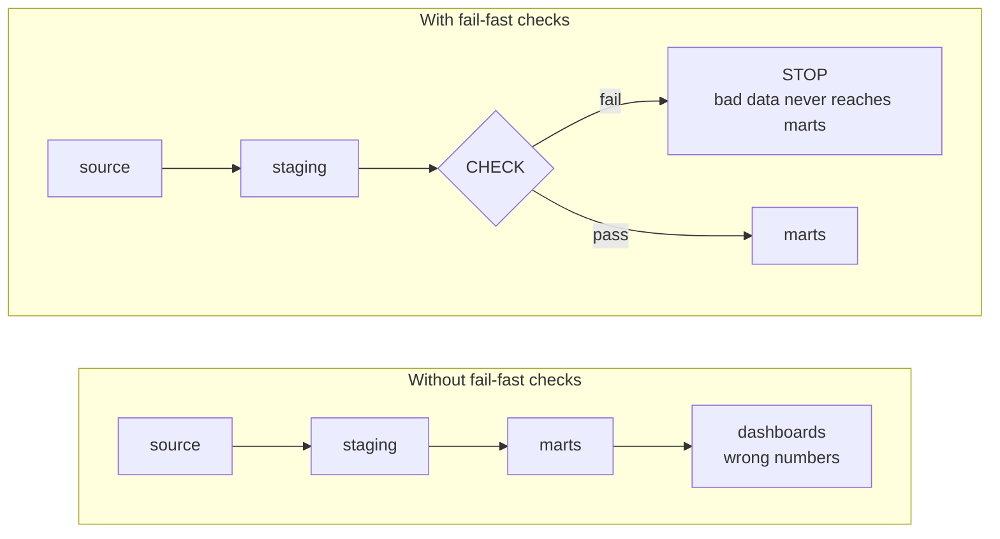

# Data Quality Checks

Phase 1 left you with a job: make the pipeline answer "is the data correct?" automatically, and answer it
*loudly*. This phase is the how. You don't have to test the truth of every number - that's impossible. You
test a handful of **dimensions** that together catch the overwhelming majority of silent breakage, like
smoke detectors placed around the data: each watches for one kind of failure, and any one going off stops
the run. The four that earn their keep: **freshness, volume, schema, and validity** - each a question you
can answer with a query.

## Freshness - is the data actually up to date?

A freshness check asks: *when did this table last receive new data, and is that recent enough to be
useful?* It catches the most common silent failure of all - a pipeline that "succeeds" by faithfully
reprocessing yesterday's data because the *source* stopped sending new rows. The job is green; the data is
a day stale; nobody can tell from the checkmark. You find the newest timestamp in the table and compare it
to now - if the gap is bigger than it should be, you fail.

```console
$ # How old is the freshest row?
SELECT MAX(created_at) AS newest,
       NOW() - MAX(created_at) AS lag
FROM orders;
        newest        |      lag
 ---------------------+----------------
  2026-06-17 23:58:11 | 1 day 08:31:49
(1 row)
```

*What just happened:* The newest order in the table is from late on the 17th, but it's now well into the
19th - a lag of over a day. If this pipeline is supposed to land yesterday's orders every morning, that lag
is the silent failure from Phase 1, made visible. The data isn't corrupted, it's *old* - and old data is
wrong data the moment someone reads it as current.

⚠️ **Gotcha - trust the data's own clock, not the job's.** It's tempting to mark freshness by "did the job
run today?" But a job can run on schedule and still load nothing. Always measure freshness from a timestamp
*inside the data* (`created_at`, `event_time`), not from when the pipeline executed - the point is to catch
the case where the machine ran but the data didn't arrive.

## Volume - did the row count swing wildly?

A volume check asks: *is the amount of data in the right ballpark?* Most pipelines process a fairly
predictable quantity day to day. A sudden collapse (a join silently dropped most rows) or explosion (a join
fanned out into duplicates) signals something broke upstream, even when every individual row looks fine.
You count today's rows and compare against what's normal - a fixed floor, or recent history.

```console
$ SELECT COUNT(*) FROM orders WHERE day = CURRENT_DATE;
  count
 -------
   1284
(1 row)
```

*What just happened:* Today landed 1,284 orders. On its own that means nothing - the check only works
against expectation. If this table normally lands 40,000–60,000 rows a day, 1,284 is a five-alarm fire: a
join probably lost its match, or the source sent a partial file. The count didn't error; it just quietly
became absurd, and only a comparison reveals it.

📝 **Terminology.** *Fan-out* = a join that matches each input row to many rows on the other side,
multiplying the row count (often a sign of a missing or wrong join key). *Row-count anomaly* = a count that
deviates far enough from the historical norm to be suspicious. A simple threshold ("must be at least N")
catches the worst cases on day one; fancier setups compare against a rolling average.

## Schema - did a column change or disappear?

A schema check asks: *is the shape of the data what we agreed on?* Upstream teams rename columns, change
types, or drop fields without telling anyone - one of the most common ways a pipeline silently starts
producing nonsense. A vanished column might read as `null` everywhere; a type change from integer to string
can break a calculation while still "loading." You assert the expected columns exist with the expected
types before trusting the rest of the run.

```console
$ # Inspect the actual columns and types now arriving
SELECT column_name, data_type
FROM information_schema.columns
WHERE table_name = 'orders'
ORDER BY ordinal_position;
  column_name |     data_type
 ------------+--------------------
  id         | bigint
  customer_id| bigint
  amount     | text                <-- was numeric yesterday
  created_at | timestamp
(4 rows)
```

*What just happened:* The `amount` column is now arriving as `text`, not the `numeric` it used to be - 
someone upstream changed it. Every downstream `SUM(amount)` is about to either error or, worse, coerce
silently and produce a wrong total. A schema check that pins `amount` to `numeric` catches this *here*,
before the bad type poisons everything that reads it.

💡 **Key point.** A schema check is a *contract* with your upstream. It says "I depend on these columns
having these types," and it fails the moment that contract is broken - a loud, attributable alert instead
of a mysterious wrong number three tables downstream.

## Validity - do the values themselves make sense?

Validity is a family of checks on the *content* of individual columns. Three pull the most weight:

- **Nulls** - a column that should never be empty (a primary key, a required amount) suddenly contains
  `null`. This was the exact mechanism behind the Phase 1 revenue bug.
- **Uniqueness** - a column that should have no duplicates (an `id`, an order number) suddenly has them,
  usually from a fan-out join or a double-load. Duplicates inflate every count and sum built on top.
- **Ranges** - a value that should fall within sane bounds lands outside them: a negative age, an order of
  `-50` items, a percentage of `1200`, a date in the year 2099.

Each is a query that counts the *violations* and fails if there are any.

```console
$ -- Validity: nulls, duplicates, and out-of-range values in one sweep
SELECT
  COUNT(*) FILTER (WHERE amount IS NULL)            AS null_amounts,
  COUNT(*) - COUNT(DISTINCT id)                     AS duplicate_ids,
  COUNT(*) FILTER (WHERE amount < 0)                AS negative_amounts
FROM orders
WHERE day = CURRENT_DATE;
  null_amounts | duplicate_ids | negative_amounts
 -------------+---------------+------------------
           37 |             0 |                4
(1 row)
```

*What just happened:* Today's load has 37 rows where `amount` is `null` (the silent revenue-killer from
Phase 1, caught in the act) and 4 rows where `amount` is negative (impossible for a real order - probably a
sign error or a refund leaking into the orders table). None of these rows would have crashed anything; each
is "valid" to the database. The check is what gives them an opinion: *these values don't make sense, stop
the run.*

**Try a validity sweep yourself.** Same shape of check - count the violations in one query - over a tiny
seeded library dataset. It returns zero violations today; change a threshold to watch it "fire":

```sql runnable
SELECT
  SUM(CASE WHEN b.title IS NULL THEN 1 ELSE 0 END)  AS null_titles,
  COUNT(*) - COUNT(DISTINCT b.id)                   AS duplicate_ids,
  SUM(CASE WHEN b.year < 1800 THEN 1 ELSE 0 END)    AS impossible_years
FROM books b;
```

⚠️ **Gotcha - test the column that hurts, not every column.** It's tempting to slap a null check on all 80
columns. Don't. A null in an optional `notes` field is fine; a null in `amount` corrupts revenue. Spend your
checks where a bad value actually changes a number someone trusts - over-checking is its own failure mode,
covered as alert fatigue in [Phase 3](03-pipeline-observability.md).

## Where to run the checks: fail fast, before bad data spreads

Knowing *what* to check is half of it. The other half is *where* - **run checks as early as you can, and
make a failure stop the pipeline before bad data reaches anything downstream.** That's the difference
between catching bad data in one staging table and chasing it across twenty.



You insert the checks as a *gate* between stages - after data lands in staging but before it's transformed
into the marts that dashboards read. If a check fails, the run aborts right there: the staging table might
be wrong, but the trusted downstream tables are never touched, so nobody reads a bad number while you fix
the source. Here's that gate as an annotated assertion the pipeline runs and reacts to:

```console
$ -- quality_gate.sql : the run aborts if this returns any rows
WITH violations AS (
  SELECT 'stale'   AS check_name
  WHERE (SELECT NOW() - MAX(created_at) FROM staging_orders) > INTERVAL '26 hours'
  UNION ALL
  SELECT 'too_few_rows'
  WHERE (SELECT COUNT(*) FROM staging_orders WHERE day = CURRENT_DATE) < 10000
  UNION ALL
  SELECT 'null_amounts'
  WHERE EXISTS (SELECT 1 FROM staging_orders WHERE amount IS NULL AND day = CURRENT_DATE)
)
SELECT * FROM violations;
  check_name
 --------------
  null_amounts
(1 row)
```

*What just happened:* This single query asks all three questions at once and returns **one row per failed
check** - here, `null_amounts` fired. The rule: *if this query returns any rows, fail the run.* The
orchestrator sees a non-empty result, aborts before the transform step, and turns the job red - the silent
failure from Phase 1 converted into exactly the loud crash you wanted: a named reason, and bad data
quarantined in staging.

💡 **Key point - the check's job is to fail the run, not just to log.** A quality check that writes
"warning: nulls found" to a log and lets the pipeline continue is barely better than no check at all. The
power comes from wiring the check to **halt the pipeline and go red**, so bad data physically cannot
proceed and a human is forced to look.

Most teams don't hand-write every assertion - testing frameworks built into transformation tools (dbt ships
`not_null`, `unique`, `accepted_values`, and relationship tests, plus freshness packages) let you declare
checks next to the models they guard. The *tool* varies; the four dimensions and fail-fast placement stay
constant.

## Recap

1. You don't test every number - you test a few **dimensions**: **freshness** (is it up to date?),
   **volume** (is the row count sane?), **schema** (did columns change or vanish?), and **validity** (do the
   values - nulls, uniqueness, ranges - make sense?).
2. Measure freshness from a timestamp **inside the data**, not from whether the job ran.
3. A volume or range check only works **against an expectation** - a floor or a historical comparison; the
   raw number alone says nothing.
4. A schema check is a **contract** with your upstream; it turns a silent type change into a loud,
   attributable failure.
5. **Run checks early and fail fast** - gate the transform step so a failure halts the run and bad data
   never reaches the trusted downstream tables.
6. The check's job is to **fail the run and go red**, not merely to log - that's how you buy back the loud
   crash.

Next: zooming out from individual checks to the whole system - seeing which downstream tables a broken
source poisons, alerting on these checks without drowning in noise, and setting SLAs so you catch the
silent failure before a human does.

---

[← Phase 1: Why Trust Is the Whole Product](01-why-trust-is-the-whole-product.md) · [Phase 3: Pipeline Observability →](03-pipeline-observability.md)

## Try it yourself

A quick format check - which values are valid ISO dates (YYYY-MM-DD)?

```playground-regex
^\d{4}-\d{2}-\d{2}$
2026-06-20
2026-6-20
20260620
not-a-date
```
