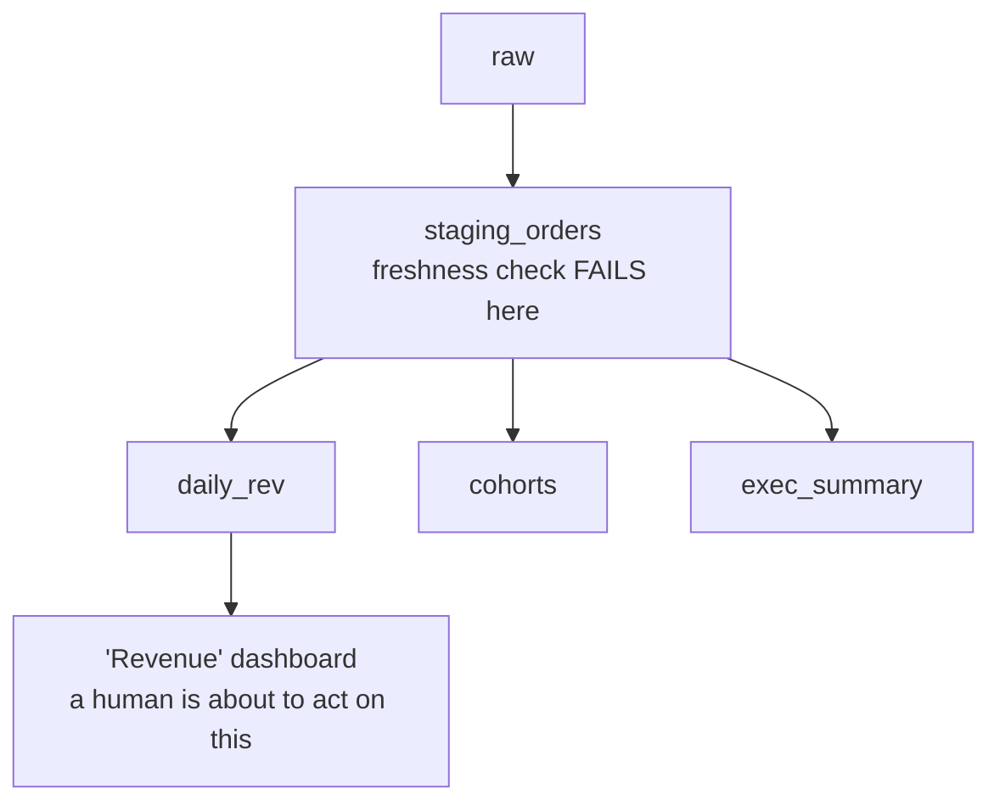
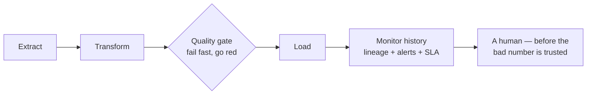

# Pipeline Observability

In Phase 2 you placed smoke detectors around individual tables. This phase wires them into a building-wide
alarm system — and gives you the map of the building. That's the difference between a *check* and
*observability*: a check tells you one table is wrong; observability tells you the *whole system's* health,
*which* downstream tables a broken source has poisoned, and gets a signal to a human the moment something
trips — ideally before anyone reads a bad number.

The mental model: a data quality check is a thermometer. Observability is the whole hospital monitor — many
readings, a history, a map of how the patient's systems connect, and an alarm that goes off at the right
bedside. You already have the thermometers. Now we connect them.

## Lineage — the map of what poisons what

*Lineage* is the dependency graph of your data: which tables are built from which other tables, all the way
from raw sources to the dashboards people read. It's the answer to two questions you'll be asked in every
data incident — *"if this source is broken, what's affected?"* (downstream) and *"this dashboard looks
wrong, where did the number come from?"* (upstream).

📝 **Terminology.** *Upstream* = the tables your table is built *from* (its inputs). *Downstream* = the
tables built *from* yours (what depends on you). *Lineage* = the full upstream-to-downstream map across the
whole platform.

When a freshness check fails on a raw source, lineage instantly tells you the blast radius — every mart and
dashboard that draws from it, so you know what to quarantine and who to warn.



*What just happened:* The diagram traces a single failure at `staging_orders` down to every table and
dashboard that depends on it. Without lineage, you'd find out about the blast radius the slow way — one
angry Slack message per affected dashboard, over hours. With it, you see in one glance that `daily_rev`,
`cohorts`, `exec_summary`, and the Revenue dashboard are all downstream of the break, so you can hold them
*before* anyone trusts them.

💡 **Key point.** Lineage is what makes a single check *systemic*. A check says "this table is bad."
Lineage says "...and therefore these twelve things built on it cannot be trusted until it's fixed." That
second sentence is what lets you protect decisions instead of just tables.

## Monitoring and alerting — getting the signal to a human

*Monitoring* is recording the results of your checks over time — not just pass/fail right now, but the
history (how fresh has this table been every day for a month? how has the row count trended?). *Alerting*
is the rule that decides when a result is bad enough to interrupt a human, and the mechanism that reaches
them. A check that fails into a void helps no one — monitoring turns each result into a durable signal, and
alerting routes the *important* ones to a person through a channel they actually watch.

Two failures, two very different responses — and the difference is the whole craft:

```text
   FAILURE                         RESPONSE
   ─────────────────────────       ───────────────────────────────────
   raw revenue source stale,       page on-call NOW — money number,
   feeds the exec dashboard   ─►    decision-grade, every minute counts
   ─────────────────────────       ───────────────────────────────────
   optional 'notes' field has      log it, fix in normal hours —
   a few nulls, feeds nothing  ─►    nobody needs to wake up for this
```

*What just happened:* Both are check failures, but only one deserves to wake someone. The severity of an
alert should track the **severity of the data it guards** — measured by what decisions ride on it and how
many downstream tables (via lineage) it poisons — not by how easy the check was to write. Wiring every
check to the same loud channel is how you get to the next gotcha.

## ⚠️ Alert fatigue — the failure mode of doing this well

This is the trap that catches teams *after* they get good at quality checks, so it deserves its own
warning. Alert fatigue is what happens when you have so many alerts — many noisy, flaky, or unimportant —
that people stop reading them. The alarm becomes wallpaper, and the moment it does, the *one that matters*
scrolls past unread, landing you right back in Phase 1: a real silent failure, except now you technically
"alerted" on it and still nobody looked.

The instinct after Phase 2 is to check *everything* — every column, every table, every dimension — and
route it all to one channel. It feels thorough. It's actually counterproductive: a hundred low-value alerts
don't add up to vigilance, they manufacture the indifference that lets the high-value one slip through.
More checks is not more safety past a point; **more *trusted* checks is.**

**How to keep alerts meaningful:**

- **Test what matters, not what's easy.** Guard the columns and tables that feed real decisions. A null in
  `amount` pages someone; a null in `notes` does not.
- **Match severity to blast radius.** Use lineage: a failure feeding twenty downstream tables and the exec
  dashboard is a page; one feeding nothing is a log line.
- **Route by severity, not all to one firehose.** Critical → page/on-call. Warning → a channel people check
  during the day. Info → a dashboard, no notification.
- **Kill flaky checks fast.** A check that cries wolf — fails on a normal day, needs a "just re-run it" —
  trains everyone to ignore *all* checks. A check you've learned to ignore is worse than no check, because
  it costs attention and gives nothing back. Tune it or delete it.

💡 **Key point.** The goal isn't the *most* alerts — it's that **every alert is worth reading.** A small set
of trusted, high-signal alerts beats a hundred that everyone has muted. You're protecting a scarce
resource: human attention. Spend it only where a wrong number would actually cost something.

## Data SLAs — promising trust, and measuring it

A *data SLA* (service-level agreement) is an explicit, written promise about the data — most commonly its
**freshness** ("the revenue table is updated by 7am every business day") and its **correctness** ("it
passes its quality checks before it's published"). It turns vague expectations into a number you can
monitor against and be held to.

📝 **Terminology.** *SLA* = service-level agreement, the promise you make to consumers ("fresh by 7am").
*SLO* = service-level objective, the internal target you actually engineer toward (often a bit tighter, e.g.
"fresh by 6:30am," to leave headroom). Borrowed straight from how production services are run.

An SLA is what makes "is the data trustworthy?" measurable rather than a feeling. It converts the freshness
and quality checks from Phase 2 into a *commitment*: not just "we noticed it was stale" but "we promised
7am, the check tripped at 6:15, on-call had 45 minutes to fix it before anyone opened the dashboard." That's
the silent failure caught and resolved *before* a human ever acted on a bad number, with time to spare
because you set a target with headroom.

## Tying it together — observability serves the pipeline you built

Everything here sits *on top of* the pipelines from [ETL & ELT Pipelines](/guides/etl-elt-pipelines). That
guide builds the machinery that moves data; this one watches the machinery and, more importantly, the
*truth of what comes out of it*. The same orchestration that runs your extract/transform/load steps runs
your quality gates, records their history, and fires your alerts — observability isn't a separate system
bolted on, it's the same pipeline, instrumented so it can tell you when it's lying.

The full picture, end to end:



*What just happened:* This is the whole guide in one line of pipes. You build the pipeline (the ETL/ELT
guide), gate it with checks that fail fast and go red (Phase 2), and wrap it in lineage, monitoring,
severity-routed alerts, and an SLA (Phase 3). The payoff is the exact inverse of the Phase 1 nightmare:
instead of a green job quietly shipping a wrong number that surfaces in a meeting a week later, a tripped
wire turns the job red, names the broken table, shows you everything downstream it endangers, and reaches a
human while there's still time to fix it.

## Recap

1. **Observability** is the system-wide view — many checks, their history, a dependency map, and alerts —
   not a single table's pass/fail.
2. **Lineage** is the map of what poisons what; it turns "a source broke" into "these exact downstream
   tables and dashboards are now at risk," so you protect decisions, not just tables.
3. **Monitoring** records check results over time; **alerting** routes the important ones to a human, and
   alert severity should track the **severity and blast radius of the data**, not the ease of the check.
4. ⚠️ **Alert fatigue** is the failure mode of doing this well — too many low-value alerts and people stop
   reading the one that matters. **Test what matters, route by severity, and kill flaky checks.**
5. A **data SLA** turns trust into a measurable promise (freshness, correctness) you can monitor against
   and catch *before* the deadline — with headroom (the SLO) to fix it in time.
6. Observability isn't bolted on; it's the **same pipeline** from the ETL/ELT guide, instrumented so it can
   tell you when its output can't be trusted.

That's the whole arc: a green job never meant the data was true (Phase 1); checks make "is it true?" a
question the pipeline answers loudly (Phase 2); and observability makes sure the answer reaches a human
before a decision is built on a lie (Phase 3). The product was never the pipeline. It was the trust.

---

[← Phase 2: Data Quality Checks](02-data-quality-checks.md) · [Guide overview →](_guide.md)

**Related:** [ETL & ELT Pipelines](/guides/etl-elt-pipelines) · [What Is Data Engineering?](/guides/what-is-data-engineering)
