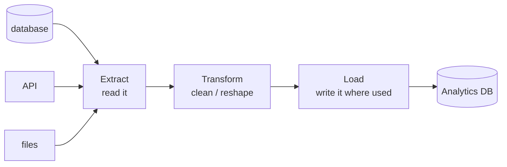

# Extract, Transform, Load

ETL gets thrown around like one thing, but it's really three separate jobs wearing one name. They blur together because the data goes "into the pipeline" and "comes out clean," and the middle is fog.

The fix is one picture: an assembly line. Raw material comes in one end, gets worked on in the middle, a finished product comes out the other. That's the whole mental model - once it's in place, every tool and buzzword you meet later slots into one of the three stations.

## The whole thing, in one picture

**What a pipeline actually is.** A pipeline is a sequence of steps that moves data from where it's *produced* to where it's *consumed*, reshaping it along the way. Think of a factory line: each station does one job and hands its output to the next.



Each station has exactly one responsibility. When something breaks, this picture is what lets you ask the right question: *which station failed?* That alone turns "the pipeline is broken" into a debuggable problem.

> 📝 **Terminology.** *Source* = where data comes from (an app's database, a third-party API, uploaded files). *Destination* (or *sink*, or *target*) = where the pipeline writes its output, usually an analytics database people query. We'll define the warehouse vs. lake distinction in [Warehouses vs. Lakes](/guides/warehouses-vs-lakes); for now, "the place reports read from."

## Stage 1 - Extract: pull the data out

**What it actually is.** Extract is the "read" step: copy data *out* of a source so the pipeline can work on it without disturbing the source. You are making a copy, not moving the original - the app's production database keeps serving the app.

**What it does in real life.** Extraction connects to a source and pulls records. Sometimes it's a full pull (grab everything); more often it's *incremental* (grab only what changed since last time), because re-reading millions of rows every run is wasteful.

**A real example.** Pulling new orders from a production database since the last run:

```console
$ python extract_orders.py --since 2026-06-18
Connecting to orders-db (read replica)...
Querying orders WHERE updated_at > '2026-06-18'...
Fetched 1,204 rows
Wrote raw/orders_2026-06-19.json
```

*What just happened:* The script connected to a *read replica* (a copy of the database meant for reads, so analytics queries don't slow down the live app), asked only for orders touched since yesterday, and dumped the raw result to a file untouched. No cleaning yet - extract's only job is to get the data out faithfully.

⚠️ **Gotcha - extract reads from production; treat it gently.** A naive "grab everything" query against the live database your app depends on can slow the app down for real users. This is why teams extract from read replicas, run heavy pulls off-hours, and prefer incremental pulls. The extract step is the one most likely to hurt something *outside* the pipeline.

**Why this saves you later.** When a report is missing yesterday's orders, the assembly-line picture sends you straight to station one: *did extract run, and did it pull the right window of data?* Most "missing data" mysteries are an extract that pulled the wrong range or silently fetched zero rows.

## Stage 2 - Transform: clean and reshape it

**What it actually is.** Transform is where raw, messy data - inconsistent formats, duplicate rows, codes instead of labels, three systems that each spell "USA" differently - becomes something a human or a dashboard can trust.

**What it does in real life.** Common transforms:
- **Clean** - fix types, trim whitespace, standardize values (`"usa"`, `"US"`, `"U.S.A."` → `"US"`).
- **Filter** - drop test records, drop rows you don't need.
- **Join / enrich** - stitch tables together (orders + customers + products into one row).
- **Aggregate** - roll detail up into summaries (orders → daily revenue per region).

**A real example.** A transform that standardizes country codes and joins in customer data:

```console
$ python transform_orders.py raw/orders_2026-06-19.json
Loaded 1,204 rows
Standardized 'country' field (47 variants -> 31 ISO codes)
Dropped 18 test orders (email ending @example.com)
Joined customer names from customers table
Wrote staged/orders_clean_2026-06-19.parquet
```

*What just happened:* The raw 1,204 rows went in; the script normalized the messy `country` field down to standard codes, removed obvious test data, and attached customer names so downstream reports don't have to. What comes out is the same orders, but *trustworthy and ready to use*. (Numbers are illustrative, not measured.)

💡 **Key point.** Transform is the stage that holds all your business logic - what "a valid order" means, how revenue is defined, which records count. That's why it's where most of the real engineering effort goes, and, as the next phase shows, *where* you run it is the choice that defines ETL vs. ELT.

**Why this saves you later.** When a number looks wrong - revenue double-counted, a region missing - the cause is almost always a transform rule, not a broken machine. Knowing the logic lives at station two tells you exactly which code to read.

## Stage 3 - Load: write it where it's used

**What it actually is.** Load is the "write" step: take the cleaned, reshaped data and put it in the destination where people and tools will actually read it - the analytics database behind your dashboards.

**What it does in real life.** Loading writes rows into target tables. The key decision is *how* you write:
- **Append** - add new rows to what's already there (good for event logs).
- **Overwrite** - replace a table or partition wholesale (good for "today's full snapshot").
- **Upsert / merge** - update rows that exist, insert ones that don't (good for records that change, like an order moving from "pending" to "shipped").

**A real example.** Loading the cleaned file into the warehouse table:

```console
$ python load_orders.py staged/orders_clean_2026-06-19.parquet
Connecting to warehouse...
MERGE into analytics.orders ON order_id
  1,186 rows updated or inserted
Done.
```

*What just happened:* The cleaned rows were merged into the analytics table on `order_id` - existing orders got updated, brand-new ones got inserted. Now the dashboards reading `analytics.orders` see fresh, clean data. The assembly line has produced its finished product.

⚠️ **Gotcha - the wrong write mode quietly corrupts your data.** Use *append* where you meant *merge* and re-running the pipeline doubles your rows. Use *overwrite* on the wrong scope and you wipe history you needed. The load step is where re-running a pipeline can do real damage - which is exactly the *idempotency* problem we tackle in [Phase 3](03-orchestration.md).

**Why this saves you later.** When numbers are inflated after a re-run, the load step's write mode is the first suspect. Recognizing append-vs-merge as a deliberate choice - not a detail - saves you from the classic "why is revenue suddenly 2x?" panic.

## Recap

1. A **pipeline is an assembly line**: raw material in, finished product out, one job per station.
2. **Extract** copies data out of sources faithfully - read gently, prefer incremental, don't hurt production.
3. **Transform** cleans, filters, joins, and aggregates - this is where all your business logic lives.
4. **Load** writes the result where people use it - and the *write mode* (append / overwrite / merge) matters more than it looks.
5. When something breaks, the three stations tell you *where* to look first.

You now have the shape of every pipeline. The next question is one of order: do you transform the data *before* you load it, or load it raw and transform it *after*? That single swap is the difference between ETL and ELT.

Watch it animated: [ETL pipelines](/explainers/ETLPipelines.dc.html)

---

[← Guide overview](_guide.md) · [Phase 2: ETL vs ELT →](02-etl-vs-elt.md)
