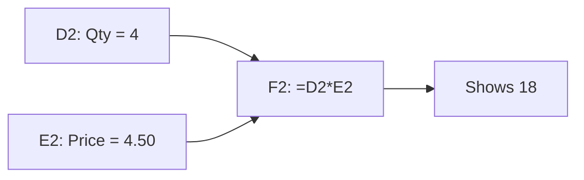

# Workbooks, Cells, and Formulas

Excel looks like a grid of boxes where you type things. That is true and hides the one idea that matters: some boxes hold what you typed, and some hold an instruction that Excel re-runs every time anything it depends on changes. Know which is which and you can read any spreadsheet someone hands you.

## The three containers

- A **workbook** is the file (`.xlsx`). It is the whole thing you save and email.
- A **worksheet** (or sheet) is one grid inside the workbook. The tabs along the bottom are sheets.
- A **cell** is one box in the grid. Its address is its column letter followed by its row number, so `C4` is column C, row 4.

A sheet has 1,048,576 rows and 16,384 columns (the last column is `XFD`). You will never fill that, but it explains why Excel talks about "the whole column" so casually.

Three screen parts to know:

- The **Name Box** (left of the formula bar) shows the address of the selected cell.
- The **formula bar** shows what is actually stored in the selected cell.
- The cell itself shows the **displayed** result.

Those last two can differ, and that gap is the heart of this phase.

## A cell holds a value or a formula

Click a cell and type. When you press Enter, Excel stores one of two things:

| You type | Excel stores | The cell shows |
|---|---|---|
| `42` | the number 42 | 42 |
| `Notebook` | the text "Notebook" | Notebook |
| `=2+3` | a formula | 5 |

A **formula** is anything that starts with `=`. The cell displays the result, and the formula bar keeps the recipe. Everything without a leading `=` is a **constant**: a number, text, a date, or TRUE/FALSE.

Excel decides the type from what you typed, and it shows you its decision through alignment. By default, numbers and dates sit on the right of the cell and text sits on the left. If a number you typed hugs the left edge, Excel stored it as text, and arithmetic functions will not treat it as a number. Phase 3 shows what that costs you.

Dates are numbers in disguise. Excel counts days from a starting point, so 1 October 2026 is stored as 46296 and merely displayed as a date. Pressing `Ctrl + ;` enters today's date.

Four keys you will use constantly:

- **Enter** confirms and moves down. **Tab** confirms and moves right.
- **Esc** cancels what you are typing.
- **F2** edits the selected cell without retyping it.
- **Ctrl + Z** undoes.

## Formulas do arithmetic and obey an order

In a formula, `+` adds, `-` subtracts, `*` multiplies, `/` divides, `^` raises to a power, and `%` turns a number into a percentage. Multiplication and division happen before addition and subtraction, like school math. Parentheses override the order.

| Type this | Result | Why |
|---|---|---|
| `=2+3*4` | 14 | 3*4 first, then add 2 |
| `=(2+3)*4` | 20 | parentheses first |
| `=10/4` | 2.5 | plain division |
| `=2^3` | 8 | 2 to the power of 3 |

⚠️ **Gotcha.** The `=` is not optional. Type `2+3` without it and Excel stores the text "2+3" and shows exactly that.

## The real power: formulas point at cells

A formula that only does `2+3` is a calculator. The power comes from using **cell addresses** in place of numbers. `=D2*E2` means "take whatever is in D2, multiply by whatever is in E2". Excel does not remember the answer. It remembers the instruction, and it re-runs the instruction when D2 or E2 changes.

Build the example you will carry through this guide. A small stationery shop logs sales. Type this into a new sheet, headers in row 1, starting at `A1`:

| | A | B | C | D | E |
|---|---|---|---|---|---|
| 1 | Date | Item | Category | Qty | Price |
| 2 | 2026-10-01 | Notebook | Paper | 3 | 4.50 |
| 3 | 2026-10-01 | Pen Pack | Writing | 5 | 2.20 |
| 4 | 2026-10-02 | Stapler | Office | 1 | 12.00 |
| 5 | 2026-10-02 | Notebook | Paper | 2 | 4.50 |
| 6 | 2026-10-03 | Marker Set | Writing | 4 | 6.25 |
| 7 | 2026-10-03 | Desk Lamp | Office | 1 | 18.90 |
| 8 | 2026-10-04 | Pen Pack | Writing | 10 | 2.20 |
| 9 | 2026-10-04 | Sticky Notes | Paper | 6 | 1.75 |

In most settings Excel reads `2026-10-01` as a date and right-aligns it. If yours sits on the left, it was stored as text, so try your region's style, such as `10/1/2026` in the US.

Now add a **Total** column. In `F1` type `Total`. In `F2` type:

```excel
=D2*E2
```

Press Enter. Row 2 is 3 notebooks at 4.50, so F2 shows 13.5. Click F2 and look at the formula bar: it still says `=D2*E2`. The cell shows the answer, the bar holds the recipe.

## Recalculation: change an input, the answer follows

Click `D2`, type `4`, press Enter. F2 now shows 18 without you touching it.



Excel tracks which cells depend on which. When an input changes, every formula downstream recalculates automatically. This is the mental model for the whole product: **constants are the facts you enter, formulas are the answers that follow from them.** Never type an answer you could compute, because a typed answer goes stale the moment an input changes.

*What just happened:* you edited a fact (Qty), and Excel re-ran the one recipe that depended on it. Nothing else changed because nothing else depended on D2.

Calculation is automatic by default. If a workbook ever stops updating, it may be set to manual (Formulas tab, Calculation Options). Pressing `F9` recalculates on demand.

Set D2 back to `3` before moving on. In Phase 2 you will copy `=D2*E2` down the column and see why it works.

Try these before the quiz:

```exercise
[
  {
    "type": "predict",
    "task": "A1 contains 6 and B1 contains 7. What number does the formula =A1*B1+1 display?",
    "accept": ["43"],
    "hint": "Multiplication happens before addition."
  },
  {
    "type": "predict",
    "task": "Same cells, but you now change A1 to 10. What does =A1*B1+1 display?",
    "accept": ["71"],
    "hint": "Excel re-runs the recipe with the new input."
  }
]
```

Check yourself before moving on:

```quiz
[
  {
    "q": "You click a cell and the formula bar shows =D2*E2 while the cell shows 13.5. What is actually stored in the cell?",
    "choices": ["The number 13.5", "The formula =D2*E2, which Excel evaluates to show 13.5", "The text =D2*E2"],
    "answer": 1,
    "explain": "A cell with a leading = stores the recipe. The displayed number is the current result, recomputed whenever D2 or E2 changes."
  },
  {
    "q": "You type 250 into a cell and it appears on the left edge of the cell. What does that most likely mean?",
    "choices": ["Excel stored it as text, not as a number", "Excel rounded it", "The column is too narrow"],
    "answer": 0,
    "explain": "By default numbers align right and text aligns left, so a left-aligned number was stored as text."
  },
  {
    "q": "What does =2+3*4 display?",
    "choices": ["20", "14", "24"],
    "answer": 1,
    "explain": "Multiplication runs before addition: 3*4 is 12, plus 2 is 14. Use =(2+3)*4 for 20."
  }
]
```

## Recap

1. A workbook is the file, a worksheet is one grid in it, a cell is one box addressed by column letter plus row number.
2. A cell holds either a constant you typed or a formula that starts with `=`.
3. The formula bar shows what is stored, the cell shows the displayed result.
4. Numbers align right and text aligns left by default, which tells you how Excel read your entry.
5. Formulas that use cell addresses recalculate automatically when their inputs change.
6. Enter facts as constants and let formulas compute everything else.

Next up, [Phase 2: Cell References](02-cell-references.md): what happens when you copy `=D2*E2` down a column, and how `$` changes it.
