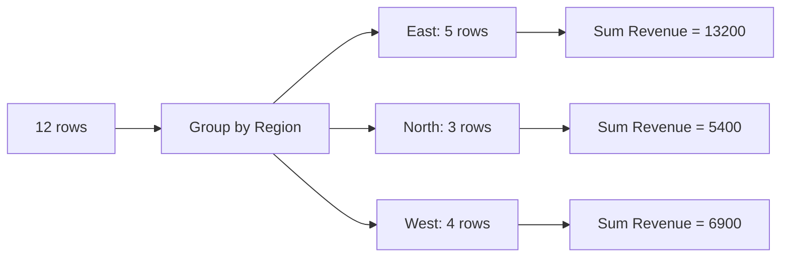

# What a PivotTable Does, and Getting Your Data Ready

A PivotTable looks like magic the first time: you drop a column name into a box and thousands of rows collapse into a tidy summary. There is no magic, only one operation done very fast. Once you can see that operation, you also know why messy data breaks pivots, and most "my pivot is broken" problems are really "my data was the wrong shape" problems.

## What a pivot actually does

A PivotTable does two things in order. First it **groups** your rows by the values in one or more columns. Then it **aggregates** a number column inside each group: add it up, count it, average it.

Here is our running example, twelve sales rows (a real dataset has thousands, but the idea is identical and twelve can be checked by hand):

| Date | Region | Product | Units | Revenue |
|---|---|---|---|---|
| 2026-01-05 | East | Laptop | 2 | 2400 |
| 2026-01-12 | West | Monitor | 5 | 1500 |
| 2026-01-19 | East | Monitor | 3 | 900 |
| 2026-02-03 | North | Laptop | 1 | 1200 |
| 2026-02-10 | West | Laptop | 3 | 3600 |
| 2026-02-17 | East | Laptop | 4 | 4800 |
| 2026-02-24 | North | Monitor | 6 | 1800 |
| 2026-03-02 | West | Monitor | 2 | 600 |
| 2026-03-09 | East | Monitor | 5 | 1500 |
| 2026-03-16 | North | Laptop | 2 | 2400 |
| 2026-03-23 | West | Laptop | 1 | 1200 |
| 2026-03-30 | East | Laptop | 3 | 3600 |

Ask "total revenue by region". Group by Region, then add up Revenue in each group:



| Region | Sum of Revenue |
|---|---|
| East | 13200 |
| North | 5400 |
| West | 6900 |
| Grand Total | 25500 |

Check East by hand: 2400 + 900 + 4800 + 1500 + 3600 = 13200. That is the whole trick.

## The same idea in SQL

If you have met databases, you have already seen this. The PivotTable above is this query:

```sql
SELECT region, SUM(revenue) AS sum_of_revenue
FROM sales
GROUP BY region;
```

`GROUP BY` is the grouping, `SUM` is the aggregate. A PivotTable is `GROUP BY` with a drag-and-drop interface and a built-in grand total. The "pivot" part is that you can also spread a second grouping across the columns, which SQL makes you write by hand. See [Querying Basics: SELECT and WHERE](/guides/querying-basics-select-where) for the SQL side.

> 💡 **Key point**
> A PivotTable never changes your data. It reads your rows and builds a separate summary. You can rearrange it a hundred times and the source stays exactly as it was.

## Shape the source data first

A PivotTable reads your range as a database table. It needs the shape a database table has:

- **One header row**, with a unique, non-blank name above every column. Those names become the field names you drag around.
- **One record per row.** One sale, one row. Not one region per row with a column per month.
- **No blank rows or blank columns inside the data.** When Excel guesses the range for you, a blank row can end the guess early, so rows below it silently vanish from the pivot.
- **No merged cells.** A merged cell holds its value in only one cell of the group, so the others look empty to the pivot.
- **No subtotal or total rows.** The pivot calculates totals itself. A subtotal row in your data is counted as one more record and double-counts everything.
- **One kind of thing per column.** Do not put numbers and text like "n/a" in the same column. Text or blanks in a number column change how the pivot summarizes it (Phase 2).

The "one column per month" layout is the most common offender. A sheet with columns Jan, Feb, Mar reads well for a human but works badly for a pivot to use, because the month is spread across headers instead of being a value in a column. Reshape it so Month is its own column and each month-region pair is one row. That tall, narrow layout is what pivots are built for.

## Turn the range into a Table

Select any cell in your data and press Ctrl+T (or choose **Insert > Table**). Leave **My table has headers** checked and select **OK**. Excel wraps the range in a Table, an object that grows automatically when you type in the row directly below it or the column next to it.

Rename it so you can recognize it later: select a cell in the Table, open the **Table Design** tab, and type a name such as `tblSales` in the **Table Name** box.

Why this matters: when you build a pivot from a Table, the pivot's source is the Table, not a fixed address like `A1:E13`. Add 500 new rows and the Table expands to include them. Build a pivot from a plain range and you have to widen the source yourself, which people forget.

## Your turn: spot the problem

You inherit a sheet with a "Total" row at the bottom that sums Revenue. You build a pivot and the Grand Total is exactly double what it should be. What happened? The pivot treated the Total row as one more record and added its revenue on top of the real rows. Delete the Total row and refresh the pivot.

Check yourself before moving on:

```quiz
[
  {
    "q": "In database terms, what does a PivotTable do to your rows?",
    "choices": ["Sorts them alphabetically", "Groups them by one or more columns and aggregates a number column", "Deletes duplicate rows from the source"],
    "answer": 1,
    "explain": "A pivot is a group-by plus an aggregate such as sum, count, or average. It never edits the source rows."
  },
  {
    "q": "Which source layout works best for a PivotTable?",
    "choices": ["One column per month (Jan, Feb, Mar) with one row per region", "One record per row, with Month as its own column", "Blank rows between regions to keep it readable"],
    "answer": 1,
    "explain": "Pivots need one record per row so that every attribute, including the month, is a value in a column they can group by."
  },
  {
    "q": "Why build the pivot from a Table instead of a plain range?",
    "choices": ["Tables make the pivot sort faster", "The Table grows when you add rows, so the pivot's source grows with it", "Plain ranges cannot be pivoted at all"],
    "answer": 1,
    "explain": "A pivot built on a Table points at the Table, which expands as data is added. A fixed range does not."
  }
]
```

## Recap

1. A PivotTable groups rows by column values and aggregates a number for each group, like SQL `GROUP BY`.
2. It reads your data and builds a separate summary. The source never changes.
3. Source data needs one header row, one record per row, no blank rows, no merged cells, no subtotal rows.
4. Reshape wide layouts (one column per month) into tall ones before pivoting.
5. Press Ctrl+T to make a Table, name it, and build the pivot from it so it grows with your data.

Next up, [Building and Reshaping a PivotTable](02-building-and-reshaping-a-pivottable.md): the four areas, and how Sum, Count, and Show Values As change the story.
