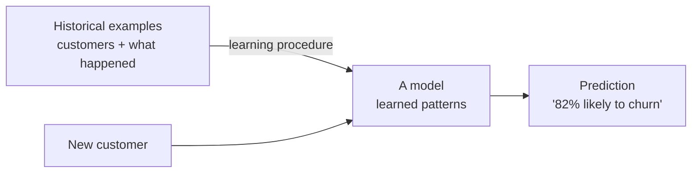

# What ML Actually Is (for Data People)

Before any tools or algorithms, here's the one idea the whole field rests on. Once you have it, ML stops being intimidating and starts being a set of choices you can reason about.

## The shift: from writing rules to learning them

Think about how you'd normally answer a question like "which customers are about to cancel?" You'd sit down and write rules — in SQL, in a spreadsheet, in your head:

```text
   THE OLD WAY: you write the rules

   IF days_since_last_login > 30
   AND support_tickets > 3
   AND plan = 'basic'
   THEN  flag as "likely to churn"
```

You, the human, decided the thresholds. Thirty days. Three tickets. You picked them from experience, and they're frozen in place until you change them by hand.

**What ML actually is.** Machine learning flips that around. Instead of *you* writing the rules, you hand the computer a pile of **historical examples** — past customers, each one labeled with what actually happened ("this one churned," "this one stayed") — and a learning procedure figures out the patterns on its own. The output of that process is a **model**: a thing you can feed a *new* customer's data and get back a prediction.



📝 **Terminology.** A *model* is the learned thing — the output of training. It's not a program someone wrote line by line; it's a set of patterns the learning procedure distilled from your data. You feed it new inputs, it returns predictions.

**Why people get this wrong.** The common picture is that ML "understands" your customers, the way a person would. It doesn't — it found statistical patterns, correlations between inputs and outcomes. That's powerful, but it means the model is only as good as the examples. Give it a thousand churned customers who all happened to be on the basic plan, and it will happily learn "basic plan = churn" whether or not that's truly *why* they left. Hold onto that — it's the seed of every ML failure we'll cover later.

**Why this matters to you.** The "pile of historical examples" *is data work* — pulling, cleaning, and labeling it correctly is the job you already do. ML didn't replace the data person; it gave them a new place to be essential.

## Supervised learning: learning from labeled examples

The churn example above is the most common flavor of ML, called **supervised learning**. The "supervision" is the answer key: every historical example comes with the correct outcome attached.

📝 **Terminology.** A *label* (also called the *target*) is the answer you want to predict, recorded for each historical example. For churn, the label is "did this customer cancel — yes or no?" The columns you predict *from* are called **features** (we'll dig into those next phase).

```text
   A supervised training table — every row has its answer

   ┌────────────┬──────────────┬──────────┬──────────────┐
   │ tenure_mo  │ tickets_90d  │ plan     │  churned?    │ ← the LABEL
   ├────────────┼──────────────┼──────────┼──────────────┤
   │    24      │      0       │  pro     │  no          │
   │     2      │      5       │  basic   │  yes         │
   │    11      │      1       │  pro     │  no          │
   │     3      │      4       │  basic   │  yes         │
   └────────────┴──────────────┴──────────┴──────────────┘
     └──────────── features ──────────────┘
```

The model studies the relationship between the feature columns and that final label column. Then, for a brand-new customer where you *don't* know the answer yet, it predicts the label.

Supervised learning splits into two everyday shapes, and the only difference is what kind of answer you're predicting:

- **Classification** — the label is a category. "Churn / no churn." "Spam / not spam." "This transaction is fraud / legitimate." The model outputs a class (often with a probability attached, like "82% likely to churn").
- **Regression** — the label is a number. "How many dollars will this customer spend next month?" "What will the order volume be on Friday?" The model outputs a number.

💡 **Key point.** If you have historical examples *with known answers*, and you want to predict that answer for new cases, you're looking at supervised learning. Category answer → classification. Numeric answer → regression. That single distinction covers a huge fraction of real-world ML.

**A real example.** Here's what using a trained churn classifier looks like in practice — the details vary by tool, but the shape is universal:

```console
$ python predict_churn.py --customer 88213
Loading model: churn_classifier_v3.pkl
Customer 88213  tenure=3mo  tickets_90d=4  plan=basic
Prediction: CHURN   (probability 0.82)
```
*What just happened:* You handed the model one new customer's features. It compared them against the patterns it learned from thousands of past customers and returned a prediction — "churn" — with a confidence of 0.82, meaning the patterns most resemble customers who left. Nobody wrote an `IF tickets > 3` rule. The model derived its own version of that logic from the data, weighing all the features together.

⚠️ **A probability is not a fact.** That `0.82` is the model's estimate based on past patterns, not a guarantee this person will cancel. Treating model probabilities as certainties is one of the fastest ways to lose trust in a project. They're decision aids, not crystal balls.

## Unsupervised learning: finding structure with no answer key

Now flip the setup: a pile of customer data with *no labels at all* — nobody's told you who's "good" or "at risk." Just rows.

**What it actually is.** **Unsupervised learning** looks for structure that's already sitting in the data, without any answer key to aim at. The most common job here is **clustering**: grouping rows that resemble each other.

```text
   Clustering: no labels going in — the algorithm
   finds natural groupings on its own

        spend
          │   • •            ░ ░ ░          ← three natural
          │  • • •          ░ ░ ░ ░           clusters emerge
          │   • •            ░ ░ ░            from the data,
          │                                   nobody labeled them
          │        ▒ ▒ ▒
          │       ▒ ▒ ▒ ▒
          │        ▒ ▒ ▒
          └─────────────────────────► engagement
```

You might run clustering on your customers and discover three natural groups — say, "high-spend, high-engagement," "new and tentative," and "dormant." The algorithm didn't know those names; *you* look at the groups afterward and interpret them. It just found that the rows fall into clusters.

**Why people get this wrong.** Because there's no answer key, there's no single "correct" output to check against. Two reasonable clustering runs can produce different groupings, and neither is "wrong." Unsupervised results are a starting point for human interpretation — not a verdict. If a teammate presents clusters as objective truth, that's a flag worth a gentle question.

**Where you'll meet it.** Customer segmentation, anomaly detection, and exploratory "what's even in this data?" work. Genuinely useful — just remember it answers "what structure is here?" not "what will happen?"

## The two side by side

| | Supervised | Unsupervised |
|---|---|---|
| **You have…** | examples *with* known answers (labels) | examples with *no* labels |
| **It does…** | predicts the answer for new cases | finds structure/groups in what you have |
| **Everyday jobs** | churn prediction, fraud detection, sales forecasting | customer segmentation, anomaly detection |
| **How you check it** | compare predictions to known answers | interpret the groups by hand; no single "right" |

Most ML you'll encounter at work — and everything in the next phase — is supervised, because most business questions are "what will happen?" and we usually have history to learn from.

## Recap

1. ML's core move: **learn patterns from historical examples** instead of you hand-writing the rules. The learned thing is a **model**.
2. The model is only as good as the examples — it finds correlations, it doesn't truly "understand."
3. **Supervised** learning predicts a known kind of answer (the **label**) for new cases — a category (**classification**) or a number (**regression**).
4. **Unsupervised** learning finds structure (like **clusters**) when there's no answer key — useful, but for interpretation, not prediction.
5. The "pile of examples" is data work — which is exactly why you belong in this conversation.

Next: the actual workflow of a supervised project — features, splitting the data so you can trust your results, training, and the subtle business of measuring whether the model is any good.

---

[← Guide overview](_guide.md) · [Phase 2: The Workflow →](02-the-workflow.md)
